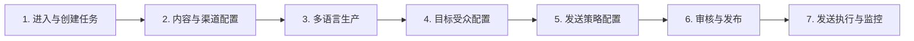
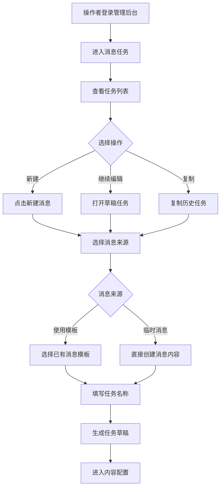
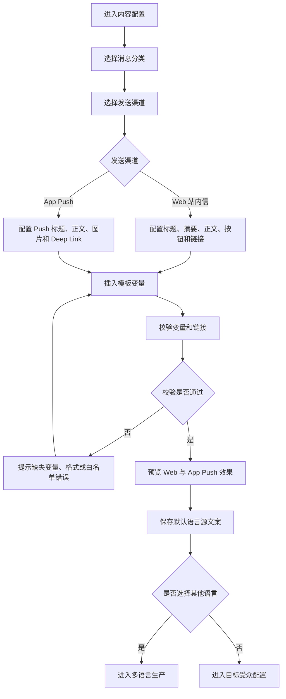
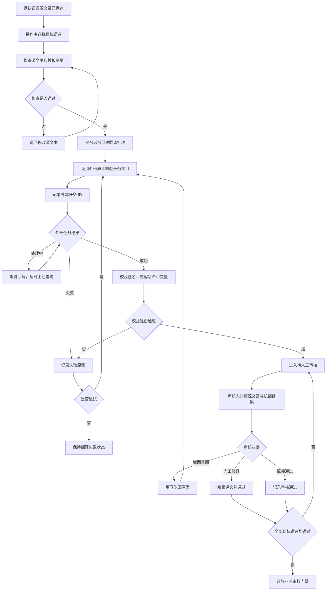
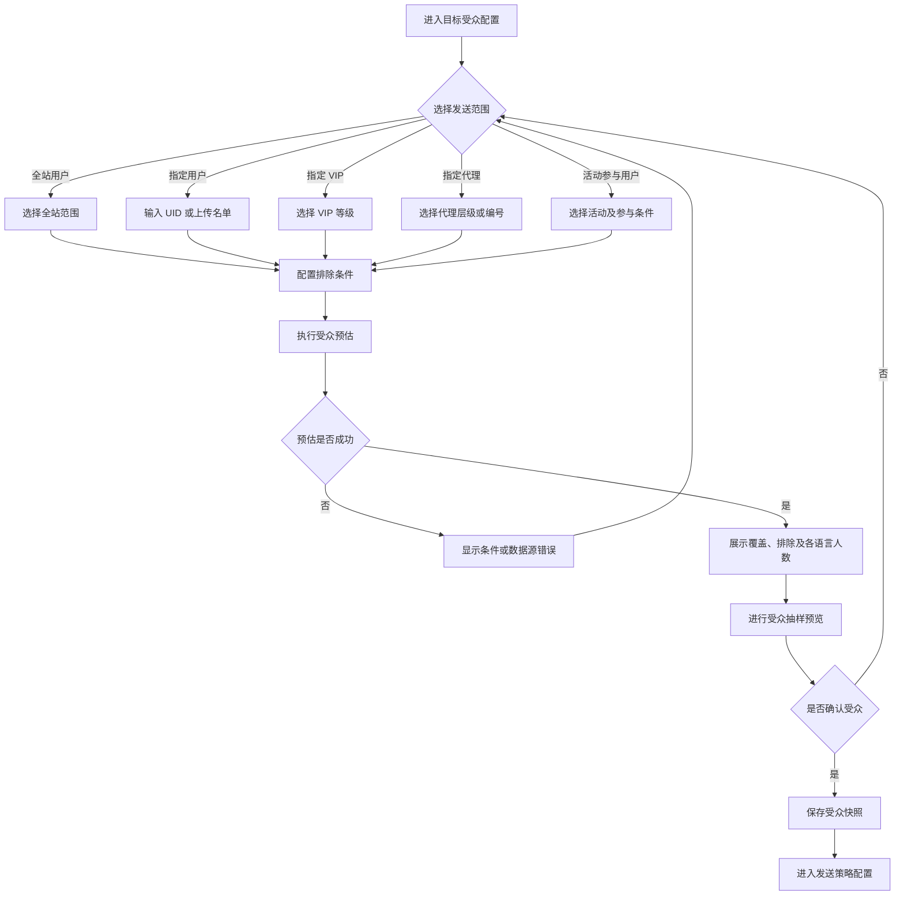
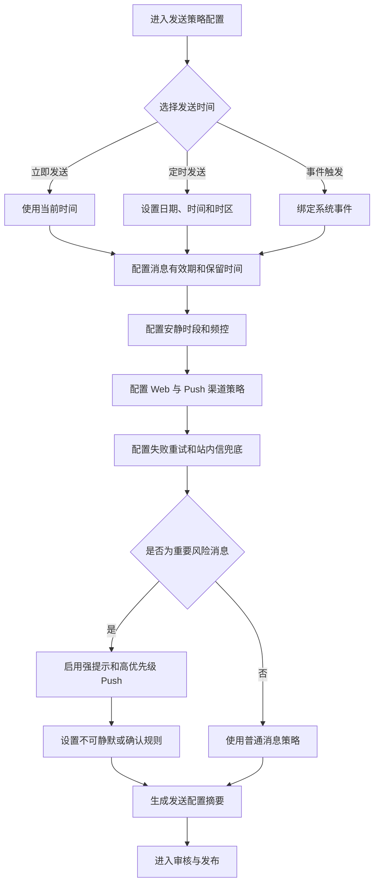
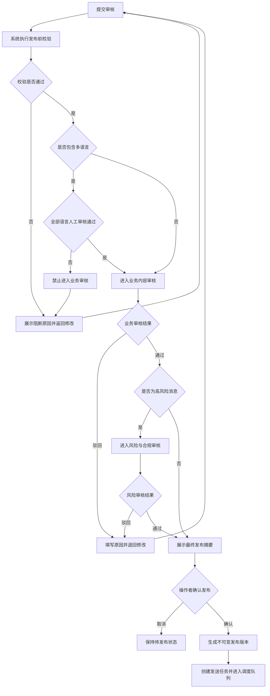
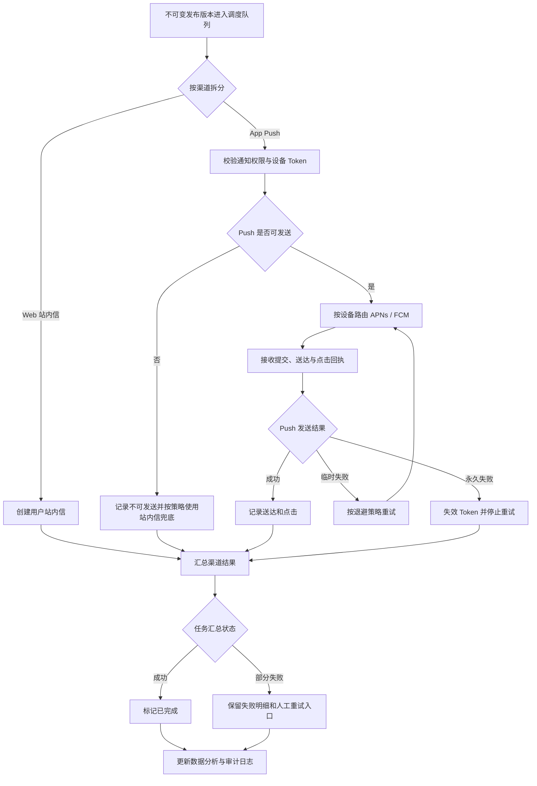

# 交易所消息中心 PRD

> 文档版本：V2.1
>
> 更新日期：2026-07-13
>
> 产品范围：Web 用户端消息中心 + App Push + 消息运营后台 + 基础数据分析
>
> 当前交付：前端交互原型；产品一期必须正式支持 App Push，当前仓库覆盖配置、审核、发送记录和分析交互，真实 APNs / FCM 发送由后端与 App 接入实现
>
> 文档状态：已确认 App Push 为一期必做能力，替代 V2.0

---

## 1. 摘要

本项目为交易所建设统一消息中心。用户可以在 Web 端查看系统公告、交易、资产、安全、奖励、活动和风控消息；运营人员可以通过后台配置模板、接入系统事件、选择目标用户、发送消息并查看效果。

第一期同时交付 Web 站内信和 App Push。Push 必须接入 APNs / FCM，覆盖设备 Token、通知权限、Deep Link、送达与点击回执、失败重试和失效 Token 治理。交易所必须对强平预警、提现风险、账户异常等重要消息提供明显提示，并保留发送记录、审批记录和操作日志。

---

## 2. 联系人与职责

| 角色 | 负责人 | 职责 |
|---|---|---|
| 产品负责人 | 项目指定 Owner | 范围、优先级、验收标准 |
| Web 产品/设计 | Web 团队 | 用户消息列表、详情、已读体验 |
| 运营负责人 | 运营团队 | 人工消息、活动消息、目标用户 |
| 业务接入负责人 | 资金/交易/奖励团队 | 系统事件和变量定义 |
| 风控负责人 | 风控团队 | 风险消息等级、强提示规则 |
| 合规负责人 | 合规团队 | 退订、保留时间、审计要求 |
| 数据负责人 | 数据团队 | 埋点、指标口径、报表 |
| 技术负责人 | 前后端负责人 | 接口、存储、幂等、性能 |
| QA 负责人 | 测试团队 | 功能、权限、兼容性和异常场景 |

---

## 3. 背景

### 3.1 当前问题

- 用户缺少统一入口查看交易所消息，容易遗漏资金和风险通知。
- 不同业务各自发送消息，分类、模板和跳转方式不统一。
- 用户无法快速区分已读与未读，也无法统一标记全部已读。
- 运营缺少面向全站、指定用户、VIP、代理和活动用户的统一发送入口。
- 多语言内容和金额、币种、交易对等变量缺少统一规范。
- 强平、提现和账户异常消息与普通运营消息的提示强度相同。
- 只知道“发了多少”，不知道用户是否阅读、点击或在有效期内处理。

### 3.2 本次范围调整

V1.0 偏向大型全渠道营销平台，包含复杂自动化、邮件短信供应商、完整地区合规和高级归因。V2.0 收敛到交易所消息中心的核心闭环：

```text
系统事件 / 后台人工发送
          ↓
多语言模板与变量渲染
          ↓
目标用户、风险审批、有效期检查
          ↓
Web 站内信 + App Push（APNs / FCM）
          ↓
列表、详情、已读、点击
          ↓
发送记录、审计与基础数据分析
```

### 3.3 名词说明

| 名词 | 说明 |
|---|---|
| 用户消息 | 一名用户实际收到的一条消息 |
| 系统消息 | 由充值、提现、成交等业务事件自动触发的消息 |
| 人工消息 | 运营人员在后台创建并提交发送的消息 |
| 消息模板 | 按语言保存标题、摘要、正文、按钮和变量规则的内容 |
| 重要消息 | 需要明显提示或用户确认的风险、安全和资金消息 |
| 阅读率 | 已读用户数 ÷ 收到消息的用户数，按 UID 去重 |
| 点击率 | 点击跳转的用户数 ÷ 收到消息的用户数，按 UID 去重 |

---

## 4. 目标

### 4.1 产品目标

1. 为用户提供统一、清晰、可追踪的 Web 消息中心和 App Push 通知。
2. 覆盖交易所关键系统事件和运营人工发送场景。
3. 支持多语言模板、标准变量、有效期与保留时间。
4. 让重要风险消息比普通消息更醒目，减少用户遗漏。
5. 建立从消息生成、阅读到点击的数据分析闭环。
6. 保留用户分群、审批、发送追踪、链接白名单和基础审计。

### 4.2 关键结果

| 指标 | 目标 | 口径 |
|---|---|---|
| 关键事件模板覆盖率 | 100% | 本文定义的 8 个系统事件均有模板，提现成功与失败分别统计 |
| 用户消息可追踪率 | 100% | 每条消息可关联来源、模板和用户 |
| 已读状态准确率 | 100% | 单条已读与全部已读结果一致 |
| 高风险消息强提示覆盖率 | 100% | 强平、提现风险、账户异常均命中规则 |
| 跳转链接白名单覆盖率 | 100% | 所有可点击链接均通过校验 |
| 高风险人工消息审批覆盖率 | 100% | 未审批不得进入发送状态 |
| 阅读与点击埋点覆盖率 | 100% | 列表曝光、详情打开和链接点击可统计 |
| Push 发送可追踪率 | 100% | 每条 Push 可关联设备、供应商消息 ID、送达/点击结果和失败原因 |

### 4.3 本轮前端原型验收目标

- 用户端和后台页面均可通过前端路由访问。
- 核心按钮可点击，并打开真实页面、抽屉或详细表单。
- 使用模拟数据演示已读、全部已读、风险提示、跳转和数据分析。
- 页面刷新后无需保证数据持久化；生产级接口属于后续开发。

---

## 5. 市场与用户

### 5.1 用户端用户

| 用户 | 需要完成的任务 | 主要问题 |
|---|---|---|
| 普通交易用户 | 查看资产、交易和活动消息 | 消息分散，重要程度不清楚 |
| 合约用户 | 及时查看强平与风险预警 | 风险消息容易被普通消息淹没 |
| VIP 用户 | 查看专属服务和权益消息 | 需要与普通活动消息区分 |
| 代理用户 | 查看返佣和代理活动消息 | 金额、币种和结算时间必须准确 |
| 多语言用户 | 使用自己的语言阅读消息 | 缺少内容时需要明确回退规则 |

### 5.2 后台用户

| 角色 | 能力 |
|---|---|
| 运营人员 | 创建人工消息、选择受众、提交审核 |
| 内容编辑 | 创建多语言模板、配置变量和跳转 |
| 业务研发 | 注册系统事件、绑定模板、测试数据 |
| 审核人员 | 审核内容、目标用户、风险和有效期 |
| 风控人员 | 配置重要消息等级和强提示方式 |
| 数据人员 | 查看阅读、点击、分类和风险消息指标 |
| 管理员/审计员 | 管理分类、链接、权限和操作日志 |

### 5.3 约束

- 第一期用户渠道为 Web 站内信和 App Push，两者均属于正式验收范围。
- App Push 必须接入 APNs / FCM，并支持 Token 生命周期、通知权限、Deep Link、送达/点击回执、失败重试和失效 Token 清理。
- 当前实现仅开发前端原型，后台数据使用模拟数据。
- 用户 UID、联系方式等敏感数据默认脱敏。

---

## 6. 价值主张

- 对用户：在一个入口查看全部消息，快速找到未读和重要风险消息。
- 对运营：通过统一模板和受众配置完成消息发送，减少重复配置。
- 对业务团队：用标准事件和变量接入消息，不再自行维护消息页面。
- 对风控：高风险消息有强提示、审批和完整记录。
- 对数据团队：统一计算消息生成、阅读、点击和过期指标。
- 对管理层：清楚看到不同分类和重要消息的实际触达效果。

---

## 7. 解决方案

## 7.1 信息架构与主要流程

### 7.1.1 用户端

| 页面 | 主要内容 |
|---|---|
| 消息中心 | 分类、消息列表、未读数、全部已读 |
| 消息详情 | 标题、正文、时间、风险提示、跳转按钮 |
| 风险提示层 | 强平、提现风险、账户异常的强提示与确认 |

用户流程：

```text
进入消息中心 → 查看全部或分类消息 → 识别未读/重要状态
→ 打开详情并自动已读 → 点击业务链接或确认风险提示
```

### 7.1.2 后台

| 一级菜单 | 第一期内容 |
|---|---|
| 工作台 | 关键指标、异常和待审核 |
| 消息任务 | 人工任务列表、新建任务 |
| 消息模板 | 多语言模板、变量、预览 |
| 系统事件 | 事件列表、模板绑定、测试数据 |
| 用户与受众 | 全站、UID、VIP、代理、活动用户 |
| 审核中心 | 普通、重要和紧急消息审批 |
| 发送记录 | 用户消息、状态、错误、重试 |
| 数据分析 | 阅读、点击、分类、风险消息分析 |
| 系统配置 | 分类、链接白名单、有效期、权限、审计 |

### 7.1.3 后台操作者模块化发布流程

后台操作者从进入页面到消息发布及结果监控，拆分为 7 个可独立评审的模块。每个模块只处理一种职责，并通过任务状态和不可变版本衔接。

#### 模块总览



| 模块 | 输入 | 输出状态 |
|---|---|---|
| 进入与创建任务 | 操作者身份、历史任务或新建请求 | 草稿 |
| 内容与渠道配置 | 草稿、模板、消息分类 | 源文案已保存 |
| 多语言生产 | 默认语言源文案、目标语言 | 全部语言审核通过 |
| 目标受众配置 | 受众规则、排除条件 | 受众快照已确认 |
| 发送策略配置 | 渠道、时间、有效期、频控 | 待提交审核 |
| 审核与发布 | 完整任务版本、审批链 | 已发布 / 待调度 |
| 发送执行与监控 | 不可变发布版本 | 已完成 / 部分失败 |

#### 模块一：进入页面与创建消息任务



模块输出至少包括任务 ID、任务名称、消息来源、消息分类、创建人、创建时间和草稿状态。

#### 模块二：消息内容与渠道配置



App Push 是一期正式渠道，不得标记为预留。Push 内容必须支持 APNs / FCM、通知权限、有效设备 Token、Deep Link 和点击动作校验。

#### 模块三：多语言生产与人工审核



浏览器不得直接调用翻译供应商。创建人不能审核自己的翻译；已审核内容发生变化后，对应语言必须重新审核。

#### 模块四：目标受众配置



受众快照必须保存快照编号、预计覆盖数、去重数、排除数、无有效渠道数以及语言和地区分布。

#### 模块五：发送策略配置



Push 发送前必须校验用户通知权限和有效设备 Token。临时失败进入退避重试，永久失败不得继续重试。

#### 模块六：审核与发布



发布前必须校验必填内容、模板变量、白名单链接、目标受众、翻译审核、有效期、风险审批、定时时间和操作者权限。

#### 模块七：发送执行与监控



数据分析必须覆盖 Web 与 App Push 的发送数、送达率、失败率、阅读率、点击率、失败原因、重试次数、风险消息阅读时效和渠道成本。

## 7.2 核心功能

### 7.2.1 消息分类

系统预置且不可删除以下分类，管理员只能调整名称翻译、图标、颜色、排序和状态：

| 分类编码 | 中文名称 | 默认风险 | 示例 |
|---|---|---|---|
| `system_notice` | 系统公告 | 普通 | 维护、升级、规则调整 |
| `trade_notice` | 交易通知 | 普通 | 订单成交、订单状态 |
| `asset_notice` | 资产通知 | 重要 | 充值、提现、资产变化 |
| `security_notice` | 安全通知 | 重要 | 登录异常、设备变化 |
| `reward_notice` | 奖励通知 | 普通 | 体验金、积分、返佣到账 |
| `campaign_notice` | 活动通知 | 普通 | 报名、开始、奖励发放 |
| `risk_notice` | 风控通知 | 紧急 | 强平预警、提现风险 |

分类字段：`category_code`、`name_i18n`、`icon`、`color`、`sort_order`、`default_risk_level`、`default_retention_days`、`allow_opt_out`、`status`。

### 7.2.2 用户消息列表

列表必须展示：

| 字段 | 必填 | 说明 |
|---|---|---|
| 消息标题 | 是 | 最多两行，超出省略 |
| 消息摘要 | 是 | 最多两行，不展示 HTML |
| 消息分类 | 是 | 图标、名称和颜色 |
| 消息时间 | 是 | 24 小时内显示相对时间，否则显示日期 |
| 已读状态 | 是 | 未读显示圆点和加粗标题 |
| 风险等级 | 是 | 普通、重要、紧急 |
| 有效状态 | 是 | 有效、已过期 |

交互要求：

- 默认按消息时间倒序。
- 支持“全部”和 7 个分类筛选。
- 支持只看未读。
- 页面顶部显示未读总数。
- 点击消息进入详情；成功打开后标记已读。
- 过期消息可以根据分类策略隐藏，或保留为只读。
- 空状态、加载状态、加载失败状态必须完整。

### 7.2.3 已读与消息详情

支持以下操作：

- 单条已读：打开详情或点击“标记已读”。
- 全部已读：只处理当前用户可见且未删除的消息。
- 消息详情：展示分类、标题、摘要、正文、时间、风险提示和按钮。
- 跳转链接：支持站内路径、App Deep Link 和已备案 Web URL。
- 跳转失败：保留详情页并提示链接不可用。

全部已读必须二次确认，并在前端提供可恢复的失败提示。重复标记已读应保持成功，不产生重复统计。

### 7.2.4 重要风险消息强提示

| 风险等级 | 列表样式 | 详情样式 | 行为 |
|---|---|---|---|
| 普通 | 标准消息卡片 | 标准详情 | 无额外要求 |
| 重要 | 橙色标识、列表靠前 | 顶部警示区 | 建议用户及时查看 |
| 紧急 | 红色标识、置顶 | 红色警示区 | 需要明确确认；具备有效 Token 和通知权限时必须发送 App Push |

强提示场景至少包括：强平预警、提现风险、账户异常。紧急消息不能被普通活动消息覆盖排序；已读后仍保留风险标签。

### 7.2.5 系统触发消息

| 事件编码 | 场景 | 默认分类 | 默认风险 | 关键变量 |
|---|---|---|---|---|
| `deposit.credited` | 充值到账 | 资产通知 | 重要 | 金额、币种、时间 |
| `withdrawal.succeeded` | 提现成功 | 资产通知 | 重要 | 金额、币种、地址、时间 |
| `withdrawal.failed` | 提现失败 | 资产通知 | 重要 | 金额、币种、失败原因、时间 |
| `order.filled` | 订单成交 | 交易通知 | 普通 | 交易对、方向、价格、数量、时间 |
| `liquidation.warning` | 强平预警 | 风控通知 | 紧急 | 交易对、保证金率、标记价格、时间 |
| `trial_fund.credited` | 体验金到账 | 奖励通知 | 普通 | 金额、币种、有效期 |
| `points.credited` | 积分到账 | 奖励通知 | 普通 | 积分值、来源、时间 |
| `commission.credited` | 返佣到账 | 奖励通知 | 普通 | 金额、币种、结算周期、时间 |

提现成功与失败必须是两个明确模板。相同业务 ID、事件编码和状态只能生成一条用户消息。

### 7.2.6 后台人工发送

人工任务字段：

| 分组 | 字段 |
|---|---|
| 基础信息 | 任务名称、消息分类、风险等级、发送原因、关联工单 |
| 内容 | 模板、模板版本、语言、变量映射、预览 |
| 目标用户 | 受众类型、受众值、排除用户、预计人数 |
| 发送策略 | 立即/定时、时区、有效期、频控、优先级 |
| 审批 | 审批流程、审核人、风险确认、提交备注 |

受众类型必须明确支持：

1. 全站用户。
2. 指定用户：输入或上传 UID。
3. 指定 VIP：选择 VIP 等级。
4. 指定代理：输入代理 UID 或选择代理层级。
5. 活动参与用户：选择活动 ID 和参与状态。

全站或紧急消息必须升级审批。发送前展示预计人数、抽样用户、消息预览和有效期。

### 7.2.7 多语言消息模板

模板基础字段：`template_code`、`template_name`、`category_code`、`risk_level`、`default_locale`、`supported_locales`、`channel`、`variables_schema`、`status`、`version`、`valid_from`、`valid_to`。

每种语言内容字段：`locale`、`title`、`summary`、`body`、`risk_copy`、`button_text`、`target_url`。

#### 多语言生产流程

默认语言文案由操作者维护，不进入机器翻译。操作者选择目标语言后，平台后台按模板版本创建一个翻译批次，并按目标语言创建翻译子任务，再调用外部异步机翻任务接口。浏览器不得直接访问外部翻译服务。

标准流程为：

`维护默认语言源文案 → 选择目标语言 → 提交外部机翻 → 回调/主动查询结果 → 逐语言人工审核 → 全部审核通过 → 业务审核 → 发布`

外部服务同步返回任务是否受理及 `external_task_id`，翻译结果异步返回。平台后台接收带签名的完成回调，并以主动查询作为回调超时或丢失时的兜底。回调必须校验签名、时间戳、防重放信息、任务归属和源文案内容哈希，并保持幂等。

一个模板版本只对应一个有效翻译批次，每种目标语言对应一个子任务。部分语言失败时保留成功结果，只重试失败语言。翻译成功后进入人工审核，审核人可在对照源文案的界面修订机翻结果并通过，或填写原因后驳回重翻。创建人与翻译审核人不能是同一人。

所有选中的目标语言均人工审核通过后，模板版本才可提交业务审核或发布。任一语言处于排队、翻译中、失败、待审核或驳回状态时，整版发布入口必须禁用并显示具体原因。审核通过后的内容发生修改时，该语言审核结论立即失效并回到待人工审核。

#### 翻译批次字段

| 字段 | 类型 | 说明 |
|---|---|---|
| `translation_batch_id` | string | 平台翻译批次 ID |
| `object_type` | enum | 第一期固定为 `message_template_version` |
| `object_id` / `object_version` | string | 模板 ID 与不可变版本 |
| `source_locale` | string | 默认语言 |
| `target_locales` | string[] | 本批次目标语言 |
| `status` | enum | 翻译批次聚合状态 |
| `total_count` / `completed_count` | integer | 总语言数与机翻完成数 |
| `approved_count` / `failed_count` | integer | 人审通过数与失败数 |
| `created_by` / `created_at` / `updated_at` | string/datetime | 创建人及时间 |

#### 语言翻译子任务字段

| 字段 | 类型 | 说明 |
|---|---|---|
| `translation_item_id` / `translation_batch_id` | string | 子任务与所属批次 |
| `target_locale` | string | 目标语言 |
| `external_task_id` | string | 外部机翻任务 ID |
| `attempt_no` | integer | 当前翻译尝试次数 |
| `status` | enum | 子任务状态 |
| `source_content_hash` | string | 提交时源文案哈希，用于丢弃过期回调 |
| `machine_title` / `machine_summary` / `machine_body` | string | 外部机翻原始结果 |
| `machine_risk_copy` / `machine_button_text` | string | 风险与按钮机翻结果 |
| `reviewed_title` / `reviewed_summary` / `reviewed_body` | string | 人工确认或修订结果 |
| `reviewed_risk_copy` / `reviewed_button_text` | string | 人工确认的风险与按钮文案 |
| `error_code` / `error_message` | string | 外部任务错误信息 |
| `submitted_at` / `translated_at` / `reviewed_at` | datetime | 流程时间 |
| `reviewer_id` / `review_result` / `review_comment` | string | 人审记录 |

标准变量：

| 变量 | 类型 | 示例 |
|---|---|---|
| `user_nickname` | string | Gary |
| `amount` | decimal | 1,250.00 |
| `currency` | string | USDT |
| `symbol` | string | BTC/USDT |
| `occurred_at` | datetime | 2026-07-13 18:30 UTC+8 |

模板必须支持预览、变量示例值、缺失变量提示和语言回退。机翻前后均检查变量名称及数量，变量被翻译、删除或新增时禁止人工通过。回退顺序为用户语言 → 同语言通用版本 → 模板默认语言；紧急消息缺少可用语言时不得静默发送。

### 7.2.8 有效期与保留时间

- 任务有效期：超过后不再生成或补发消息。
- 用户消息有效期：控制按钮和业务动作是否仍可使用。
- 保留时间：控制消息在用户端保留多久。
- 分类默认值：管理员可为每个分类配置默认保留天数。
- 模板可覆盖分类默认值，任务可在允许范围内进一步缩短。
- 过期消息不得继续跳转到有时效风险的业务操作。

### 7.2.9 渠道范围

- 第一期启用 Web 站内信和 App Push。
- App Push 正式支持标题、正文、图片、设备平台、Push Token、通知权限、Deep Link、折叠键、优先级、供应商消息 ID、送达回执、点击回执、错误码和重试次数。
- iOS 通过 APNs、Android 通过 FCM 发送；平台按设备类型路由，并对无效 Token 做失效标记和后续清理。
- Push 临时失败按退避策略重试；永久失败不重试，并记录可筛选的标准错误码。
- 邮件、短信不进入第一期导航和验收。
- 后台数据模型必须通过 `channel` 区分 `inbox` 与 `push`，任务可单选或组合发送。

### 7.2.10 用户与受众

保留精简用户分群，用于人工消息目标选择。第一期提供 VIP、代理、活动参与、UID 名单和简单条件分群，不实现三层嵌套规则、复杂人群组合和自动化生命周期旅程。

### 7.2.11 风险审批

- 普通消息：运营单审或按模板免审。
- 重要消息：业务审核。
- 紧急消息、全站消息：业务 + 风控双审。
- 创建人与最终审核人不能是同一人。
- 审批后锁定模板版本、受众、变量、时间和有效期；修改后重新审批。

### 7.2.12 发送记录

记录字段：`message_id`、`source_type`、`source_id`、`user_id_masked`、`category_code`、`template_version`、`locale`、`risk_level`、`created_at`、`read_at`、`clicked_at`、`expire_at`、`status`、`error_code`、`retry_count`。

后台支持按任务、事件、UID、分类、风险、时间和状态查询。失败详情必须展示失败原因；敏感信息默认脱敏。

### 7.2.13 跳转链接白名单

白名单字段：`link_type`、`path_pattern`、`allowed_parameters`、`platform`、`owner`、`risk_level`、`status`、`effective_at`、`expire_at`。

模板保存和消息打开时均校验链接。外部 Web URL 默认禁止，只有备案域名和路径可以使用。

### 7.2.14 权限与审计

第一期角色：内容编辑、运营人员、翻译审核、业务审核、风控审核、管理员、审计员。内容编辑可以维护源文案、选择语言、提交机翻和查看结果；翻译审核可以修订机翻结果、通过或驳回；业务审核只能处理已经通过翻译发布门禁的版本。关键日志记录操作人、对象、变更前后内容、时间、IP/设备摘要和结果。

必须审计：提交机翻、外部任务 ID 绑定、回调验签、主动查询、失败重试、人工修订、翻译审核结论、源文案变更导致的审核失效、模板发布、全站发送、紧急消息发送、业务审批、全部已读接口异常、分类修改、链接白名单修改和数据导出。

### 7.2.15 数据分析

#### 核心指标

| 指标 | 计算方式 |
|---|---|
| 生成消息数 | 成功创建的用户消息实例数 |
| 触达用户数 | 收到消息的去重 UID 数 |
| 已读用户数 | `read_at` 非空的去重 UID 数 |
| 未读消息数 | 当前有效且 `read_at` 为空的消息数 |
| 阅读率 | 已读用户数 ÷ 触达用户数 |
| 点击用户数 | 产生有效链接点击的去重 UID 数 |
| 点击率 | 点击用户数 ÷ 触达用户数 |
| 过期未读数 | 到期时仍未读的消息数 |
| 发送失败数 | 创建或写入用户消息失败的数量 |

#### 一期报表

- 消息生成、阅读、点击趋势。
- 7 个分类的消息量和阅读率。
- 系统事件与人工任务表现对比。
- 高阅读和低阅读消息 TOP 10。
- 普通、重要、紧急消息表现。
- 风险消息 5 分钟、30 分钟阅读率。
- 过期仍未读的风险消息数量。
- Web 站内信与 App Push 的发送、送达、阅读和点击效果对比。

#### 筛选维度

时间、分类、来源、事件、任务、模板版本、风险等级、受众类型、VIP 等级、语言、客户端和渠道。

#### 埋点事件

| 事件 | 触发时机 | 必填参数 |
|---|---|---|
| `message_list_view` | 消息列表曝光 | 用户、分类、未读数、客户端 |
| `message_detail_open` | 打开消息详情 | 消息、任务/事件、分类、风险、语言 |
| `message_mark_read` | 单条已读 | 消息、读取方式、时间 |
| `message_mark_all_read` | 全部已读 | 处理数量、分类范围、时间 |
| `message_link_click` | 点击跳转 | 消息、链接类型、目标、结果 |
| `risk_message_ack` | 确认紧急风险提示 | 消息、风险类型、确认时间 |

分析数据需展示更新时间。第一期允许分钟级延迟；同一用户重复打开只计一个已读用户，但保留打开次数供明细分析。

## 7.3 数据对象

| 对象 | 核心字段 |
|---|---|
| `message_category` | 编码、多语言名称、风险、保留时间、状态 |
| `message_template` | 编码、分类、风险、默认语言、版本、状态 |
| `message_template_content` | 语言、标题、摘要、正文、按钮、链接 |
| `translation_batch` | 模板版本、源语言、目标语言、聚合状态、进度、创建信息 |
| `translation_item` | 目标语言、外部任务、尝试次数、机翻结果、人审结果、错误与时间 |
| `event_definition` | 事件编码、Schema、幂等规则、模板版本 |
| `message_task` | 来源、受众、模板、计划时间、有效期、审批状态 |
| `user_message` | 用户、渲染内容、已读、点击、有效期、状态 |
| `message_action_event` | 曝光、已读、点击、确认及发生时间 |
| `approval_record` | 对象、版本、审核人、结论、意见、时间 |
| `link_allowlist` | 类型、路径、参数、平台、有效期、状态 |
| `audit_log` | 操作人、对象、动作、变更、时间、结果 |

## 7.4 状态与规则

### 用户消息状态

`待生成 → 未读 → 已读`，任一有效消息可进入 `已过期`；生成失败进入 `失败`。已读和过期可以同时存在，页面以“已过期”限制按钮，以 `read_at` 判断阅读统计。

### 人工任务状态

`草稿 → 待审核 → 已通过 → 待发送 → 发送中 → 已完成`，异常状态包括 `已驳回`、`已取消`、`部分失败`、`失败`、`已过期`。

### 模板状态

`草稿 → 审核中 → 已发布 → 已停用 → 已归档`。已发布版本不可覆盖，只能新建版本。

### 翻译批次状态

`未提交 → 机翻处理中 → 待人工审核 → 全部审核通过`，异常或分支状态包括 `部分失败`、`审核被驳回`、`已取消`。批次状态由所有语言子任务聚合计算，前端不得手工修改。

### 语言翻译子任务状态

`未提交 → 排队中 → 翻译中 → 待人工审核 → 审核通过`，异常或分支状态包括 `翻译失败`、`审核驳回`、`已取消`。`翻译失败`和`审核驳回`可以单语言重试；已通过内容修改后回到`待人工审核`。

## 7.5 异常与边界场景

- 模板缺少用户语言时执行回退，并记录实际语言。
- 变量缺失、类型错误或金额格式非法时禁止发送。
- 全部已读部分失败时显示成功数和失败数，允许重试。
- 同一事件重复提交时不得生成重复消息。
- 链接过期或不在白名单时禁止跳转。
- 消息详情已删除或不可见时返回安全空状态。
- 紧急消息过期未读时进入风险分析，不自动改为已读。
- 用户跨设备打开后，已读状态最终保持一致。
- 超长标题、摘要和正文必须在模板发布前提示。
- 外部接口未受理时，语言子任务进入翻译失败并记录错误码，整版禁止发布。
- 回调超时后触发主动查询，超过最大等待时间仍无最终结果时标记翻译失败。
- 重复回调必须幂等；源文案哈希不匹配的过期回调必须丢弃并记录审计日志。
- 部分语言失败时保留成功语言，只允许重试失败语言，所有语言通过前不得绕过发布门禁。
- 外部翻译服务不可用时显示服务异常并允许稍后重试，不提供跳过翻译人工审核的发布路径。

## 7.6 非功能要求

- Web 页面适配桌面端和移动 Web。
- 用户端主要操作必须支持键盘访问和清晰焦点状态。
- 列表首次加载、分类切换和全部已读需要明确反馈。
- 用户 UID、手机号、邮箱和设备标识默认脱敏。
- 前端不得直接执行未备案外链。
- 生产版本必须支持接口幂等、权限校验和审计；当前原型只验证交互。

## 7.7 验收场景

1. 用户可以按 7 个分类查看标题、摘要、时间和已读状态。
2. 用户打开单条消息后变为已读，并可执行全部已读。
3. 消息详情可以安全跳转到白名单内页面。
4. 充值、提现成功/失败、成交、强平、体验金、积分和返佣事件均有可预览模板。
5. 运营可以选择全站、UID、VIP、代理和活动用户创建任务。
6. 模板可以配置至少中英文内容及 5 个标准变量。
7. 任务和消息均可配置有效期，分类可配置保留时间。
8. Web 站内信和 App Push 均完整可用；Push 可通过 APNs / FCM 发送，并追踪送达、点击、失败、重试和失效 Token。
9. 强平、提现风险和账户异常在列表与详情均有强提示。
10. 数据分析可以按分类和来源查看消息量、阅读率、点击率和过期未读数。
11. 操作者可以选择目标语言并创建带平台批次 ID 与外部任务 ID 的异步机翻任务。
12. 模板页可以查看逐语言排队、翻译、失败、待人工审核与审核通过状态，并单独重试失败语言。
13. 翻译审核人员可以对照默认语言修订机翻结果后通过，或填写原因后驳回重翻。
14. 任一目标语言未人工审核通过时，模板发布与消息任务选用均被阻止；全部通过后才开放业务审核。

---

## 8. 发布计划

### 8.1 本轮交付：前端交互原型

- Web 用户消息列表、分类、详情、已读和全部已读。
- 风险消息强提示。
- App Push 渠道选择、APNs / FCM 状态、Deep Link、发送记录、失败原因和分析筛选的完整前端交互。
- 后台消息任务、模板、事件、受众、审批、发送记录。
- 外部异步机翻任务、逐语言状态、人工翻译审核和发布门禁的前端原型。
- 消息分类、跳转白名单、有效期和保留时间配置。
- 基础数据分析和埋点字段展示。
- 使用模拟数据，不接生产接口。

### 8.2 产品一期：Web 站内信与 App Push 生产接入

- 用户消息、已读和全部已读接口。
- 业务事件接入、幂等和真实模板渲染。
- 人工任务审批与真实受众计算。
- 外部机翻任务接口、签名回调、主动查询兜底和人工翻译审核数据入库。
- 埋点入库和分析指标计算。
- App Push 正式接入：APNs / FCM、Token 生命周期、通知权限、Deep Link、送达/点击回传、失败重试和监控告警。

### 8.3 后续版本

- 邮件和短信渠道。
- 自动化流程和生命周期旅程。
- 多供应商路由、成本和故障切换。
- 复杂国家/地区合规中心。
- 高级营销归因、自定义报表和实验分析。
- 三层嵌套分群和复杂用户画像。

### 8.4 明确不在产品一期范围

- 邮件、短信真实发送。
- 自动化流程编辑器。
- 复杂供应商管理。
- 高级营销转化归因。
- 交易、提现或账户权限操作本身。

---

## 9. 假设与风险

### 9.1 假设

- 交易所存在统一 UID。
- 业务事件能提供稳定的业务 ID 和发生时间。
- 存在可用的外部异步机翻任务接口，能够返回任务 ID，并支持完成回调和任务状态查询。
- 用户语言和 VIP/代理身份可通过接口读取。
- App 团队与消息中心同步交付 Push Token 注册/注销、通知权限上报、Deep Link 路由和点击埋点。

### 9.2 主要风险

| 风险 | 缓解方式 |
|---|---|
| 重要消息被过度使用 | 限制风险等级修改权限并要求审批 |
| 多语言内容缺失 | 外部机翻任务、逐语言人工审核、默认语言回退和发布门禁 |
| 外部机翻回调丢失或超时 | 验签回调、主动查询兜底、超时失败和单语言重试 |
| 源文案变化后返回旧翻译 | 内容哈希比对、丢弃过期回调、审核结论自动失效 |
| 事件重复生成消息 | 业务 ID + 事件 + 状态幂等 |
| 全部已读误操作 | 二次确认、结果反馈、审计 |
| 外链被滥用 | 保存和点击时双重白名单校验 |
| 分析口径不一致 | 指标字典、去重规则和更新时间展示 |
| Push 权限关闭或 Token 失效导致漏达 | 发送前校验授权与 Token，永久失败及时失效设备并通过站内信兜底 |
| 原型被误认为生产系统 | 页面注明模拟数据，PRD 明确交付边界 |

---

## 10. PRD 结论

V2.1 的核心是完成 Web 站内信与 App Push 双渠道闭环，并让后台任务、模板、事件、风险治理、发送记录和数据分析形成统一链路。App Push 是第一期正式能力，邮件、短信和高级营销能力按发布计划后置。
