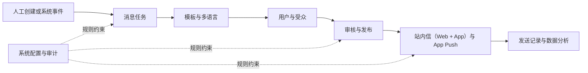

# 消息中心总览 PRD

> 文档版本：V2.3
>
> 产品范围：Web / App 用户站内信 + App Push + 消息运营后台 + 基础数据分析
>
> 当前交付：前端交互原型；产品一期需要真实后台、APNs / FCM 和外部翻译接口

## 1. 摘要

ForX Finance 消息中心为交易所建立统一的消息生产、审核、发送、阅读和分析链路。用户可在 Web 和 App 的站内信中查看系统公告、交易、资产、安全、奖励、活动和风控消息，两端共用消息及已读状态；同时通过 App Push 及时收到重要通知。运营和业务团队可通过后台模板、事件、受众、审批及发送记录完成消息治理。

## 2. 联系人与职责

| 角色 | 负责人 | 职责 |
|---|---|---|
| 产品负责人 | 项目指定 Owner | 范围、优先级、跨模块规则、验收 |
| Web 产品/设计 | Web 团队 | Web 端站内信列表、详情、已读体验 |
| App 团队 | App 团队 | App 站内信、已读同步、Push Token、通知权限、Deep Link、点击埋点 |
| 运营负责人 | 运营团队 | 人工任务、活动消息、目标受众 |
| 业务接入负责人 | 资金/交易/奖励团队 | 系统事件、业务 ID、事件变量 |
| 内容与翻译 | 内容团队 | 模板源文案、多语言内容、翻译审核 |
| 风控与合规 | 风控/合规团队 | 风险等级、强提示、审批、保留和审计 |
| 数据负责人 | 数据团队 | 埋点、口径、报表、数据质量 |
| 技术负责人 | 前后端负责人 | 接口、存储、幂等、性能和监控 |
| QA 负责人 | 测试团队 | 功能、权限、兼容性和异常验收 |

## 3. 背景

当前交易所消息由不同业务分别维护，分类、模板、跳转、风险提示和统计口径不统一。用户容易遗漏资金和风险通知；运营缺少统一的人工发送入口；业务事件缺少稳定的模板与变量协议；管理人员只能看到发送量，无法判断阅读、点击和失败情况。

本版本收敛为交易所核心消息闭环，暂不建设大型全渠道营销平台。

## 4. 产品目标与关键结果

### 4.1 产品目标

1. 为用户提供统一、清晰、可追踪的 Web / App 站内信和 App Push。
2. 覆盖关键系统事件和全站、指定用户、VIP、代理、活动用户的人工消息。
3. 建立多语言模板、外部机翻、人工审核和发布门禁。
4. 对强平、提现风险、账户异常提供强提示和完整审计。
5. 打通消息生成、送达、阅读、点击、失败和过期的数据分析。

### 4.2 关键结果

| 指标 | 目标 | 口径归属 |
|---|---|---|
| 关键事件覆盖率 | 100% | 8 个系统事件场景均可配置已启用任务 |
| 用户消息可追踪率 | 100% | 每条消息可关联来源、任务、模板和用户 |
| 已读状态准确率 | 100% | 单条已读、全部已读和跨设备最终一致 |
| 高风险强提示覆盖率 | 100% | 强平、提现风险、账户异常均命中规则 |
| 跳转白名单覆盖率 | 100% | 所有可点击链接均通过校验 |
| 高风险人工消息审批率 | 100% | 未完成规定审批不得发布 |
| 阅读与点击埋点覆盖率 | 100% | 列表、详情、已读、点击和风险确认均可统计 |
| Push 可追踪率 | 100% | 可关联设备、供应商消息 ID、送达、点击和失败原因 |

## 5. 用户与价值

| 用户 | 核心任务 | 产品价值 |
|---|---|---|
| 普通交易用户 | 查看交易、资产和活动消息 | 在一个入口识别未读与重要信息 |
| 合约用户 | 及时处理强平和风险预警 | 降低被普通消息淹没的风险 |
| VIP/代理用户 | 查看权益、返佣和专属活动 | 准确展示金额、币种和结算时间 |
| 多语言用户 | 使用偏好语言阅读消息 | 通过审核译文和明确回退获得可读内容 |
| 运营人员 | 创建、审核、发送人工消息 | 统一模板、受众、策略和效果追踪 |
| 业务研发 | 接入系统事件 | 通过标准事件和变量复用消息能力 |
| 风控/审计 | 管理高风险消息 | 获得强提示、审批和不可篡改记录 |

## 6. 信息架构

### 6.1 用户端

- 消息中心：分类、消息列表、未读数、全部已读。
- 消息详情：完整正文、风险提示、按钮和安全跳转。
- 风险提示层：紧急风险确认和处理入口。

详见[用户消息中心](./01-用户消息中心.md)。

### 6.2 管理后台

| 一级菜单 | 负责模块 |
|---|---|
| 工作台 | 待办、关键指标、异常入口 |
| 消息任务 | 人工与事件触发任务 |
| 消息模板 | 内容、版本、多语言和预览 |
| 系统事件 | 事件定义、变量和测试事件 |
| 用户与受众 | 人工受众、预估与快照 |
| 审核中心 | 翻译、业务、风险和发布审核 |
| 发送记录 | 用户级、设备级发送结果和重试 |
| 数据分析 | 阅读、点击、风险时效和渠道效果 |
| 系统配置 | 分类、白名单、有效期、权限和审计 |

## 7. 跨模块流程

人工任务按[消息任务](./02-消息任务.md)选择[消息模板与多语言](./03-消息模板与多语言.md)、配置[用户与受众](./05-用户与受众.md)，再进入[审核与发布](./06-审核与发布.md)。系统事件由[系统事件](./04-系统事件.md)进入已启用的事件任务。发布版本由[渠道与发送记录](./07-渠道与发送记录.md)执行，并将结果提供给[数据分析](./08-数据分析.md)。

## 8. 统一约束

- 第一期正式消息渠道为站内信和 App Push；站内信同时呈现在 Web 与 App，并共用同一 `message_id`、未读数和 `read_at`。
- App Push 必须支持 APNs / FCM、Token 生命周期、通知权限、Deep Link、送达/点击回执和失败治理。
- 当前仓库只开发前端原型，所有业务数据为模拟数据。
- 用户 UID、联系方式和设备标识默认脱敏。
- 生产系统必须提供接口幂等、权限校验、审计和可观测性。

## 9. 发布计划

### 9.1 当前交付：前端交互原型

- Web / App 用户列表、分类、详情、已读、全部已读、跨端同步和风险强提示。
- 人工/事件任务、模板、多语言、外部机翻、受众、审批、发送记录和分析页面。
- Push 配置、设备平台、Deep Link、失败原因和渠道分析交互。
- 模拟数据，不连接真实业务、供应商和数据库。

### 9.2 产品一期：生产接入

- 用户消息、已读、全部已读和 Web / App 跨端同步接口。
- 业务事件、幂等、真实模板渲染和受众计算。
- 外部机翻任务、签名回调、主动查询和审核数据入库。
- APNs / FCM、Token 生命周期、通知权限、Deep Link、回执、重试和告警。
- 埋点入库、指标计算、权限和审计。

### 9.3 后续版本

- 邮件与短信。
- 自动化旅程和复杂分群。
- 多供应商路由、成本与故障切换。
- 高级营销归因、自定义报表和实验分析。
- 复杂国家/地区合规中心。

## 10. 假设与风险

| 类型 | 内容 | 应对方式 |
|---|---|---|
| 假设 | 存在统一 UID 和稳定业务事件 ID | 接入前完成数据契约验收 |
| 假设 | 外部机翻支持异步任务、回调和查询 | 提供超时查询与单语言重试 |
| 假设 | App 团队同步交付 Token 和 Deep Link | 将 App 能力列入一期联合验收 |
| 风险 | 重要消息被过度使用 | 限制风险等级权限并升级审批 |
| 风险 | 事件重复生成消息 | 业务 ID、事件编码和状态联合幂等 |
| 风险 | 译文缺失或过期 | 内容哈希、人工审核和发布门禁 |
| 风险 | Push 权限关闭或 Token 失效 | 发送前校验、失效治理和站内信兜底 |
| 风险 | 分析口径不一致 | 统一指标字典、去重规则和更新时间 |
| 风险 | 原型被误认为生产系统 | 页面和文档明确模拟数据与交付边界 |

## 11. 非本总览范围

字段、状态、错误码和页面级验收由对应模块文档定义。本总览不替代模块 PRD。

## 12. 总体验收标准

1. 用户能在 Web 和 App 查看同一套七类站内信、详情、已读状态和安全跳转；任一端标记已读后另一端最终一致。
2. App Push 能通过 APNs / FCM 发送并追踪送达、点击、失败与失效 Token。
3. 运营能创建人工任务，系统事件能通过已启用任务触发消息。
4. 所有目标语言通过人工审核后，模板才可发布和被任务选用。
5. 强平、提现风险、账户异常具备强提示和规定审批。
6. 发送记录和分析可关联来源、任务、事件、模板、受众、用户及渠道。
