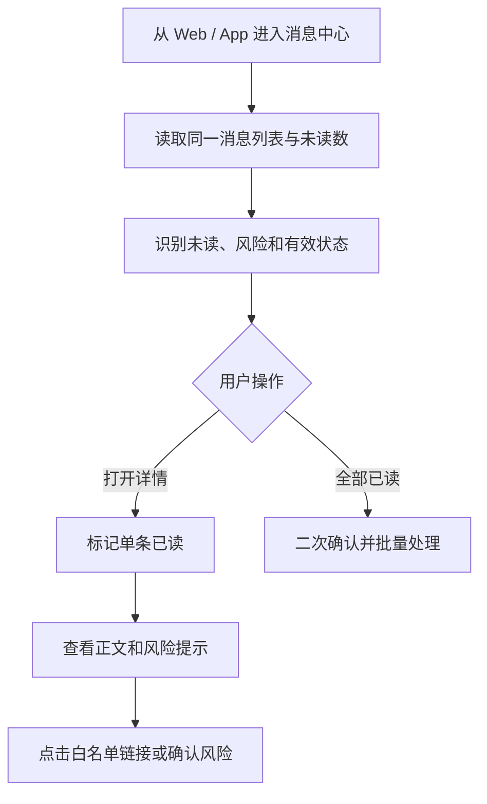

# 用户消息中心 PRD

## 1. 模块摘要

用户消息中心是用户在 Web 和 App 查看同一套站内信、识别未读和风险状态、阅读详情并进入业务页面的统一入口。两端共用消息 ID、未读数和已读状态；App Push 点击后应进入同一消息详情或指定业务页。

## 2. 目标与范围

- 覆盖系统公告、交易通知、资产通知、安全通知、奖励通知、活动通知、风控通知。
- 提供列表、分类、未读数、单条已读、全部已读、详情和安全跳转。
- Web 和 App 使用同一用户消息实例；任一端已读或全部已读后，另一端同步更新，不重复生成消息。
- 对强平预警、提现风险、账户异常提供明显且不可被普通消息弱化的提示。
- 本模块不负责模板生产、受众计算和渠道发送执行。

## 3. 用户与使用场景

| 用户 | 场景 |
|---|---|
| 普通用户 | 查看交易、资产、奖励和活动消息 |
| 合约用户 | 及时识别强平预警和风险变化 |
| VIP/代理 | 查看权益、返佣和专属活动通知 |
| 多语言用户 | 使用用户语言或明确的回退语言阅读消息 |

## 4. 前置条件与依赖

- 消息已由[渠道与发送记录](./07-渠道与发送记录.md)生成用户消息实例。
- 分类、链接和保留规则来自[系统配置与审计](./09-系统配置与审计.md)。
- 标题、摘要、正文和按钮来自已经冻结的模板或临时消息版本。

## 5. 用户流程

## 6. 功能需求

### 6.1 消息分类

| 编码 | 中文名称 | 默认风险 | 示例 |
|---|---|---|---|
| `system_notice` | 系统公告 | 普通 | 维护、升级、规则调整 |
| `trade_notice` | 交易通知 | 普通 | 订单成交、订单状态 |
| `asset_notice` | 资产通知 | 重要 | 充值、提现、资产变化 |
| `security_notice` | 安全通知 | 重要 | 登录异常、设备变化 |
| `reward_notice` | 奖励通知 | 普通 | 体验金、积分、返佣到账 |
| `campaign_notice` | 活动通知 | 普通 | 报名、开始、奖励发放 |
| `risk_notice` | 风控通知 | 紧急 | 强平预警、提现风险 |

分类为系统预置，用户端支持“全部”和七个分类筛选，并支持只看未读。

### 6.2 消息列表

- 默认按消息时间倒序，紧急未过期消息置于普通消息之前。
- 标题和摘要最多展示两行；摘要不得直接渲染 HTML。
- 未读消息显示圆点并加粗标题。
- 24 小时内显示相对时间，超过 24 小时显示日期。
- 显示普通、重要、紧急风险标识和有效、已过期状态。
- 页面顶部显示当前用户的未读总数。
- 必须提供加载、空数据、加载失败和重试状态。

### 6.3 已读操作

- 打开详情成功后自动标记单条已读，也可在列表主动标记。
- 重复标记同一消息应返回成功，不重复计算已读用户。
- 全部已读只处理当前用户可见且未删除的未读消息。
- 全部已读前二次确认；部分失败时展示成功数和失败数，并允许重试失败项。
- Web / App 已读状态以服务端 `read_at` 为事实来源，采用幂等更新；跨端允许短暂延迟，但最终必须一致。

### 6.4 消息详情和跳转

- 展示分类、标题、摘要、正文、消息时间、风险提示、有效期和操作按钮。
- 支持站内路径、App Deep Link 和已备案 Web URL。
- 打开详情和执行跳转时均校验链接；失败时保留详情并提示链接不可用。
- 过期消息仍可按分类保留只读，但不得执行有时效风险的业务动作。

### 6.5 风险强提示

| 风险 | 列表 | 详情 | 行为 |
|---|---|---|---|
| 普通 | 标准样式 | 标准详情 | 无额外要求 |
| 重要 | 橙色标识、靠前 | 顶部警示区 | 提示及时查看 |
| 紧急 | 红色标识、置顶 | 红色警示区 | 明确确认并记录确认时间 |

强提示至少覆盖强平预警、提现风险、账户异常。已读后仍保留风险标签；紧急消息过期未读进入风险分析，不自动变为已读。

## 7. 字段定义

| 字段 | 类型 | 必填 | 说明 |
|---|---|---|---|
| `message_id` | string | 是 | 用户消息唯一 ID |
| `user_id` | string | 是 | 所属用户，后台展示时脱敏 |
| `category_code` | enum | 是 | 七类消息编码 |
| `title` / `summary` / `body` | string | 是 | 已按实际语言冻结的内容 |
| `locale` | string | 是 | 实际渲染语言 |
| `risk_level` | enum | 是 | `normal`、`important`、`urgent` |
| `created_at` | datetime | 是 | 消息时间 |
| `read_at` | datetime | 否 | 首次成功已读时间 |
| `read_client` | enum | 否 | 首次已读来源：`web`、`ios`、`android` |
| `read_synced_at` | datetime | 否 | 最近一次跨端已读同步时间 |
| `clicked_at` | datetime | 否 | 首次有效点击时间 |
| `acknowledged_at` | datetime | 否 | 紧急风险确认时间 |
| `expire_at` | datetime | 否 | 业务动作失效时间 |
| `retention_until` | datetime | 是 | 用户端保留截止时间 |
| `button_text` / `target_url` | string | 否 | 操作按钮和目标 |
| `source_type` / `source_id` | string | 是 | 人工任务或系统事件来源 |
| `status` | enum | 是 | 未读、已读、失败、已删除 |

## 8. 状态与规则

`待生成 → 未读 → 已读`；生成失败进入`失败`。有效消息到期后同时具备`已过期`属性，是否已读取仍由 `read_at` 判断。超过保留时间后不再向用户展示。

语言回退顺序为用户语言 → 同语言通用版本 → 模板默认语言。紧急消息没有可用内容时不得静默发送。

## 9. 权限与审计

- 用户只能读取和操作自己的消息。
- 后台查询 UID、设备和联系方式时默认脱敏。
- 全部已读异常、风险确认和链接拦截需要记录审计或安全日志。

## 10. 异常与边界

- 消息被删除或无权限：展示安全空状态，不泄露标题或来源。
- 正文超长：详情可滚动，列表保持两行省略。
- 链接过期或不在白名单：禁止跳转并提示。
- 全部已读请求重复：保持幂等。
- 网络失败：不提前改变本地已读状态，允许重试。

## 11. 数据与埋点

至少记录 `message_list_view`、`message_detail_open`、`message_mark_read`、`message_mark_all_read`、`message_link_click`、`risk_message_ack`。详细口径见[数据分析](./08-数据分析.md)。

## 12. 验收标准

1. 用户能看到标题、摘要、分类、时间、已读和有效状态。
2. “全部”和七个分类、只看未读均能正确筛选。
3. 单条已读、打开自动已读和全部已读可操作且幂等。
4. 详情展示完整内容，白名单内链接可跳转，非法链接被阻止。
5. 强平预警、提现风险、账户异常在列表和详情中均有强提示。
6. 过期消息不能执行失效业务动作，但阅读统计保持准确。
7. 同一消息在 Web 与 App 使用同一 `message_id`；任一端标记已读后另一端未读数同步减少，重复操作保持幂等。

## 13. 非本模块范围

邮件、短信、社交分享和用户删除消息不在一期范围。App 原生站内信列表属于一期正式范围。
