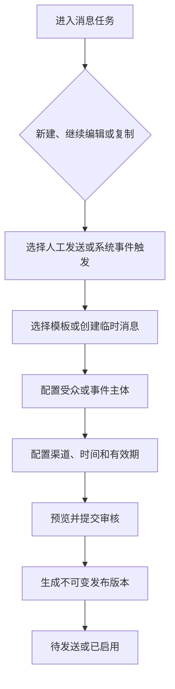

# 消息任务 PRD

## 1. 模块摘要

消息任务是消息发布的编排主体，承载来源、模板、受众、发送策略、审批和执行状态。任务分为人工发送和系统事件触发两类。

## 2. 目标与范围

- 支持新建、保存草稿、继续编辑、复制、提交审核、发布、取消和查看详情。
- 支持人工任务和事件触发任务使用统一的模板、审批和发送链路。
- 冻结发布时的内容、模板版本、受众和策略，保证发送可追溯。
- 发送中和已完成任务不可编辑；其他状态在权限和状态允许时可以再次编辑。

## 3. 用户与使用场景

| 角色 | 场景 |
|---|---|
| 运营人员 | 创建全站、指定用户、VIP、代理或活动用户消息 |
| 业务研发 | 为系统事件建立长期启用的触发任务 |
| 审核人员 | 检查任务冻结版本并决定通过或驳回 |
| 任务所有者 | 修改被驳回、失败、取消或过期的任务后再次提交 |

## 4. 前置条件与依赖

- 选用模板必须满足[消息模板与多语言](./03-消息模板与多语言.md)发布门禁。
- 人工任务依赖[用户与受众](./05-用户与受众.md)生成受众快照。
- 事件任务依赖[系统事件](./04-系统事件.md)中的事件定义和变量。
- 提交和发布规则由[审核与发布](./06-审核与发布.md)控制。

## 5. 用户流程

## 6. 功能需求

### 6.1 任务来源

- `manual`：人工发送。必须选择人工受众和立即/定时发送策略。
- `system_event`：系统事件触发。必须选择事件、已发布模板版本和触发策略，审批通过后进入已启用。

### 6.2 创建入口

- 新建消息：创建空白草稿。
- 继续编辑：打开可编辑任务的当前草稿版本。
- 复制任务：复制内容和策略为新草稿，不复制任务 ID、审批记录、受众快照和发送结果。
- 模板消息：选择已有已发布模板版本。
- 临时消息：直接维护源文案；如选择多语言，必须创建翻译批次并通过相同发布门禁。

### 6.3 配置步骤

1. 基础信息：任务名称、来源、分类、风险、发送原因和关联工单。
2. 内容与渠道：模板/临时内容、语言、变量示例、站内信（Web + App）、App Push，以及 Web 站内信预览、App 站内信预览、App Push 预览。
3. 目标：人工受众或系统事件主体与变量映射。
4. 策略：立即/定时/事件到达、时区、有效期、保留时间、频控、重试和优先级。
5. 检查提交：展示完整摘要、阻断原因和审批链。

### 6.4 编辑规则

- `发送中`和`已完成`任务不可编辑。
- 草稿、待审核、已驳回、已取消、待发送、失败、部分失败、已过期、已启用等非发送中/已完成状态可以再次编辑，但必须具有编辑权限。
- 编辑待审核或已通过版本前需撤回原审批；任何受保护字段变化都会使原审批失效。
- 编辑已启用事件任务时，保存为待审核的新版本；旧启用版本持续生效，直到新版本发布，避免事件处理中断。
- 已发布模板版本不可被任务内覆盖，只能改选新模板版本。

### 6.5 预览和校验

提交前必须校验必填内容、变量、链接白名单、模板与翻译状态、受众或事件配置、渠道、有效期、定时时间、风险等级和操作者权限。页面必须同时显示 Web 站内信预览、App 站内信预览和 App Push 预览，而不是只弹提示；两种站内信预览使用同一份站内信内容。

## 7. 字段定义

| 分组 | 字段 | 说明 |
|---|---|---|
| 标识 | `task_id`、`task_name`、`trigger_type` | 唯一标识、名称、人工/事件 |
| 基础 | `category_code`、`risk_level`、`reason`、`ticket_id` | 分类、风险和业务依据 |
| 内容 | `content_source`、`template_id`、`template_version`、`locales` | 模板或临时内容及冻结版本 |
| 变量 | `variable_values`、`event_variable_mapping` | 人工值或事件字段映射 |
| 目标 | `audience_type`、`audience_config`、`audience_snapshot_id` | 人工任务受众 |
| 事件 | `event_id`、`event_code`、`trigger_condition` | 事件任务配置 |
| 渠道 | `channels`、`fallback_policy` | `inbox`、`push`及兜底 |
| 时间 | `schedule_type`、`schedule_at`、`timezone` | 立即、定时或事件到达 |
| 生命周期 | `ttl_seconds`、`expire_at`、`retention_days` | 任务/消息有效期和保留 |
| 控制 | `frequency_cap`、`priority`、`dedupe_window`、`max_retries` | 频控、优先级、去重和重试 |
| 审批 | `approval_flow`、`approval_status`、`submitted_version` | 审批链和冻结版本 |
| 审计 | `created_by`、`created_at`、`updated_by`、`updated_at` | 创建与修改信息 |

## 8. 状态与规则

### 8.1 人工任务

`草稿 → 待审核 → 已通过 → 待发送 → 发送中 → 已完成`

分支状态：`已驳回`、`已取消`、`部分失败`、`失败`、`已过期`。非发送中和已完成状态可再次编辑；重新提交会生成新的冻结版本。

### 8.2 事件任务

`草稿 → 待审核 → 已通过 → 已启用 → 已停用/已过期`

已启用表示事件路由可使用该任务。任务运行产生发送记录，不把任务本身改成发送中或已完成。

## 9. 权限与审计

- 创建人与最终审核人不能相同。
- 复制、撤回、编辑、提交、启用、停用和取消均记录操作者、对象版本、时间和结果。
- 全站、紧急和高影响任务需要更高权限与升级审批。

## 10. 异常与边界

- 模板被停用：未发布任务阻断；已冻结发送版本按风险策略决定是否取消。
- 定时时间已过去：禁止提交，要求重新选择时间。
- 有效期早于发送时间：禁止提交。
- 受众快照失效：要求重新计算并确认。
- 事件字段与模板变量不匹配：禁止启用。
- 重复点击提交：使用任务版本和幂等键防止重复审批。

## 11. 数据与埋点

记录任务创建、保存、预览、提交、撤回、复制、发布、启用、停用、开始发送、完成和失败事件。分析维度包括触发类型、分类、风险、模板版本、受众类型、渠道和创建团队。

## 12. 验收标准

1. 可创建人工发送和系统事件触发任务。
2. 临时消息选择多语言时能进入外部机翻和人工审核流程。
3. 提交前能看到 Web 站内信预览、App 站内信预览和 App Push 预览及完整配置摘要。
4. 人工任务审批通过后进入待发送；事件任务审批通过后进入已启用。
5. 除发送中和已完成外的任务可按规则再次编辑。
6. 修改受保护字段后旧审批失效，并生成新的冻结版本。

## 13. 非本模块范围

自动化旅程、A/B 实验、复杂批次编排、多供应商成本路由不在一期范围。
