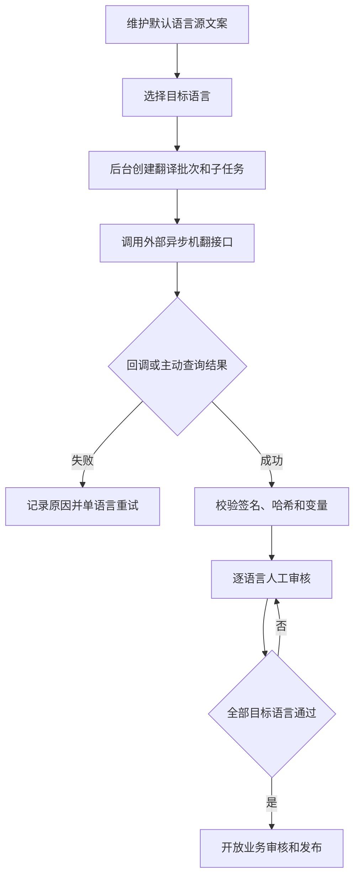

# 消息模板与多语言 PRD

## 1. 模块摘要

本模块统一管理消息内容、渠道文案、模板变量、版本、预览和多语言生产。操作者选择目标语言后，由后台调用外部异步机翻任务接口；结果返回后逐语言人工审核，全部通过才允许模板发布和任务选用。

## 2. 目标与范围

- 为 Web / App 共用的站内信和独立的 App Push 提供可版本化内容。
- 支持默认语言源文案、目标语言、外部机器翻译、人工修订和审核。
- 防止变量破坏、过期回调、自审和未审核内容发布。
- 支持模板内容预览和任务使用关系查看。

## 3. 用户与使用场景

| 角色 | 能力 |
|---|---|
| 内容编辑 | 创建模板、维护源文案、选择语言、提交机翻 |
| 翻译审核 | 对照源文案修订、通过或驳回译文 |
| 业务审核 | 审核已经通过翻译门禁的模板版本 |
| 运营人员 | 在任务中选择可用模板版本并预览 |

## 4. 前置条件与依赖

- 分类、链接白名单和默认有效期来自[系统配置与审计](./09-系统配置与审计.md)。
- 外部翻译服务由后台适配，浏览器不得直接访问供应商。
- 发布后的模板由[消息任务](./02-消息任务.md)选用。

## 5. 用户流程

## 6. 功能需求

### 6.1 模板与版本

- 模板按编码管理，已发布版本不可覆盖，只能新建版本。
- 支持草稿、送审、发布、停用和归档。
- 列表展示分类、渠道、语言覆盖、版本、状态和使用任务数。
- 详情显示被哪些人工任务或事件任务使用。

### 6.2 渠道内容

- 站内信（Web + App 共用）：标题、摘要、正文、风险文案、按钮文字、目标链接。
- App Push：Push 标题、Push 正文、图片、Deep Link、折叠键和优先级。
- 编辑时实时提供 Web 站内信预览、App 站内信预览和 App Push 预览、变量示例和长度提示；两种站内信预览渲染同一内容对象。

### 6.3 多语言生产

- 默认语言由操作者维护，不进入机器翻译。
- 操作者明确选择目标语言后，后台按模板不可变版本创建一个有效翻译批次。
- 每种目标语言创建独立子任务并取得 `external_task_id`。
- 外部结果优先通过签名回调接收；超时或回调丢失时主动查询。
- 部分语言失败时保留成功结果，只重试失败语言。
- 译文进入待人工审核后，审核人可以直接通过、修订后通过或填写原因驳回重翻。
- 创建人与翻译审核人不能相同。

### 6.4 发布门禁

任一目标语言处于排队、翻译中、翻译失败、待人工审核、审核驳回或取消状态时，整个模板版本不得进入业务审核、发布或任务选用。已审核内容或源文案发生变化时，相应审核结论立即失效。

### 6.5 变量与回退

标准变量至少包括：`user_nickname`、`amount`、`currency`、`symbol`、`occurred_at`。机翻前后校验变量名称和数量，变量被翻译、删除或新增时禁止人工通过。

语言回退为用户语言 → 同语言通用版本 → 默认语言。紧急消息缺少可用语言时禁止静默发送。

## 7. 字段定义

### 7.1 模板

| 字段 | 类型 | 必填 | 说明 |
|---|---|---|---|
| `template_id` / `template_code` | string | 是 | 模板 ID 与稳定编码 |
| `template_name` | string | 是 | 后台名称 |
| `category_code` / `risk_level` | enum | 是 | 分类和默认风险 |
| `default_locale` | string | 是 | 默认源语言 |
| `supported_locales` | string[] | 是 | 已选择目标语言集合 |
| `channels` | enum[] | 是 | `inbox`、`push` |
| `variables_schema` | object | 是 | 名称、类型、必填和格式 |
| `version` | integer | 是 | 不可变发布版本号 |
| `status` | enum | 是 | 模板状态 |
| `valid_from` / `valid_to` | datetime | 否 | 模板可用时间 |

### 7.2 语言内容

`locale`、`title`、`summary`、`body`、`risk_copy`、`button_text`、`target_url`、`push_title`、`push_body`、`push_image_url`、`deep_link`。

### 7.3 翻译批次

| 字段 | 类型 | 说明 |
|---|---|---|
| `translation_batch_id` | string | 平台批次 ID |
| `object_type` | enum | `message_template_version` 或 `temporary_message_version` |
| `object_id` / `object_version` | string | 对象和不可变版本 |
| `source_locale` / `target_locales` | string/string[] | 源语言与目标语言 |
| `status` | enum | 批次聚合状态 |
| `total_count` / `completed_count` | integer | 总数与机翻完成数 |
| `approved_count` / `failed_count` | integer | 人审通过与失败数 |
| `created_by` / `created_at` / `updated_at` | string/datetime | 创建和更新时间 |

### 7.4 翻译子任务

| 字段 | 类型 | 说明 |
|---|---|---|
| `translation_item_id` / `translation_batch_id` | string | 子任务和所属批次 |
| `target_locale` | string | 目标语言 |
| `external_task_id` | string | 外部机翻任务 ID |
| `attempt_no` | integer | 当前尝试次数 |
| `status` | enum | 子任务状态 |
| `source_content_hash` | string | 源文案哈希 |
| `machine_*` | string | 外部机翻原始内容 |
| `reviewed_*` | string | 人工确认或修订内容 |
| `error_code` / `error_message` | string | 外部错误 |
| `submitted_at` / `translated_at` / `reviewed_at` | datetime | 流程时间 |
| `reviewer_id` / `review_result` / `review_comment` | string | 审核记录 |

### 7.5 外部接口约束

- 创建任务同步返回是否受理和 `external_task_id`。
- 回调携带签名、时间戳、防重放信息、外部任务 ID、源内容哈希和结果。
- 查询接口用于回调超时兜底，不替代正常回调。
- 回调和查询结果必须幂等，过期哈希结果丢弃并审计。

## 8. 状态与规则

模板：`草稿 → 审核中 → 已发布 → 已停用 → 已归档`。

翻译批次：`未提交 → 机翻处理中 → 待人工审核 → 全部审核通过`；分支为`部分失败`、`审核被驳回`、`已取消`。

语言子任务：`未提交 → 排队中 → 翻译中 → 待人工审核 → 审核通过`；分支为`翻译失败`、`审核驳回`、`已取消`。

## 9. 权限与审计

必须记录提交机翻、外部任务 ID 绑定、回调验签、主动查询、失败重试、人工修订、通过/驳回、源文案变化导致审核失效、业务审核和模板发布。

## 10. 异常与边界

- 外部任务未受理：子任务进入翻译失败，整版禁止发布。
- 回调超时：主动查询；超过最大等待时间后标记失败。
- 重复回调：幂等处理。
- 源哈希不匹配：丢弃过期结果并记录审计。
- 服务不可用：显示服务异常并允许稍后重试，不允许绕过人工审核。
- 变量不一致或链接非法：禁止审核通过。

## 11. 数据与埋点

统计批次受理率、各语言翻译成功率、平均返回时长、人审通过率、驳回率、重试次数和从创建到发布的总时长。

## 12. 验收标准

1. 操作者可维护源文案、选择目标语言并创建外部机翻任务。
2. 页面展示批次 ID、external_task_id 和逐语言状态。
3. 回调失败时能展示主动查询和单语言重试结果。
4. 审核人可对照源文案修订后通过，或填写原因驳回。
5. 任一语言未通过时发布和任务选用均被阻止。
6. Web 站内信预览、App 站内信预览和 App Push 预览均展示真实内容效果，且两种站内信内容一致。
7. 模板列表能查看人工任务和事件任务的使用关系。

## 13. 非本模块范围

专业人工翻译供应商管理、翻译记忆库、术语库运营和自动语言质量评分不在一期范围。
