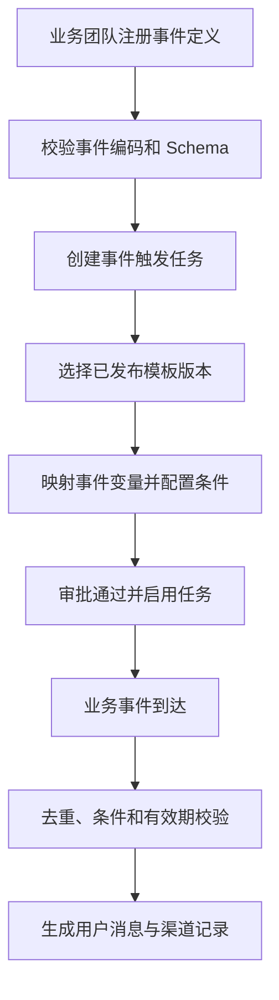

# 系统事件 PRD

## 1. 模块摘要

系统事件为充值、提现、成交、强平、奖励和返佣等业务行为提供标准消息触发入口。事件定义只描述事件编码、Schema 和治理规则；真正的模板、触发条件、变量映射和发送策略由已启用的事件触发任务承载。

## 2. 目标与范围

- 标准化关键业务事件及变量。
- 允许一个事件关联多个任务，按条件形成不同消息策略。
- 通过去重、有效期、重试和测试事件保证触发安全。
- 阻止事件直接绑定模板，避免模板版本和发送策略散落在事件定义中。

## 3. 用户与使用场景

| 角色 | 场景 |
|---|---|
| 业务研发 | 注册事件编码、Schema、业务 ID 和发生时间 |
| 消息平台管理员 | 审核事件定义、查看关联任务和运行状态 |
| 运营/内容 | 创建事件触发任务并选择模板版本 |
| QA | 发送测试事件，验证路由、变量、内容和发送记录 |

## 4. 前置条件与依赖

- 事件任务遵循[消息任务](./02-消息任务.md)生命周期。
- 事件任务只能选用满足[消息模板与多语言](./03-消息模板与多语言.md)门禁的模板版本。
- 任务审批和启用遵循[审核与发布](./06-审核与发布.md)。
- 实际生成和投递由[渠道与发送记录](./07-渠道与发送记录.md)负责。

## 5. 用户流程

## 6. 功能需求

### 6.1 必须支持的事件

| 事件编码 | 场景 | 默认分类 | 默认风险 | 关键变量 |
|---|---|---|---|---|
| `deposit.credited` | 充值到账 | 资产通知 | 重要 | 金额、币种、时间 |
| `withdrawal.succeeded` | 提现成功 | 资产通知 | 重要 | 金额、币种、地址、时间 |
| `withdrawal.failed` | 提现失败 | 资产通知 | 重要 | 金额、币种、失败原因、时间 |
| `order.filled` | 订单成交 | 交易通知 | 普通 | 交易对、方向、价格、数量、时间 |
| `liquidation.warning` | 强平预警 | 风控通知 | 紧急 | 交易对、保证金率、标记价格、时间 |
| `trial_fund.credited` | 体验金到账 | 奖励通知 | 普通 | 金额、币种、有效期 |
| `points.credited` | 积分到账 | 奖励通知 | 普通 | 积分值、来源、时间 |
| `commission.credited` | 返佣到账 | 奖励通知 | 普通 | 金额、币种、结算周期、时间 |

提现成功与提现失败必须使用不同事件和不同模板内容。

### 6.2 事件定义

- 事件编码全局唯一，发布后不可修改；变更 Schema 使用新版本。
- Schema 定义字段名、类型、必填性、示例、敏感等级和说明。
- 必须提供 `business_id`、`subject_user_id`、`occurred_at` 和 `event_version`。
- 事件可以查看关联任务数量、已启用任务数量和最近测试时间，但不保存模板 ID。

### 6.3 事件触发任务

- 一个事件可关联多个事件任务；任务通过触发条件决定是否匹配。
- 任务冻结事件版本、模板 ID、模板版本、变量映射、渠道、TTL、去重窗口和重试策略。
- 同一事件下如多个已启用任务同时匹配，分别生成消息；任务 ID 纳入去重键。
- 事件主体用户作为默认受众，不允许在事件任务中手工上传 UID 名单。

### 6.4 变量映射

- 支持同名字段自动映射和人工选择事件字段。
- 所有模板必填变量必须映射；字段类型必须兼容。
- 金额、币种、交易对和时间等变量不得用不可审计的自由文本代替。
- 事件 Schema 变化后，受影响任务进入配置异常，不再接受新事件，直到新版本审核启用。

### 6.5 条件、幂等和重试

- 触发条件支持基于事件字段的安全表达式；禁止执行脚本。
- 默认去重键为 `event_code + business_id + event_status + task_id`。
- 相同去重键在去重窗口内只生成一条用户消息。
- TTL 从 `occurred_at` 计算，超过 TTL 的迟到事件不发送并记录过期。
- 临时错误按任务退避策略重试；永久数据错误不重试。

### 6.6 测试事件

- 事件详情提供“发送测试事件”和“创建触发任务”。
- 测试表单按 Schema 生成字段，并提供示例值。
- 测试事件只进入测试用户或测试环境，结果展示命中任务、模板版本、渲染内容、渠道和错误。
- 没有已启用任务时明确提示“未找到可用触发任务”，不得伪造发送成功。

## 7. 字段定义

### 7.1 事件定义

| 字段 | 类型 | 必填 | 说明 |
|---|---|---|---|
| `event_id` / `event_code` | string | 是 | 内部 ID 和稳定编码 |
| `event_name` | string | 是 | 后台名称 |
| `event_version` | integer | 是 | Schema 版本 |
| `owner_team` | string | 是 | 业务责任团队 |
| `schema` | object | 是 | 字段协议 |
| `default_category` / `default_risk_level` | enum | 是 | 创建任务时的默认值 |
| `status` | enum | 是 | 草稿、已注册、已停用 |
| `created_at` / `updated_at` | datetime | 是 | 时间 |

### 7.2 事件信封

`event_code`、`event_version`、`business_id`、`event_status`、`subject_user_id`、`occurred_at`、`produced_at`、`payload`、`trace_id`。

### 7.3 事件任务策略

`task_id`、`template_id`、`template_version`、`trigger_condition`、`variable_mappings`、`dedupe_window_seconds`、`ttl_seconds`、`max_retries`、`retry_backoff`、`enabled_version`。

## 8. 状态与规则

事件定义：`草稿 → 已注册 → 已停用`。已停用事件不接收新数据，但保留历史任务和记录。

事件任务：`草稿 → 待审核 → 已通过 → 已启用 → 已停用/已过期`。只有已启用版本参与路由。新版本启用时原版本原子失效。

事件处理：`已接收 → 已去重/条件不匹配/已过期/处理中 → 已生成/失败`。

## 9. 权限与审计

- 业务研发可提交事件定义，管理员负责注册或停用。
- 事件任务创建人与最终审核人不得相同。
- 注册、Schema 变更、测试事件、任务启停、事件接收、去重和失败均保留 trace 与审计记录。

## 10. 异常与边界

- 未知事件编码或版本：拒绝并告警。
- 缺少业务 ID、主体用户或必填变量：永久失败，不重试。
- 重复事件：返回幂等成功，不重复生成消息。
- 无已启用任务：记录未路由，不生成消息。
- 模板版本被停用：按发布冻结策略处理；新任务不得选用。
- 事件到达乱序：按业务状态和发生时间判定，不覆盖更新状态。

## 11. 数据与埋点

统计事件接收量、合法率、去重率、未路由率、任务命中率、生成成功率、平均处理时长、迟到率和失败原因分布。

## 12. 验收标准

1. 八个关键事件均有完整编码、分类、风险和变量定义。
2. 系统事件页面展示关联任务，而不是直接绑定模板。
3. 可从事件创建预选事件编码的事件触发任务。
4. 只有已启用任务和已发布模板版本可以处理事件。
5. 测试事件能显示命中任务并生成测试发送记录。
6. 重复、过期、字段缺失和无路由事件均有明确结果且不误发。

## 13. 非本模块范围

业务交易状态机、资金记账、行情计算和跨业务事件总线建设不属于消息中心范围。
