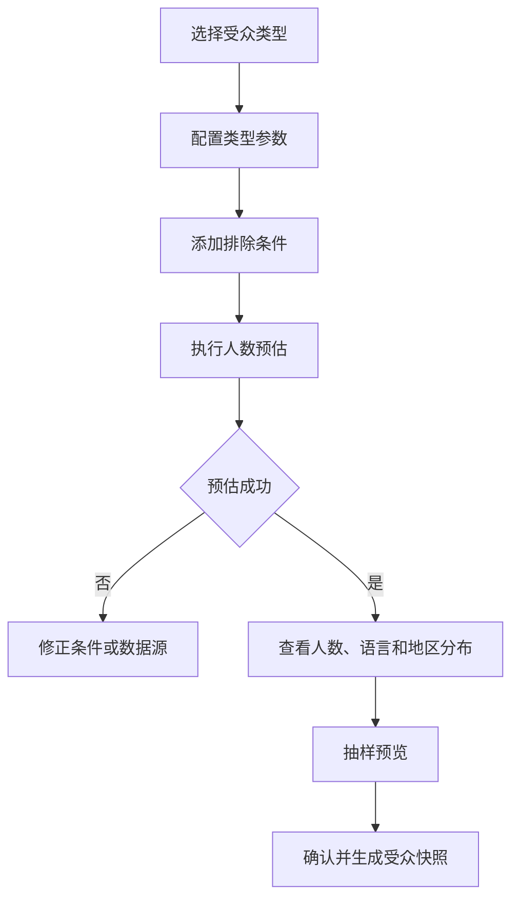

# 用户与受众 PRD

## 1. 模块摘要

本模块为人工消息选择目标用户，提供范围配置、包含与排除、人数预估、抽样预览和不可变受众快照。事件通知规则使用事件主体映射，不使用人工人群快照。

## 2. 目标与范围

- 支持全站、指定用户、指定 VIP、指定代理、活动参与用户五种人工受众。
- 在发送前展示覆盖、去重、排除、无有效渠道和语言分布。
- 通过快照保证审批看到的人群与发送使用的人群一致。
- 默认脱敏用户数据并限制导出。

## 3. 用户与使用场景

| 角色 | 场景 |
|---|---|
| 运营人员 | 配置受众条件、排除用户和查看抽样 |
| 数据团队 | 提供 VIP、代理、活动和用户属性数据 |
| 审核人员 | 检查人数、范围、抽样和风险 |
| 审计员 | 追踪名单来源、计算版本和导出行为 |

## 4. 前置条件与依赖

- 人工受众归属于[消息任务](./02-消息任务.md)。
- 渠道可达性依赖[渠道与发送记录](./07-渠道与发送记录.md)中的用户渠道状态。
- 用户、VIP、代理和活动参与数据由外部业务系统提供。

## 5. 用户流程

## 6. 功能需求

### 6.1 受众类型

1. 全站：全部满足账户与合规条件的有效用户。
2. 指定用户：手工输入或上传 UID；显示有效、重复、无效和无权限数量。
3. 指定 VIP：选择一个或多个 VIP 等级，可配置统计时点。
4. 指定代理：输入代理 UID、代理编号或选择代理层级。
5. 活动参与用户：选择活动 ID 和报名、参与、完成、获奖等参与状态。

### 6.2 指定 UID CSV 导入

- 文件必须为 UTF-8 `.csv`，包含必填 `uid` 列，可包含不参与发送的 `remark` 列。
- 支持 UTF-8 BOM、逗号分隔和双引号包裹字段；单文件最大 10 MB、最多 100,000 个数据行。
- UID 按字符串处理并匹配 `^[A-Za-z0-9_-]{1,64}$`，不得转换为数字。
- 手动 UID 与 CSV UID 合并去重；页面展示文件总行数、有效、重复、无效和最终数量。
- 无效 UID 被排除，操作者必须确认排除结果后才能继续配置任务。
- 再次上传替换上一份 CSV；删除 CSV 只移除 CSV 来源 UID，保留手动 UID。
- 前端原型只执行格式校验；正式环境由用户服务校验用户存在性、账户状态、触达权限、地区限制和抑制名单。

### 6.3 包含与排除

- 同一任务只有一个主受众类型，允许附加简单条件。
- 支持排除 UID、内部测试账号、冻结账号、注销账号、受限制地区和已退订营销消息用户。
- 安全、资产和风控事务消息是否允许退订由分类配置决定。
- 一期不支持三层嵌套、复杂交并差和生命周期自动旅程。

### 6.4 预估与抽样

- 展示原始覆盖数、去重数、排除数、最终预计数、无 Web 账户数、无有效 Push 数。
- 展示用户语言、地区、VIP 等级和渠道可达性分布。
- 抽样只展示脱敏 UID 和审核所需属性，不展示手机号、邮箱或完整设备信息。
- 预估数据必须显示数据时间和计算版本。

### 6.5 受众快照

- 操作者确认后生成不可变 `audience_snapshot_id`。
- 提交审核冻结快照 ID、条件 JSON、数据版本、统计结果和内容哈希。
- 修改受众条件必须重新预估、确认和审批。
- 定时发送默认使用审批时快照；如业务选择发送时重算，必须重新确认风险并在任务中明确标注，本期默认不启用。

### 6.6 事件主体用户

事件通知规则默认将事件信封中的`subject_user_id`映射为目标用户。测试事件只能使用授权测试 UID。事件主体不存在、被注销或无消息资格时不生成用户消息，并在触发记录中保存原因。

## 7. 字段定义

| 字段 | 类型 | 必填 | 说明 |
|---|---|---|---|
| `audience_config_id` | string | 是 | 可编辑配置 ID |
| `audience_type` | enum | 是 | `all`、`uid`、`vip`、`agent`、`activity` |
| `include_rules` | object | 是 | 主类型及简单包含条件 |
| `exclude_rules` | object | 否 | 排除条件 |
| `source_reference` | string | 否 | 名单、活动或数据版本 |
| `estimated_total` | integer | 是 | 原始覆盖数 |
| `deduplicated_count` | integer | 是 | 去重后数量 |
| `excluded_count` | integer | 是 | 排除数量 |
| `unreachable_inbox_count` | integer | 是 | 无站内账户数量 |
| `unreachable_push_count` | integer | 是 | 无有效 Push 数量 |
| `final_count` | integer | 是 | 最终预计人数 |
| `source_file_name` / `source_file_hash` | string | 否 | 指定 UID CSV 文件名和内容哈希 |
| `valid_uid_count` / `invalid_uid_count` / `duplicate_uid_count` | integer | 否 | CSV 格式校验与去重统计 |
| `locale_distribution` / `region_distribution` | object | 是 | 语言和地区分布 |
| `data_as_of` / `calculation_version` | datetime/string | 是 | 数据时间和算法版本 |

快照额外包含 `audience_snapshot_id`、`config_hash`、`created_by`、`created_at` 和 `sample_user_ids_masked`。

## 8. 状态与规则

受众配置：`编辑中 → 预估中 → 预估成功 → 已确认`；异常状态为`预估失败`、`数据已过期`。

受众快照创建后不可修改。超过配置的数据新鲜度阈值时，任务提交前要求重新预估。全站或高人数受众自动升级审批。

## 9. 权限与审计

- UID 名单上传、下载和抽样查看按最小权限授权。
- 用户 UID、手机号、邮箱和设备标识默认脱敏。
- 记录条件变化、名单文件摘要、预估、快照、抽样查看、导出和删除。

## 10. 异常与边界

- 名单包含无效或重复 UID：展示明细统计，有效部分可继续。
- VIP/代理/活动数据源不可用：预估失败，禁止提交。
- 最终人数为 0：禁止提交。
- 人数较预估异常增长：发布前触发二次风险确认。
- 用户只有部分渠道可达：按任务渠道和兜底策略处理。

## 11. 数据与埋点

统计各受众类型任务数、预估与实际差异、排除率、无有效 Push 比例、语言分布和受众计算失败率。

## 12. 验收标准

1. 支持全站、指定用户、指定 VIP、指定代理和活动参与用户。
2. 指定用户支持手动输入和 CSV 上传，二者合并去重；展示有效、重复、无效和最终数量，并要求确认排除无效 UID。
3. 预估展示覆盖、排除、渠道可达性、语言和地区分布。
4. 抽样数据脱敏，未授权人员不能下载完整名单。
5. 确认后生成不可变受众快照，修改条件需重新审批。
6. 事件通知规则固定使用事件主体映射，不显示人工名单配置。

## 13. 非本模块范围

复杂实时画像、三层嵌套条件、自动生命周期人群和通用 CDP 建设不在一期范围。
