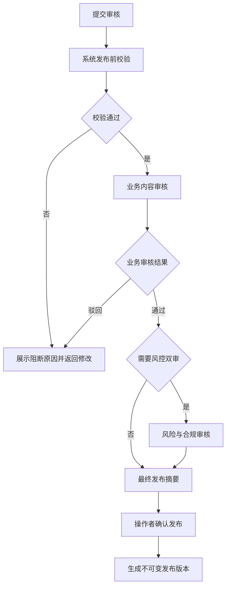

# 审核与发布 PRD

## 1. 模块摘要

本模块在人工消息发布、事件通知规则启用或规则内容版本热切换前完成内容、翻译、受众、风险和权限检查，形成不可变发布版本。

## 2. 目标与范围

- 确保未完成翻译、变量、链接、受众和风险检查的任务无法发布。
- 让审核人看到与最终发送完全一致的冻结版本和预览。
- 支持通过、驳回、撤回、重新提交和发布确认。
- 保留完整审批链和关键操作审计。

## 3. 用户与使用场景

| 角色 | 能力 |
|---|---|
| 创建人 | 提交、撤回、修改并重新提交 |
| 语言审核 | 普通语言在来源页确认，小语种在“多语言审核”专项复核 |
| 业务审核 | 审核内容、受众、发送理由和业务准确性 |
| 风控审核 | 审核紧急、全站和高影响消息 |
| 发布操作员 | 查看最终摘要并确认发布 |
| 审计员 | 只读查看版本、结论、意见和日志 |

## 4. 前置条件与依赖

- 任务配置来自[消息任务](./02-消息任务.md)。
- 翻译状态来自[消息模板与多语言](./03-消息模板与多语言.md)。
- 人工任务受众来自[用户与受众](./05-用户与受众.md)。
- 权限、风险和链接规则来自[系统配置与审计](./09-系统配置与审计.md)。

## 5. 用户流程

## 6. 功能需求

### 6.1 发布前校验

必须检查：必填内容、模板状态和版本、多语言人工审核、变量及示例、链接白名单、受众/事件配置、渠道、有效期、定时时间、风险等级、审批链和操作者权限。每个阻断项需要定位到具体配置步骤。

### 6.2 审批路由

| 场景 | 最低审批要求 |
|---|---|
| 普通消息 | 运营单审；已批准模板可按配置免内容复审 |
| 重要消息 | 业务审核 |
| 紧急消息 | 业务 + 风控双审 |
| 全站消息 | 业务 + 风控双审 |
| 多语言内容 | 所有目标语言先完成翻译人工审核 |
| 高影响配置变更 | 管理员或合规追加审核 |

创建人与最终业务审核人不能相同。普通语言是否允许提交人确认、小语种审核组与职责分离要求由逐语言策略决定。

### 6.3 审核工作台

审核中心只处理业务与风控审批，不再混入翻译待办。普通语言可在对应来源页面的多语言进度抽屉内直接查看机翻、保存修订并确认；小语种在该抽屉内只读，专项修改和审核仅位于独立“多语言审核”。

- 列表展示任务、触发类型、风险、受众规模、渠道、计划时间、提交人和等待时长。
- 详情展示 Web 站内信预览、App 站内信预览和 App Push 预览、各语言状态、模板版本、事件策略或受众快照、有效期和修改差异。
- 审核人可执行“通过审核”，或填写必填原因后执行“驳回审核”；紧急/全站审批意见不得为空。
- 事件通知规则详情必须展示事件编码、条件、主体映射、去重、TTL、重试策略和当前内容版本。
- 规则内容版本审批必须展示全部目标语言、外部机翻任务结果、人工审核结论和相对当前版本的差异。

### 6.4 版本冻结

提交审核时冻结任务版本、模板版本、语言内容哈希、变量、受众快照/事件配置、渠道、时间、有效期和审批路由。审批通过后任何受保护字段变化均使审批失效，并生成新版本重新提交。

### 6.5 发布与启用

- 人工任务发布后进入待发送或按计划立即进入发送中。
- 事件通知规则审核通过后进入已启用，不创建一次性受众快照。
- 新规则内容版本审核通过后进入待生效；发布时原子切换`current_content_version_id`，规则状态保持已启用。
- 发布前再次展示覆盖人数或事件策略、内容预览、渠道、时间、有效期和风险提示。
- 取消发布保持待发布状态，不生成执行记录。

### 6.6 撤回与驳回

- 提交人可在最终发布前执行“撤回审核”；撤回记录原因，人工任务回到`草稿`。
- 驳回必须选择问题类型并填写意见；人工任务进入`待修改`，可修改后重新提交。
- 已进入发送中的人工任务不能撤回；只能按运行规则暂停或取消未执行部分。

## 7. 字段定义

| 字段 | 类型 | 必填 | 说明 |
|---|---|---|---|
| `approval_id` | string | 是 | 审批实例 ID |
| `object_type` / `object_id` | string | 是 | 模板、任务或配置对象 |
| `object_version` | string | 是 | 冻结版本 |
| `risk_level` | enum | 是 | 普通、重要、紧急 |
| `approval_route` | object | 是 | 审批节点和顺序 |
| `current_node` | string | 是 | 当前节点 |
| `status` | enum | 是 | 审批状态 |
| `submitted_by` / `submitted_at` | string/datetime | 是 | 提交信息 |
| `reviewer_id` / `reviewed_at` | string/datetime | 否 | 当前审核信息 |
| `decision` / `comment` | string | 否 | 结论与意见 |
| `snapshot_hash` | string | 是 | 冻结内容哈希 |
| `published_version_id` | string | 否 | 最终发布版本 |

## 8. 状态与规则

审批实例：`未提交 → 待审核 → 审核中 → 已通过 → 待发布 → 已发布`；分支为`已驳回`、`已撤回`、`已取消`。审批实例状态与任务列表中的任务状态、发送结果分别存储和展示。

任一前置门禁未通过时不得创建业务审批。发布操作必须校验当前对象哈希等于审批快照哈希。相同版本重复发布保持幂等。

## 9. 权限与审计

- 使用 RBAC 控制提交、各类审核、发布、撤回和只读查看。
- 审计记录审批对象、冻结版本、修改前后、操作者、时间、IP/设备摘要、意见和结果。
- 发布、全站发送、紧急消息、事件规则启停和内容版本切换属于高风险操作。

## 10. 异常与边界

- 审核期间模板或任务已修改：终止当前审批并提示重新提交。
- 审核人无权限或角色变化：重新路由，不自动通过。
- 定时时间在审核期间已过去：发布前阻断并要求改期。
- 受众数据过期：要求重新预估和审批。
- 多人同时审核：只有首个有效提交成功，后续显示最新状态。
- 发布请求超时：通过幂等键查询实际结果，禁止盲目重试。

## 11. 数据与埋点

统计提交量、通过率、驳回率、撤回率、各节点等待时长、从提交到发布时长、风险等级分布和常见阻断原因。

## 12. 验收标准

1. 普通、重要、紧急和全站消息进入正确审批链。
2. 任一目标语言未人工审核通过时不能进入业务审核。
3. 审核详情展示真实预览和冻结的受众或事件策略。
4. 驳回后人工任务进入待修改；撤回审核后人工任务回到草稿，均可编辑并重新提交。
5. 修改受保护字段后旧审批自动失效。
6. 人工定时任务通过后进入待发送，人工立即任务通过后进入发送中；事件通知规则通过后进入已启用。
7. 事件内容版本发布只切换当前内容版本，不暂停规则，也不重复处理同一事件实例。
7. 重复发布不会创建两个发布版本或两次发送。

## 13. 非本模块范围

通用企业工作流引擎、跨系统电子签章和法务合同审批不在一期范围。
