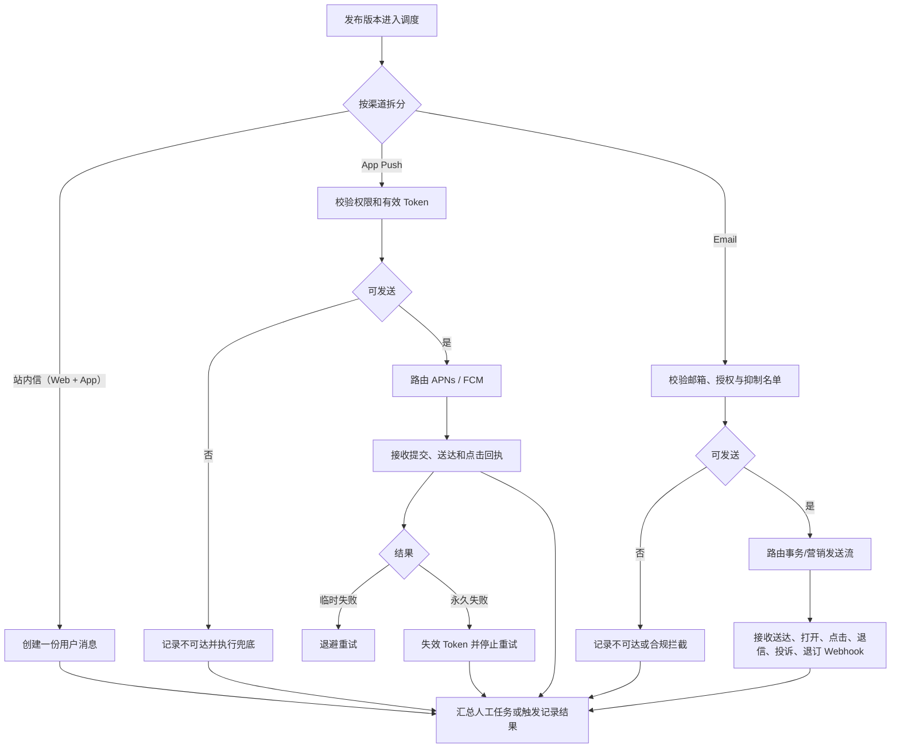

# 渠道与发送记录 PRD

## 1. 模块摘要

本模块将不可变发布版本发送到站内信（Web + App 共用）、App Push 和 Email，并记录用户级、渠道级、设备级和邮箱级结果。App Push 必须真实接入 APNs / FCM，Email 必须通过后台统一适配层接入邮件服务商。

## 2. 目标与范围

- 为每个用户创建一份可同时在 Web / App 展示的站内信实例，为 App 设备发送 Push，为已验证且未被抑制的邮箱发送 Email。
- 管理 Push Token、Email 地址资格、通知/营销授权、Deep Link、Webhook 回执、重试和失效治理。
- 提供可按人工任务或事件触发记录查询的渠道发送记录、失败原因和人工重试入口。
- 处理有效期、保留时间、安静时段、频控和渠道兜底。

## 3. 用户与使用场景

| 角色 | 场景 |
|---|---|
| 用户 | 在 Web / App 收到同一站内信，在 App 收到 Push，在邮箱收到事务或营销 Email 并安全跳转 |
| 运营人员 | 查看任务汇总、失败原因和重试结果 |
| App 团队 | 注册/注销 Token，上报权限，处理 Deep Link 和点击 |
| 运维 | 监控 APNs / FCM、队列、失败率和积压 |
| 审计员 | 查询某任务、事件、用户或设备的发送链路 |

## 4. 前置条件与依赖

- 输入必须是[审核与发布](./06-审核与发布.md)生成的不可变发布版本。
- 用户消息展示规则见[用户消息中心](./01-用户消息中心.md)。
- 有效期、白名单和保留默认值来自[系统配置与审计](./09-系统配置与审计.md)。

## 5. 用户流程

## 6. 功能需求

### 6.1 站内信（Web + App）

- 为每个目标用户创建一条用户消息，保存冻结内容、实际语言、来源、有效期和保留时间。
- 人工来源使用`task_id + publish_version + uid`幂等；事件来源沿用触发记录冻结的内容版本，并以`trigger_id + channel + destination_id`创建渠道实例。
- 站内信创建成功即视为渠道写入成功；阅读和点击由用户行为更新。
- Web 与 App 查询同一用户消息实例；任一端首次已读写入统一 `read_at`，并记录 `read_client` 与最近同步时间。
- 同一任务不得为 Web 和 App 重复创建两条站内信发送记录。

### 6.2 App Push

- iOS 通过 APNs，Android 通过 FCM；按设备平台路由。
- 支持标题、正文、图片、Push Token、通知权限、Deep Link、折叠键、优先级和供应商消息 ID。
- App 提供 Token 注册、刷新、注销，通知权限状态及更新时间上报。
- 同一用户多设备按任务策略发送；设备级记录独立保存。
- 紧急消息在用户具有有效 Token 和通知权限时必须发送高优先级 Push。

### 6.3 Deep Link 与点击

- 发送前校验 Deep Link 类型、路径和参数白名单。
- App 点击回传消息 ID、设备、供应商消息 ID、点击时间和路由结果。
- 路由失败时进入安全默认页或消息详情，不执行未备案外链。

### 6.4 重试与失效 Token

- 超时、限流、供应商暂时不可用等临时失败按指数退避重试。
- Token 无效、应用卸载、参数永久非法等永久失败不重试。
- APNs / FCM 返回 Token 失效后立即标记并进入清理流程。
- 人工重试只处理满足有效期且错误可重试的记录，不重新发送成功设备。

### 6.5 Email 投递与合规

- 后台通过`EmailProviderAdapter`统一封装发送、查询和 Webhook 标准化，前端和业务模块不得感知服务商密钥。
- 事务邮件和营销邮件分别进入`transactional`与`broadcast`发送流；充值、提现、成交、强平和账户安全消息不得与营销群发共用信誉池。
- 发送域名必须完成 SPF、DKIM 与 DMARC 校验；生产环境配置退信域名、Webhook 签名和告警。
- 发送前检查主邮箱已验证、地址未命中硬退信/投诉抑制、营销授权与地区规则；营销邮件必须提供可见退订入口并处理一键退订。
- Webhook 至少标准化提交、送达、打开、点击、软退信、硬退信、投诉、退订和供应商拒绝；重复与乱序事件按`provider_event_id`幂等合并。
- 软退信可限次退避重试；硬退信、投诉和退订立即进入抑制名单。打开率受隐私代理影响，只作为趋势指标。

### 6.6 渠道策略

- 人工任务或事件通知规则可单选或组合`inbox`、`push`、`email`。
- Push 不可达时可按任务策略使用站内信兜底；已经选择站内信的任务不重复创建。
- 安静时段和频控默认作用于运营消息；紧急风险消息按合规配置豁免。
- 超过任务 TTL 不再生成新记录，超过用户消息有效期不再执行业务动作。

### 6.7 发送记录查询

- 支持按人工任务、触发记录、通知规则、事件、UID、分类、风险、内容版本、渠道、设备平台、时间、状态和错误码筛选。
- 列表显示脱敏用户/设备、渠道、状态、提交/送达/点击时间、错误、重试次数。
- 站内信详情展示阅读来源与跨端同步状态；Push 详情展示设备回执；Email 详情展示脱敏收件地址、发送流、服务商消息/事件 ID、送达、打开、点击、退信、投诉和退订时间线。

## 7. 字段定义

### 7.1 用户/渠道发送记录

| 字段 | 类型 | 必填 | 说明 |
|---|---|---|---|
| `delivery_id` / `message_id` | string | 是 | 记录和用户消息 ID |
| `source_type` / `source_id` | string | 是 | `manual_task`或`event_trigger`及来源 ID |
| `task_id` | string | 否 | 人工来源时关联任务 |
| `trigger_id` / `rule_id` / `event_code` | string | 否 | 事件来源时关联触发、规则和事件 |
| `user_id_masked` | string | 是 | 脱敏 UID |
| `category_code` / `risk_level` | enum | 是 | 分类和风险 |
| `template_id` / `template_version` | string | 是 | 内容版本 |
| `locale` | string | 是 | 实际语言 |
| `channel` | enum | 是 | `inbox`、`push`或`email` |
| `status` | enum | 是 | 渠道状态 |
| `created_at` / `expire_at` | datetime | 是 | 创建和有效期 |
| `read_at` / `clicked_at` | datetime | 否 | 阅读和点击 |
| `read_client` / `read_synced_at` | enum/datetime | 否 | 站内信首次阅读来源及最近跨端同步时间 |
| `error_code` / `error_message` | string | 否 | 标准错误和说明 |
| `retry_count` / `next_retry_at` | integer/datetime | 是/否 | 重试信息 |

### 7.2 Push 设备记录

`device_id_masked`、`platform`、`token_id_masked`、`permission_status`、`provider`、`provider_message_id`、`submitted_at`、`delivered_at`、`clicked_at`、`provider_error_code`、`token_invalidated_at`。

### 7.3 Email 记录

`recipient_email_masked`、`email_type`、`sender_profile_id`、`message_stream`、`provider`、`provider_message_id`、`provider_event_id`、`submitted_at`、`delivered_at`、`opened_at`、`clicked_at`、`bounce_type`、`bounce_reason`、`complained_at`、`unsubscribed_at`。

## 8. 状态与规则

站内信：`待创建 → 已创建 → 已读`；异常为`创建失败`，并可同时具备`已过期`属性。

Push：`待发送 → 已提交 → 已送达 → 已点击`；分支为`临时失败 → 重试中`、`永久失败`、`已取消`、`已过期`。

Email：`待发送 → 已提交 → 已送达`；可附加`已打开`、`已点击`，异常分支为`软退信 → 重试中`、`硬退信`、`投诉`、`退订`、`合规拦截`和`已过期`。

人工任务执行结束后，任务状态统一为`已完成`。发送结果单独汇总：全部目标记录终态成功为`成功`；同时存在成功和永久失败为`部分失败`；全部失败为`失败`。对`部分失败`或`失败`执行“重试失败项”时创建新的重试草稿，原任务及原发送结果保持不变。

事件来源按`trigger_id`汇总渠道结果：全部成功为触发记录`已完成`；同时存在成功和失败为`部分失败`；全部失败为`失败`。该汇总只更新触发记录，不改变事件通知规则的`已启用`状态。

## 9. 权限与审计

- Token、完整 UID 和设备标识仅对服务账号可见，后台默认脱敏。
- 人工重试、取消、导出、Token 失效和配置变更需要审计。
- 供应商凭证不得出现在浏览器、日志或导出文件中。

## 10. 异常与边界

- 用户无有效 Token 或关闭权限：记录不可达，按策略站内信兜底。
- APNs / FCM 全局故障：暂停放大重试，触发熔断和告警。
- 回执重复或乱序：按设备记录幂等合并，不回退终态。
- 消息已过期：取消未执行重试。
- 用户多设备：一个设备失败不影响其他设备和站内信状态。
- Deep Link 失效：Push 仍可打开安全的消息详情。

## 11. 数据与埋点

向[数据分析](./08-数据分析.md)提供发送、提交、送达、点击、阅读、失败、重试、过期、设备平台、供应商和标准错误码数据。

## 12. 验收标准

1. 站内信、App Push 和 Email 均作为正式渠道可选；站内信同时覆盖 Web / App 且每个用户只创建一份消息实例。
2. iOS 经 APNs、Android 经 FCM 路由，并记录供应商消息 ID。
3. 可追踪 Push 提交、送达、点击、失败、重试和失效 Token。
4. 临时失败可退避重试，永久失败不继续重试。
5. 无通知权限或有效 Token 时能记录原因并按策略兜底。
6. 渠道发送记录支持人工任务/触发记录来源、规定维度筛选、详情时间线和安全脱敏。
7. 站内信记录可查看首次阅读来源与跨端同步状态，Web / App 重复已读不重复计数。
8. 事件渠道记录可追溯到触发记录、通知规则和冻结内容版本，单次失败不改变规则状态。
9. Email 可区分事务/营销发送流，校验域名与抑制状态，并追踪送达、打开、点击、退信、投诉和退订。

## 13. 非本模块范围

短信、WhatsApp 等渠道和多供应商智能成本路由不在当前范围。
