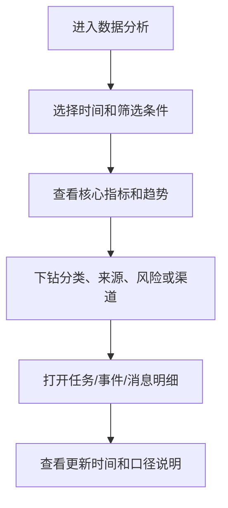

# 数据分析 PRD

## 1. 模块摘要

数据分析用于评估消息生成、发送、送达、阅读、点击、失败和过期效果，支持分类、来源、风险、受众、语言、消息渠道和访问客户端对比，并重点观察风险消息阅读时效。渠道与客户端必须分开统计：站内信和 App Push 是渠道，Web / App 是访问客户端。

## 2. 目标与范围

- 建立统一指标字典和去重口径。
- 提供趋势、分类、来源、风险和渠道报表。
- 让运营定位低阅读、低点击、高失败和过期未读消息。
- 一期只做消息效果分析，不做交易转化归因和实验平台。

## 3. 用户与使用场景

| 角色 | 场景 |
|---|---|
| 产品/运营 | 查看整体趋势、任务表现和低效果消息 |
| 风控 | 查看紧急消息 5 分钟、30 分钟阅读率和过期未读 |
| 消息平台 | 查看站内信/Push 失败率、重试和错误分布 |
| 数据团队 | 核对埋点、指标口径、延迟和数据质量 |

## 4. 前置条件与依赖

- 生成、发送和回执数据来自[渠道与发送记录](./07-渠道与发送记录.md)。
- 用户阅读和点击事件来自[用户消息中心](./01-用户消息中心.md)。
- 任务、事件、模板和受众维度来自对应冻结版本，不使用当前可编辑配置。

## 5. 用户流程

## 6. 功能需求

### 6.1 核心指标

| 指标 | 计算方式 |
|---|---|
| 生成量 | 成功创建的用户消息实例数 |
| 触达用户数 | 收到至少一个渠道消息的去重 UID |
| 发送量 | 渠道发送尝试数；站内信与 Push 分开统计，Web / App 不重复计算站内信实例 |
| 送达率 | 已送达 Push 设备数 ÷ 已提交 Push 设备数；站内信用创建成功率单列 |
| 已读用户数 | `read_at` 非空的去重 UID |
| 未读消息数 | 当前有效且 `read_at` 为空的用户消息数 |
| 阅读率 | 已读用户数 ÷ 触达用户数 |
| 点击用户数 | 有有效链接点击的去重 UID |
| 点击率 | 点击用户数 ÷ 触达用户数 |
| 失败率 | 永久失败渠道记录数 ÷ 发送尝试数 |
| 过期率 | 到期时仍未读的消息数 ÷ 到期消息数 |
| 过期未读数 | 到期时 `read_at` 为空的消息数 |
| 平均阅读时长 | `read_at - created_at` 的有效样本平均值 |

分母为 0 时显示“—”，不得显示 0%。同一用户重复打开只计一个已读用户，但保留打开次数。

### 6.2 一期报表

- 消息生成量、触达用户数、阅读率、点击率、失败率和过期率趋势。
- 七个分类的消息量、阅读率和点击率。
- 系统事件与人工任务表现对比。
- 高阅读和低阅读消息 TOP 10。
- 普通、重要、紧急消息表现。
- 风险消息 5 分钟、30 分钟阅读率和过期未读数。
- 站内信（Web + App）与 App Push 的发送、送达、阅读、点击和失败对比。
- 站内信按首次阅读客户端（Web、iOS、Android）分析阅读、点击与同步延迟；不得把 App 端站内信归入 App Push。
- Push 设备平台、供应商错误码、重试次数和失效 Token 趋势。

### 6.3 筛选与下钻

支持时间、分类、来源、事件、任务、模板版本、风险等级、受众类型、VIP 等级、语言、地区、客户端、渠道、设备平台和状态。渠道筛选为全部渠道/站内信/App Push；客户端筛选为全部客户端/Web/App，两个筛选维度可组合。

点击图表或列表可进入任务、事件、模板或发送记录详情；所有下钻继承当前时间和筛选条件。

### 6.4 数据时效和质量

- 页面显示数据更新时间、统计时区和延迟说明。
- 一期允许分钟级延迟；风险消息监控目标延迟不高于 5 分钟。
- 数据缺失、延迟或重算时显示质量标识，不用旧数据冒充实时结果。
- 导出沿用当前权限、脱敏和筛选条件。

### 6.5 归因边界

点击率只统计消息内已备案链接点击。交易、充值、活动参与等业务转化不在一期统一归因范围；需要时由业务系统通过消息 ID 做后续关联。

## 7. 字段定义

### 7.1 事实事件

| 事件 | 触发时机 | 必填参数 |
|---|---|---|
| `message_generated` | 用户消息创建成功 | 消息、用户、任务/事件、模板、语言 |
| `channel_send_attempt` | 渠道发送尝试 | 消息、渠道、设备、尝试次数 |
| `channel_delivered` | 收到送达回执 | 消息、渠道、供应商、送达时间 |
| `channel_failed` | 渠道失败 | 消息、渠道、错误码、是否可重试 |
| `message_list_view` | 消息列表曝光 | 用户、分类、未读数、客户端 |
| `message_detail_open` | 打开详情 | 消息、分类、风险、语言、来源 |
| `message_mark_read` | 单条已读 | 消息、读取方式、时间 |
| `message_mark_all_read` | 全部已读 | 处理数量、分类范围、时间 |
| `message_link_click` | 点击跳转 | 消息、链接类型、目标、结果 |
| `risk_message_ack` | 确认紧急提示 | 消息、风险类型、确认时间 |

### 7.2 公共维度

`date`、`timezone`、`category_code`、`source_type`、`task_id`、`event_code`、`template_version`、`risk_level`、`audience_type`、`vip_level`、`locale`、`region`、`client`、`channel`、`platform`。

## 8. 状态与规则

- 指标使用冻结维度，历史数据不随模板、分类显示名或任务配置变化而重写。
- 阅读率和点击率按 UID 去重；渠道送达率按设备记录计算。
- 全部报表默认使用 UTC+8，可切换时区但不改变原始事件时间。
- 数据重算必须保留指标版本和更新时间。

## 9. 权限与审计

- 普通运营只能查看授权业务线；风控可查看风险汇总；数据和审计角色按权限查看明细。
- 导出用户级数据需要额外权限，UID 和设备默认脱敏。
- 筛选、下钻、导出和指标配置变化记录审计。

## 10. 异常与边界

- 分母为 0：显示“—”并解释无可计算样本。
- 回执迟到：更新历史送达指标并刷新数据时间。
- 同一回执重复：幂等去重。
- 跨设备多次点击：点击用户数按 UID 去重，设备点击次数保留。
- 消息过期后首次阅读：计入已读用户，但不改变到期时过期未读快照。

## 11. 数据与埋点

埋点统一携带 `event_id`、`occurred_at`、`message_id`、`user_id`、`source_type`、`source_id`、`channel`、`client` 和 `trace_id`。敏感字段不得进入分析事件明文。

## 12. 验收标准

1. 能查看生成量、送达率、阅读率、点击率、失败率和过期率。
2. 能按分类、来源、风险、受众、语言和渠道筛选。
3. 能对比站内信（Web + App）和 App Push 效果，并能独立按 Web / App 访问客户端筛选；App 端站内信不计入 Push。
4. 风险消息展示 5 分钟、30 分钟阅读率和过期未读数。
5. 页面显示更新时间、时区和口径说明。
6. 指标能下钻到任务、事件或发送记录，且继承筛选条件。
7. 分母为 0、延迟和数据质量异常有明确状态。

## 13. 非本模块范围

高级营销转化归因、A/B 实验、用户生命周期模型、预测分析和自定义 BI 建模不在一期范围。
