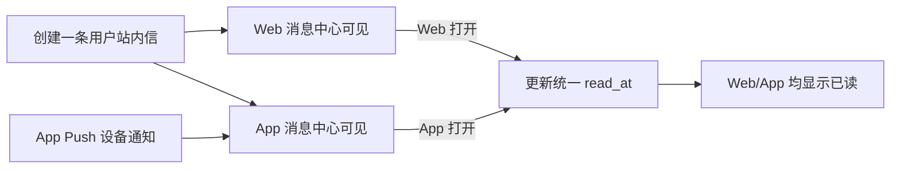

# Web/App 跨端站内信设计

## 1. 目标

将消息中心中的“站内信”统一定义为 Web 和 App 共用的用户消息渠道。Web 消息中心和 App 消息中心展示同一条用户消息，共享未读数和已读状态；App Push 继续作为独立的系统通知触达渠道。

本次同时修改模块化 PRD、后台前端文案、内容预览、发送记录、数据分析和用户消息中心原型。

## 2. 统一渠道模型

```text
消息内容
├─ 站内信（channel = inbox）
│  ├─ Web 消息中心（client = web）
│  └─ App 消息中心（client = app）
└─ App Push（channel = push）
   └─ iOS / Android 系统通知栏
```

核心规则：

1. `站内信`是一个渠道，不拆成 Web 站内信和 App 站内信两个发送渠道。
2. Web/App 使用同一个 `message_id` 和同一份冻结内容。
3. `read_at`、`clicked_at` 和风险确认状态属于用户消息，不属于终端。
4. 用户在任一端成功阅读后，另一端最终同步为已读。
5. App Push 是额外触达记录，不等于 App 站内信，也不改变站内信是否已读。

## 3. 内容与数据模型

现有 `Channel` 继续使用 `站内信 | Push`，不新增 `Web站内信` 或 `App站内信` 枚举。

现有 `LocalizedMessageContent.web` 在产品含义上改为 `inbox`。为控制本次前端改动范围，代码数据键暂时保留 `web`，但类型和界面文案统一解释为跨端站内信内容；后续真实接口直接使用 `inbox_content`。

站内信内容字段：标题、摘要、正文、风险提示、按钮文字和目标链接。Web 与 App 复用内容，展示布局分别适配桌面和手机。

发送记录按以下维度区分：

- `channel = 站内信`：用户消息创建记录，不按 Web/App 重复创建。
- `channel = Push`：设备级 APNs / FCM 发送记录。
- `client = Web | App`：只用于站内信曝光、阅读和点击行为分析。
- `platform = Web | iOS | Android`：用于终端和 Push 设备分析。

## 4. 前端设计

### 4.1 全局文案

后台中的“Web 站内信”统一改为“站内信（Web + App）”或在空间有限时显示“站内信”。全局状态区显示“站内信正常 / App Push 正常”。

### 4.2 模板和任务编辑

内容编辑仍只维护一套站内信文案。预览区提供三个视图：

1. Web 站内信预览：桌面消息详情卡片。
2. App 站内信预览：手机消息详情卡片。
3. App Push 预览：手机系统通知卡片。

三个视图用于展示适配差异，不要求操作者重复录入站内信内容。

### 4.3 用户消息中心

现有 `/inbox` 继续作为 Web 端原型。页面增加 Web/App 共享消息和已读状态的说明，并提供 App 消息中心的手机端预览或响应式展示。

App 消息中心包含相同的七类筛选、未读数、消息列表、风险标识、详情、全部已读和安全跳转能力。

### 4.4 发送记录

发送记录页签从“Web 站内信”改为“站内信”。站内信记录表示用户消息创建成功，不因用户尚未打开 Web 或 App 而失败。详情展示 Web/App 阅读来源和最后同步时间。

### 4.5 数据分析

一级渠道对比为“站内信 / App Push”。站内信卡片包含生成数、创建成功率、阅读率、点击率和跨端已读同步情况。

客户端筛选改为：全部客户端、Web、App。选择 Web 或 App 时，仅筛选站内信的曝光、阅读和点击行为，不把 App 等同于 Push。

## 5. 状态与数据流



前端原型继续通过共享 Store 模拟跨端同步。真实生产系统由统一用户消息接口持久化 `read_at`，并通过刷新、轮询或消息同步机制让另一端最终一致。

## 6. 异常和边界

- App Push 发送失败不影响 App 消息中心中的站内信可见性。
- 用户关闭通知权限，只影响 Push，不影响 App 站内信。
- 用户在 Web/App 同时标记已读时，接口保持幂等，以首次成功时间作为 `read_at`。
- App 版本不支持某类 Deep Link 时，进入站内信详情或安全默认页。
- Web/App 布局长度不同，模板发布前分别展示预览和溢出提示，但不拆成两套内容。
- 用户未安装 App 时仍可在 Web 查看站内信；无 Web 会话时仍可在 App 查看。

## 7. PRD 修改范围

- 总览：产品范围改为 Web/App 用户消息中心 + App Push。
- 用户消息中心：明确两个终端共享消息与已读状态。
- 消息任务：渠道改为站内信和 App Push，预览包含三个终端视图。
- 模板与多语言：站内信内容跨端复用。
- 渠道与发送记录：站内信为用户级记录，Push 为设备级记录。
- 数据分析：区分渠道维度和客户端维度。
- 系统配置：Deep Link 和展示规则覆盖 Web、iOS、Android。

## 8. 测试与验收

1. 后台不再把站内信描述为 Web 独占渠道。
2. 模板、任务和审核预览同时显示 Web 站内信、App 站内信和 App Push。
3. 站内信内容只录入一份，两个站内信预览内容一致。
4. App Push 与 App 站内信在文案、记录和分析中明确区分。
5. 发送记录使用“站内信”页签，并能展示终端阅读来源。
6. 数据分析一级对比站内信与 App Push，Web/App 作为客户端筛选。
7. 用户消息中心说明 Web/App 共享未读数和已读状态。
8. 现有任务、翻译、审批、事件和发送测试保持通过。

## 9. 非本期范围

- 不开发真实 iOS/Android 原生应用。
- 不新增 Web/App 两套独立站内信文案。
- 不实现真实跨设备长连接同步。
- 不改变真实 Push 供应商接入边界。
