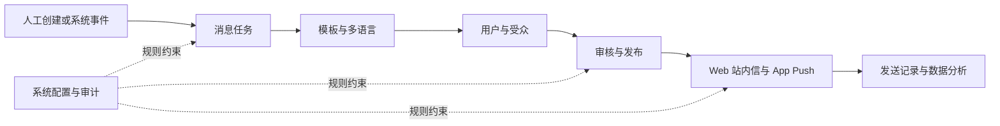

# 消息中心 PRD 模块化拆分设计

## 1. 目标

将根目录的 `PRD-exchange-message-center-admin.md` 从单一长文档拆分为一份产品总览和九份业务模块 PRD，使产品、设计、前端、后端、测试和业务接入方可以独立评审与维护各自负责的范围。

拆分后不得改变已经确认的产品范围、一期能力、字段含义、状态规则和验收标准。

## 2. 文档结构

模块文档统一存放在 `docs/prd/message-center/`：

| 文件 | 内容归属 |
|---|---|
| `README.md` | 文档阅读顺序、模块索引、变更规则 |
| `00-消息中心总览.md` | 摘要、背景、目标、用户、价值、整体架构、跨模块流程、发布范围、假设与风险 |
| `01-用户消息中心.md` | 七类消息、列表、详情、已读、跳转、风险强提示、用户端状态和验收 |
| `02-消息任务.md` | 人工任务与事件任务、任务创建、编辑、复制、状态、发送策略和任务字段 |
| `03-消息模板与多语言.md` | 模板版本、变量、多语言生产、外部机翻、人工审核、模板发布门禁和预览 |
| `04-系统事件.md` | 事件定义、事件变量、任务关联、触发条件、幂等、测试事件和关键事件清单 |
| `05-用户与受众.md` | 全站、指定用户、VIP、代理、活动用户、包含与排除规则、受众快照和脱敏 |
| `06-审核与发布.md` | 风险分级、审批链、版本冻结、驳回、撤回、发布门禁和权限 |
| `07-渠道与发送记录.md` | Web 站内信、App Push、APNs/FCM、有效期、重试、送达记录、失败治理和 Deep Link |
| `08-数据分析.md` | 指标口径、报表、筛选维度、埋点事件和数据验收 |
| `09-系统配置与审计.md` | 分类配置、链接白名单、默认有效期、权限、操作日志、保留时间和合规要求 |

根目录的 `PRD-exchange-message-center-admin.md` 保留，但改为兼容入口，说明文档已模块化并链接到新目录，不再保留重复正文。

## 3. 内容归属原则

1. 每条具体需求只在一个模块文档中完整定义。
2. 跨模块引用使用相对链接，不复制字段表或状态规则。
3. 总览只说明目标、范围和端到端流程，不重复模块级字段。
4. 模块文档可以独立评审，必须包含范围、用户流程、功能规则、字段、状态、异常和验收标准。
5. 外部机翻与系统事件联动的现有设计内容并入对应模块，独立设计文档继续作为历史决策记录。
6. 当前交付是前端交互原型；产品一期的真实后台、APNs/FCM 和外部翻译接口要求仍需保留并明确标注。

## 4. 跨模块主流程

## 5. 模块文档统一结构

每份模块 PRD 采用以下结构，并根据模块实际情况删减不适用的小节：

1. 模块摘要
2. 目标与范围
3. 用户与使用场景
4. 前置条件与依赖
5. 用户流程
6. 功能需求
7. 字段定义
8. 状态与规则
9. 权限与审计
10. 异常与边界
11. 数据与埋点
12. 验收标准
13. 非本模块范围

## 6. 迁移规则

- 以现有 V2.1 PRD 为需求事实来源。
- 保留原始需求的含义和优先级，不在拆分过程中新增功能。
- 修正已经与当前实现明确冲突的旧表述：系统事件不直接绑定模板，而是通过已启用的事件触发任务选择已发布模板版本。
- App Push 继续作为产品一期必做渠道，不使用“预留”表述。
- 模块内使用一致术语：消息任务、消息模板、系统事件、受众快照、翻译批次、发布版本、发送记录。

## 7. 验证方法

拆分完成后执行以下检查：

1. 原 PRD 的核心需求均能在新文档中找到。
2. 九个模块文档和总览均可通过索引访问。
3. 所有相对链接指向存在的文件。
4. 文档中不存在 `TBD`、`TODO` 或未解释的占位内容。
5. App Push、七类消息、五类人工受众、八类系统事件、多语言审核、有效期、风险强提示和数据分析均有明确归属。
6. 系统事件、任务和模板的关系与当前产品设计一致。
