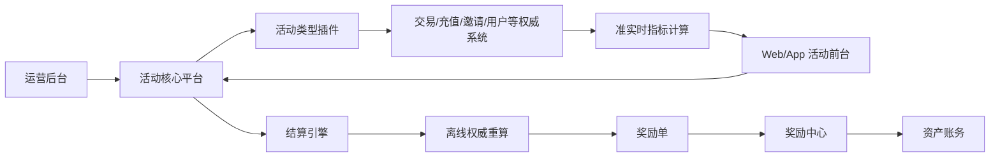
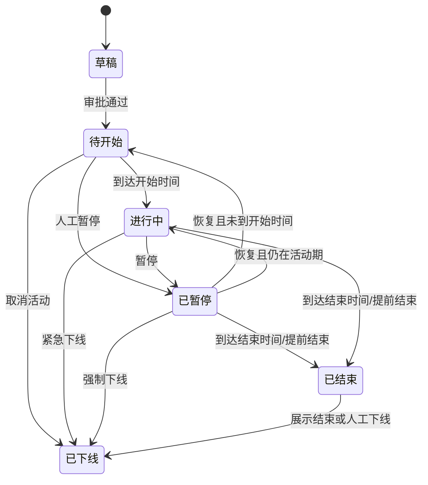
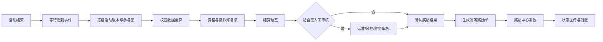

# CEX 统一活动上下架管理系统 PRD

> 文档版本：V1.0  
> 文档日期：2026-07-13  
> 产品范围：运营后台、用户前台、活动计算与结算  
> 已确认方向：核心平台 + 活动类型插件；排行榜 1–5 分钟准实时；最终结算按权威数据重算；奖励中心负责实际入账；分级审批

---

## 1. 摘要

建设一个统一的 CEX 活动管理平台，支持交易赛、积分活动、邀请活动、充值活动、体验金活动和排行榜活动。平台覆盖活动创建、审批、定时上下架、报名参与、进度与榜单、结算预览、奖励发放、数据分析和全链路审计。

系统采用“共性能力平台化、活动类型插件化”的设计。活动平台不直接修改用户资产，而是生成幂等的奖励单，由独立奖励中心根据金额、币种、地区和风险等级自动或人工发放。

## 2. 联系人与职责

| 角色 | 建议负责人 | 职责 |
|---|---|---|
| 产品负责人 | 活动平台 Owner | 范围、优先级、指标、验收 |
| 运营负责人 | 增长/活动运营 | 活动配置、预算、上线、复盘 |
| 设计负责人 | Web/App 设计团队 | 活动列表、详情、报名、榜单体验 |
| 技术负责人 | 活动平台研发负责人 | 架构、数据接入、稳定性、交付 |
| 数据负责人 | 数据平台团队 | 指标口径、准实时计算、离线重算 |
| 资产负责人 | 钱包/账务团队 | 奖励中心、入账、对账、冲正 |
| 风控负责人 | 业务风控团队 | 反作弊、异常剔除、风险策略 |
| 合规负责人 | 法务/合规团队 | 地区、用户资格、宣传与奖励合规 |
| 财务负责人 | 财务团队 | 奖池预算、成本归集、发放对账 |
| QA 负责人 | 测试团队 | 功能、资金安全、性能、容灾验收 |

## 3. 背景

### 3.1 当前问题

- 不同活动由不同业务团队单独开发，字段、状态和操作方式不一致。
- 活动上线和下线依赖研发发版，运营响应慢，容易错过市场窗口。
- 用户资格、白名单、黑名单和地区限制散落在多个系统中，难以统一审计。
- 排行榜展示数据与结算数据口径不一致，容易造成奖励争议。
- 发奖脚本缺少统一幂等、审批和对账能力，存在重复发奖与漏发风险。
- 进行中活动被直接修改后，用户看到的规则、系统执行规则和审核版本可能不一致。
- 运营只能看到参与人数，难以评估交易量、充值转化和奖励投入产出。

### 3.2 建设原则

1. 活动配置必须版本化；发布版本不可原地覆盖。
2. 展示数据与结算数据分开；榜单不直接作为发奖依据。
3. 活动平台不直接记账；奖励中心是唯一入账入口。
4. 所有关键操作可审批、可追溯、可回滚或可补偿。
5. 活动结束、结算完成、奖励发放完成是三个不同概念。
6. 首版使用结构化规则组件，不开放任意脚本和通用表达式执行。

## 4. 目标与关键结果

### 4.1 产品目标

1. 让运营无需研发发版即可安全创建和管理常见活动。
2. 建立统一的参与资格、指标、榜单、奖励和结算模型。
3. 降低资金、合规和活动规则变更风险。
4. 给用户提供一致、可解释的参与进度和奖励查询体验。
5. 建立从曝光、报名、参与到交易或充值转化的分析闭环。

### 4.2 建议关键结果

| 关键结果 | 首版目标 | 统计口径 |
|---|---:|---|
| 标准活动无需研发发版比例 | ≥90% | 六类活动中使用既有规则组件完成的活动 |
| 活动配置上线平均耗时 | 降低 70% | 从配置开始到审核通过 |
| 定时上下架成功率 | ≥99.99% | 到期任务中按时完成状态切换的比例 |
| 参与事件处理成功率 | ≥99.95% | 已接收有效事件成功计算的比例 |
| 榜单与进度数据延迟 | 95% ≤5 分钟 | 业务事件时间到前台可见时间 |
| 结算重复发奖率 | 0 | 相同用户、活动、奖励项重复入账 |
| 奖励对账一致率 | 100% | 奖励单与奖励中心最终状态一致 |
| 高风险活动双审覆盖率 | 100% | 命中双审策略的活动不得绕过 |
| 关键操作审计覆盖率 | 100% | 发布、修改、暂停、恢复、下线、结算、发奖 |

## 5. 用户与市场分群

这里的“市场”按用户需要划分，而不是按人口属性划分。

| 用户群 | 核心任务 | 主要痛点 |
|---|---|---|
| 活动运营 | 快速配置、上线、暂停和复盘活动 | 依赖研发、配置分散、数据滞后 |
| 审核人与合规 | 判断规则、地区、奖池和用户范围是否安全 | 缺少版本差异与完整证据 |
| 风控人员 | 识别刷量、关联账户和异常交易 | 结算前难以统一剔除 |
| 财务与资产人员 | 控制预算、发放、对账与补发 | 发奖脚本不可追溯、易重复 |
| 数据分析人员 | 统一计算参与、转化和成本 | 指标口径不一致 |
| 普通参与用户 | 了解资格、进度、排名和奖励 | 规则不透明、数据更新慢 |
| 客服人员 | 快速解释未入榜、未获奖或延迟发放 | 无法查询计算依据和状态 |

### 5.1 约束

- 国家/地区、KYC、账户状态、机构账户和员工账户可能受到限制。
- 交易、充值、邀请等指标必须使用对应权威系统的数据。
- 奖励币种需要满足资产系统支持、地区合规和预算要求。
- 排行榜对外展示需要脱敏，不得暴露完整 UID、邮箱或手机号。
- 不同活动可能跨时区，存储统一使用 UTC，后台和前台明确展示活动时区。

## 6. 价值主张

- 对运营：用同一套后台管理六类活动，能复制模板、定时发布、暂停和复盘。
- 对用户：资格、进度、榜单和奖励状态透明，规则版本保持一致。
- 对风控合规：上线前有策略拦截，结算前可重算和剔除异常用户。
- 对资产财务：奖励先形成预算内奖励单，再通过奖励中心发放和对账。
- 对研发数据：新增活动类型只实现专属指标和规则，不复制整套活动基础设施。

## 7. 产品范围

### 7.1 首版范围

- 六类活动：交易赛、积分、邀请、充值、体验金、排行榜。
- 活动全生命周期：草稿、待开始、进行中、已暂停、已结束、已下线。
- 结构化资格、奖励、排名规则与名单管理。
- 活动列表、详情、报名、进度、榜单、我的奖励。
- 自动/手动结算、预览、异常剔除、发放确认和对账。
- 分级审批、版本管理、操作日志和数据看板。
- 与用户/KYC、交易、充值、邀请、风控、奖励、消息和数据平台集成。

### 7.2 不在首版范围

- 运营自行编写 SQL、脚本或任意表达式。
- 完全自由的低代码工作流编排。
- 活动系统直接修改用户资产余额。
- NFT、链上任务、第三方 DeFi 任务等链上活动。
- 多活动自动组合、复杂成长路径和跨活动统一积分商城。
- 基于机器学习的动态奖池或个性化奖励。

## 8. 总体方案

### 8.1 系统分层

### 8.2 核心模块

| 模块 | 职责 | 依赖 |
|---|---|---|
| 活动管理 | 基础信息、内容、时间、排序、复制和版本 | 文件/CDN、国际化 |
| 生命周期 | 定时开始、结束、暂停、恢复和下线 | 调度服务、审批中心 |
| 资格中心 | 报名、参与码、KYC、地区、名单、账户状态 | 用户、KYC、风控 |
| 活动类型插件 | 各活动专属字段、事件、指标和校验 | 活动核心接口 |
| 指标中心 | 交易量、收益率、邀请数、积分、净充值 | 实时事件、数据平台 |
| 榜单中心 | 排名、并列、脱敏、更新和快照 | 指标中心、缓存 |
| 奖励中心适配 | 奖励定义、预算占用、奖励单、状态同步 | 独立奖励中心 |
| 结算中心 | 冻结、重算、预览、剔除、审核和发放 | 权威数据源、风控 |
| 审批与审计 | 分级审批、版本差异、日志和导出 | IAM、审计存储 |
| 分析看板 | 参与、交易、成本、转化和漏斗 | 实时/离线数仓 |

### 8.3 活动类型插件契约

每个插件必须提供：

- `schema`：专属配置字段和默认值。
- `validator`：发布前配置校验。
- `event_sources`：需要消费的业务事件。
- `metric_definitions`：指标名称、口径、精度和更新周期。
- `ranker`：需要榜单时的排序与并列规则。
- `settlement_calculator`：基于冻结数据计算奖励候选结果。
- `explain`：为后台、客服和用户输出可理解的计算说明。

插件不得直接写资产、绕过资格中心或自行发放奖励。

## 9. 信息架构

| 一级菜单 | 二级页面 |
|---|---|
| 工作台 | 活动概览、待办审批、异常告警、待结算活动 |
| 活动管理 | 活动列表、新建活动、活动模板、回收站 |
| 审核中心 | 待我审核、全部审批、紧急操作复核 |
| 参与管理 | 报名记录、用户进度、参与码、名单管理 |
| 榜单管理 | 实时榜单、榜单快照、异常排名 |
| 结算中心 | 待结算、结算预览、发奖任务、异常与补发 |
| 奖励管理 | 奖励配置、预算占用、奖励单、对账记录 |
| 数据分析 | 活动看板、转化漏斗、成本与 ROI、导出 |
| 风控合规 | 资格策略、反作弊、地区限制、异常用户 |
| 系统配置 | 活动类型、指标、审批策略、权限、审计日志 |

## 10. 角色与权限

| 权限动作 | 运营 | 审核人 | 风控/合规 | 财务 | 管理员 | 审计员 |
|---|---:|---:|---:|---:|---:|---:|
| 新增/编辑草稿 | ✓ |  |  |  | ✓ |  |
| 提交审批 | ✓ |  |  |  | ✓ |  |
| 审批上线 |  | ✓ | 条件审批 | 条件审批 | ✓ |  |
| 暂停/恢复 | 授权后 | ✓ | ✓ |  | ✓ |  |
| 紧急下线 | 授权后 | ✓ | ✓ |  | ✓ |  |
| 结算预览 | ✓ | ✓ | ✓ | ✓ | ✓ | 只读 |
| 剔除异常用户 | 申请 |  | ✓ |  | ✓ | 只读 |
| 确认发奖 |  |  | 条件确认 | ✓ | ✓ | 只读 |
| 查看完整 UID/导出 | 受限 | 受限 | ✓ | ✓ | ✓ | 授权后 |
| 查看审计日志 | 本人/本团队 | ✓ | ✓ | ✓ | ✓ | ✓ |

约束：创建人不能审批自己创建或修改的活动；高风险活动的两级审批人必须不同。

## 11. 活动类型

| 类型 | 核心指标 | 常见奖励 | 专属配置 |
|---|---|---|---|
| 交易赛 | 有效交易量、收益率、净盈利 | 排行榜、阶梯、固定奖池 | 市场、交易对、方向、有效成交规则 |
| 积分活动 | 行为积分、累计积分 | 积分、阶梯、兑换资格 | 积分项、每日上限、总上限、去重规则 |
| 邀请活动 | 有效邀请数、被邀请人交易/充值 | 固定、阶梯、返佣加成 | 关系确认、有效邀请条件、归因窗口 |
| 充值活动 | 净充值、首次充值、累计充值 | 固定、阶梯、返现 | 币种、链、最低金额、净充值口径 |
| 体验金活动 | 领取、激活、使用、收益 | 体验金、收益归属 | 面额、有效期、适用品种、回收规则 |
| 排行榜活动 | 任一已注册指标 | 排名、固定奖池 | 指标、排序方向、榜单范围、并列规则 |

一个活动可以包含多个指标和多个奖励项，但必须指定一个主活动类型。首版不允许一个活动同时使用两套互相冲突的结算插件。

## 12. 活动状态与上下架

### 12.1 活动状态

| 状态 | 含义 | 用户可见 | 允许的主要操作 |
|---|---|---:|---|
| 草稿 | 尚未形成有效发布版本 | 否 | 编辑、复制、删除、提交审批 |
| 待开始 | 已审批，未到活动开始时间 | 由展示时间决定 | 撤回、暂停、受控修改、下线 |
| 进行中 | 当前可参与且正在累计指标 | 是 | 暂停、受控修改、提前结束、下线 |
| 已暂停 | 暂时停止新增参与或指标累计 | 保留并显示暂停说明 | 恢复、结束、下线 |
| 已结束 | 已停止累计，等待或正在结算 | 是 | 结算、查看、导出、下线 |
| 已下线 | 前台不可见且不可参与 | 否 | 查看、复制、审计；不可恢复 |

### 12.2 状态机

### 12.3 时间定义

| 字段 | 规则 |
|---|---|
| 展示开始时间 | 活动进入前台列表和详情可访问的时间，可早于活动开始 |
| 活动开始时间 | 允许报名/参与并开始累计指标的时间 |
| 活动结束时间 | 停止新增参与和指标累计的时间 |
| 展示结束时间 | 活动从列表下架的时间，可晚于活动结束以展示结果 |
| 活动时区 | 创建时必填；保存为 IANA 时区，底层统一转换为 UTC |

必须满足：`展示开始 ≤ 活动开始 < 活动结束 ≤ 展示结束`。如果允许活动结束后继续展示，详情页需要标注“活动已结束/奖励结算中”。

### 12.4 暂停、恢复和下线语义

- 暂停默认停止新报名、参与码兑换、指标累计和奖励资格新增。
- 暂停前已产生的有效数据保留；恢复后是否补算暂停期数据，创建时必须配置，默认不补算。
- 恢复时如尚未到活动开始时间，返回待开始；如已超过活动结束时间，直接进入已结束。
- 下线是终态。下线后前台不可见，并停止新增参与和指标累计，但不删除活动、参与、结算或审计数据。
- 紧急下线可先执行后复核；必须填写原因、影响范围和用户沟通方案。
- 已下线活动如需重新开展，只能复制成新活动 ID。

## 13. 活动配置

### 13.1 基础信息

| 字段 | 类型 | 必填 | 规则 |
|---|---|---:|---|
| 活动 ID | 系统生成 | 是 | 全局唯一，不可修改 |
| 活动名称 | 文本 1–100 字 | 是 | 后台名称与前台标题可分开 |
| 活动类型 | 单选 | 是 | 发布后不可修改 |
| 活动时间 | 时间范围 | 是 | 含活动时区 |
| 展示时间 | 时间范围 | 是 | 覆盖活动时间 |
| 排序权重 | 整数 | 是 | 数值越大越靠前；相同按发布时间倒序 |
| Banner | 图片/多语言 | 是 | Web/App 可分别上传，校验尺寸和文件安全 |
| 活动规则 | 富文本/多语言 | 是 | 支持规则编号、目录、预览和版本 |
| 活动摘要 | 文本/多语言 | 是 | 列表页使用 |
| 业务线 | 单选 | 是 | 现货、合约、充值、增长等 |
| 地区与语言 | 多选 | 是 | 决定前台曝光与合规校验 |
| 活动标签 | 多选 | 否 | 新手、限时、热门等 |
| 客服说明 | 内部富文本 | 否 | 仅后台和客服可见 |

### 13.2 参与规则

| 字段 | 类型 | 规则 |
|---|---|---|
| 是否需要报名 | 开关 | 开启后只有报名成功用户进入计算 |
| 报名时间 | 时间范围 | 必须落在展示期内；可早于活动开始 |
| 是否需要参与码 | 开关 | 可与报名同时使用 |
| 参与码模式 | 单码/批量唯一码 | 唯一码只能成功使用一次 |
| 参与资格 | 规则组 | 支持 KYC、地区、账户类型、注册时间、VIP 等级、资产条件 |
| 白名单 | 文件/用户分群 | 白名单可作为唯一准入或资格规则补充 |
| 黑名单 | 文件/风控标签 | 黑名单优先级最高，命中即拒绝 |
| 资格检查时点 | 报名时/参与时/结算时 | 关键活动建议三次检查 |
| 资格失败提示 | 多语言文案 | 不得暴露具体风控命中原因 |

规则优先级：`全局禁止名单 > 活动黑名单 > 地区/合规限制 > 活动资格 > 白名单策略 > 报名/参与码`。

### 13.3 名单管理

- 支持 UID CSV 上传、用户分群引用和 API 同步。
- 上传前校验格式、重复 UID、无效用户、越权用户和文件大小。
- 文件中完整 UID 仅对授权人员可见，普通运营看到脱敏结果。
- 每次名单变更生成独立版本，记录新增、删除、操作者和原因。
- 进行中活动扩大白名单或缩小黑名单属于资格放宽，需要重新审批。

## 14. 指标与排行规则

### 14.1 支持指标

| 指标 | 示例口径 | 权威来源 |
|---|---|---|
| 有效交易量 | 成交额扣除自成交、刷量、指定做市账户和无效成交 | 交易/风控系统 |
| 收益率 | `(期末权益 - 期初权益 - 净入金) / 期初权益` | 账务与持仓快照 |
| 邀请数 | 活动期内完成指定 KYC/充值/交易条件的直接邀请用户数 | 邀请系统 |
| 积分 | 各有效行为积分之和，受每日和活动总上限约束 | 活动指标中心 |
| 净充值 | 有效充值 - 活动期内对应提币，可配置是否计内部转账 | 充值/账务系统 |

### 14.2 排行配置

| 字段 | 规则 |
|---|---|
| 排名指标 | 从已注册指标中选择，发布后不可更换 |
| 排序方向 | 降序或升序，默认降序 |
| 最低上榜门槛 | 未达到门槛不进入公开榜单和排名奖励 |
| 榜单范围 | 全部、地区、团队或指定用户群 |
| 展示名 | UID 脱敏、昵称或团队名；必须经过内容安全处理 |
| 展示人数 | 前台 Top N，后台可查看全量 |
| 更新频率 | 默认 1–5 分钟 |
| 并列规则 | 同指标时按先达成、次级指标、报名时间或共享名次 |
| 冻结时间 | 活动结束后等待事件迟到的时间，默认 30 分钟，可配置 |

### 14.3 展示与结算差异

- 前台进度和排行榜使用准实时聚合数据，明确标注“数据可能有延迟”。
- 活动结束后榜单先显示“结果核验中”，不得立即宣称获奖。
- 结算使用冻结后的权威数据重算，并重新执行资格与反作弊规则。
- 如最终排名变化，保留展示快照和结算快照，客服可查询差异原因。

## 15. 奖励配置

### 15.1 奖励类型

| 类型 | 配置要点 |
|---|---|
| 固定奖池 | 总预算、分配方式、人数上限、剩余处理 |
| 阶梯奖励 | 指标区间、奖励金额、每人上限、区间边界 |
| 排行榜奖励 | 名次区间、固定金额或奖池比例、并列处理 |
| 积分奖励 | 积分数、发放上限、有效期和使用范围 |
| 体验金奖励 | 面额、币种、有效期、适用品种、收益归属与回收 |
| 返佣加成 | 基础返佣、加成比例、有效周期、封顶金额 |

### 15.2 通用字段

- 奖励项 ID、名称、类型、币种/单位、单人上限、总预算。
- 获奖条件、互斥组、可叠加规则、发放时间、到账说明。
- 自动发放阈值、人工复核阈值、地区限制和成本中心。
- 预算不足策略：禁止发布、按比例缩减或进入人工处理；默认禁止发布。
- 奖励有效期和过期处理；体验金必须配置使用与回收规则。

### 15.3 预算控制

1. 提交审批前计算理论最大成本。
2. 审批通过时在奖励中心预占预算。
3. 进行中增加奖池必须重新审批和追加预占。
4. 结算确认时将预占转换为实际奖励单。
5. 活动关闭且对账完成后释放剩余预算。

### 15.4 幂等规则

奖励单幂等键：`activity_id + settlement_version + user_id + reward_item_id`。奖励中心必须拒绝相同幂等键的重复入账。补发需要创建新的补发批次并关联原奖励单，不得修改原单。

## 16. 前台用户体验

### 16.1 活动列表

- 展示 Banner、标题、类型、标签、活动状态和剩余时间。
- 支持按活动类型、状态和用户可参与条件筛选。
- 不符合地区或合规条件的活动默认不曝光。
- 排序按人工权重、个性化资格、发布时间组合计算；人工权重优先。

### 16.2 活动详情

- 活动标题、时间、状态、规则、奖励、榜单和风险提示。
- 明确展示时区、资格条件、指标口径、数据延迟说明和奖励发放时间。
- 发布后展示对应的规则版本；历史活动保留历史版本。
- 暂停、提前结束或规则变更时显示显著公告。

### 16.3 报名状态

状态包括：未登录、不可参与、可报名、报名中、报名成功、报名失败、活动已满、活动已结束。报名接口必须幂等，重复点击返回同一结果。

### 16.4 参与进度

- 展示当前指标、目标值、已完成阶梯、下一奖励和最近更新时间。
- 支持解释未计入数据的常见原因，但不暴露风控策略。
- 事件迟到或重算时允许进度回退，并记录调整说明。

### 16.5 排行榜

- 展示 Top N、我的名次、我的指标值、获奖区间和更新时间。
- 用户标识必须脱敏；支持本人高亮。
- 活动结束后切换为核验中，结算确认后标记最终榜单。

### 16.6 我的奖励

状态包括：待结算、审核中、待发放、发放中、已到账、发放失败、已取消、已过期。每条奖励展示来源活动、奖励内容、预计/实际到账时间和失败后的处理说明。

## 17. 运营后台

### 17.1 活动列表

筛选字段：关键词、活动 ID、活动类型、活动状态、结算状态、业务线、地区、创建人、审核状态、活动时间、创建时间。

列表字段：

`活动ID`、`名称`、`类型`、`活动时间`、`展示时间`、`地区`、`状态`、`审核状态`、`结算状态`、`参与人数`、`奖池预算`、`创建人`、`更新时间`、`操作`。

操作：新增、查看、编辑、复制、提交审批、撤回、暂停、恢复、提前结束、下线、结算、导出。

### 17.2 新建/编辑向导

1. 基础信息：名称、类型、时间、地区、语言、Banner、规则。
2. 参与规则：报名、参与码、资格、白名单、黑名单。
3. 指标规则：指标、口径、市场范围、事件与上限。
4. 榜单规则：排序、门槛、并列、展示和冻结时间。
5. 奖励配置：奖励项、奖池、阶梯、预算和发放策略。
6. 前台预览：Web/App、多语言、不同用户资格状态。
7. 风险检查：配置冲突、预算、地区、数据源和容量校验。
8. 提交审批：影响范围、预计人数、最大成本和版本差异。

草稿每 30 秒自动保存；离开未保存页面时提示。预览使用与正式前台相同的渲染数据结构。

### 17.3 复制活动

- 复制生成新的活动 ID 和草稿版本。
- 默认不复制参与记录、参与码使用记录、榜单、结算和审批记录。
- 名单、Banner 和规则可选择复制；时间必须重新设置。
- 复制后重新执行全部校验和审批。

### 17.4 批量操作

首版仅允许批量导出和批量复制，不允许批量上线、下线、结算或发奖。

## 18. 审批、版本与变更控制

### 18.1 风险等级

| 等级 | 示例 | 审批要求 |
|---|---|---|
| 低 | 小范围、低预算、非敏感地区模板活动 | 单审 |
| 中 | 多地区、排行榜或中等预算 | 运营审核 + 条件合规审核 |
| 高 | 大额奖池、全量用户、敏感地区、返佣加成 | 双审，含合规/财务 |
| 紧急 | 安全、合规或重大错误需要立即暂停/下线 | 先执行，事后双人复核 |

阈值由管理员按业务线和币种配置，不写死在活动代码中。

### 18.2 关键字段

以下字段的进行中变更必须生成新版本、展示差异、二次确认并重新审批：

- 活动开始/结束时间、展示时间。
- 参与资格、名单策略、地区、KYC 和账户限制。
- 指标口径、交易对、币种、净充值和收益率计算方式。
- 排名指标、门槛、并列规则和获奖名次。
- 奖励类型、金额、奖池、币种、上限和发放策略。
- 活动规则中影响用户权利、义务或奖励的内容。

可直接修改但仍需记录日志的非关键字段：内部备注、客服说明、错别字修正、不会改变含义的展示样式。Banner 和公开文案默认按关键字段处理。

### 18.3 版本规则

- 草稿可反复编辑；提交审批时生成候选版本。
- 审批通过后生成不可变发布快照，绑定规则、名单、奖励和多语言内容版本。
- 审批中发生任何修改，原审批自动失效。
- 进行中变更只有在新版本审批通过后才能生效。
- 每个参与事件和结算批次记录其采用的活动版本。

### 18.4 二次确认

关键操作确认框必须展示：活动名称与 ID、当前状态、影响人数、预算变化、数据是否补算、用户是否可见、审批要求和操作原因。用户需要输入活动名称或一次性确认码，不能只有“确定”按钮。

## 19. 结算与奖励发放

### 19.1 结算状态

活动状态与结算状态独立：

| 结算状态 | 含义 |
|---|---|
| 未开始 | 活动尚未结束或未触发结算 |
| 待结算 | 活动已结束，等待冻结窗口 |
| 计算中 | 正在从权威数据源重算 |
| 待预览 | 已产生候选结果 |
| 审核中 | 运营、风控或财务正在审核 |
| 待发放 | 结果已确认，尚未提交奖励中心 |
| 发放中 | 奖励中心正在处理 |
| 部分失败 | 部分奖励失败，需要重试或人工处理 |
| 已完成 | 全部奖励到达终态且对账一致 |
| 已取消 | 活动无奖励或结算被授权取消 |

### 19.2 自动结算流程

### 19.3 手动结算

手动结算不是人工上传最终发奖结果。系统仍需从权威数据源计算候选结果，只是由授权人员手动发起冻结、重算和发放确认。确需导入修正时，只允许导入“调整项”，必须填写原因并走双审。

### 19.4 结算预览

预览至少展示：

- 参与总数、合格人数、淘汰人数和异常人数。
- 指标分布、最终榜单、奖励人数和奖励总成本。
- 预算占用、预计释放金额、各币种奖励汇总。
- 与准实时榜单的排名差异和原因分类。
- 缺失数据、迟到事件、重复账户和风控命中。
- 随机抽样用户的原始数据、计算过程和最终奖励。

### 19.5 异常用户剔除

- 风控系统可自动标记，也允许风控人员人工申请剔除。
- 剔除必须包含规则编号、证据引用、影响指标和操作人。
- 人工剔除需双人复核；运营不能单独剔除用户。
- 剔除后重新计算榜单和奖池分配，生成新的结算版本。
- 对用户展示统一说明，内部保留完整原因；不泄露反作弊细节。

### 19.6 奖励发放确认

- 小额、低风险且在预算内的奖励可自动提交奖励中心。
- 大额、敏感币种、敏感地区或异常修正奖励必须人工复核。
- 确认后结算结果不可修改；修正必须通过补发或冲正流程。
- 奖励中心返回受理、处理中、成功、失败、过期、冲正等状态。
- 失败重试使用原幂等键；不得新建重复奖励单。

### 19.7 对账

按活动、结算批次、奖励项、币种和用户核对：结算结果、奖励单、奖励中心状态和资产流水。任何不一致进入异常队列并告警，未解决前结算不能标记已完成。

## 20. 数据看板

### 20.1 核心指标

| 指标 | 定义 |
|---|---|
| 活动曝光人数 | 活动列表或详情去重曝光用户数 |
| 报名人数 | 报名成功去重用户数 |
| 参与人数 | 至少产生一条有效活动指标的用户数 |
| 达标人数 | 达到活动最低奖励或排名门槛的用户数 |
| 交易量 | 活动口径下的有效成交额 |
| 净充值 | 活动口径下的有效充值减有效提币 |
| 奖励成本 | 已确认奖励按统一计价币种折算后的金额 |
| 报名转化率 | 报名人数 / 活动详情去重访客 |
| 参与转化率 | 参与人数 / 报名成功人数；免报名活动以可参与曝光人数为分母 |
| 业务转化率 | 完成目标行为人数 / 符合资格曝光人数 |
| 奖励发放成功率 | 成功奖励单 / 已提交奖励单 |

### 20.2 看板维度

时间、活动、活动类型、业务线、国家/地区、语言、渠道、用户等级、KYC 等级、奖励类型、币种和客户端。

### 20.3 数据时效

- 参与人数、交易量、榜单等运营指标默认 1–5 分钟更新。
- 奖励成本以已确认结算为准；未结算阶段展示预计成本并明确标注。
- 财务对账和 ROI 使用 T+1 或结算完成后的离线口径。

### 20.4 导出

- 导出为异步任务，支持 CSV，超大文件分片并设置有效期。
- 默认脱敏；完整 UID 需要独立权限和导出理由。
- 导出内容带活动版本、查询条件、指标口径、生成时间和操作者。
- 所有导出操作写入审计日志。

## 21. 数据模型

### 21.1 核心实体

| 实体 | 关键字段 |
|---|---|
| `activity` | id、type、owner、business_line、status、risk_level、timezone |
| `activity_version` | version、config_snapshot、content_snapshot、approval_status、effective_at |
| `activity_schedule` | display_start、activity_start、activity_end、display_end |
| `eligibility_rule` | rule_type、operator、value、check_stage、priority |
| `activity_roster` | list_type、source、version、user_count、file_ref |
| `registration` | activity_id、user_id、status、registered_at、source、version |
| `metric_definition` | code、source、formula_version、precision、aggregation_window |
| `user_metric` | activity_id、user_id、metric_code、value、watermark、version |
| `leaderboard_snapshot` | snapshot_at、rank、user_id、metric_value、is_final |
| `reward_rule` | reward_item_id、type、condition、amount、budget、currency |
| `settlement_batch` | version、status、data_cutoff、calculator_version、summary |
| `settlement_result` | batch_id、user_id、metric_snapshot、eligibility、reward |
| `reward_order` | idempotency_key、amount、currency、status、ledger_ref |
| `approval_record` | object_type、object_version、reviewer、decision、comment |
| `operation_log` | actor、action、before、after、reason、ip、trace_id、created_at |

### 21.2 数据保留

- 活动配置、发布快照、审批、结算和奖励记录按金融审计要求长期保存，建议不少于 7 年，最终以法务要求为准。
- 准实时中间指标可按成本分层保留，不能影响最终结算复现。
- 用户敏感信息应加密、脱敏并按最小权限访问。

## 22. 接口与事件

### 22.1 主要后台接口

- 活动草稿创建、更新、校验、复制、预览和提交审批。
- 活动暂停、恢复、提前结束、下线和版本变更。
- 报名记录、用户进度、榜单和名单查询。
- 结算发起、预览、剔除申请、审核、发放和重试。
- 看板查询、异步导出和审计日志查询。

### 22.2 主要前台接口

- 可见活动列表、活动详情、参与资格预检。
- 报名、参与码兑换、报名状态。
- 我的进度、榜单、我的奖励和规则版本。

### 22.3 业务事件

事件统一包含：`event_id`、`event_type`、`occurred_at`、`user_id`、`source`、`payload_version`、`trace_id`。消费端按 `event_id` 幂等，支持乱序和迟到事件。关键事件包括成交、充值确认、提币完成、邀请关系确认、KYC 变化、账户风险状态变化和奖励状态变化。

## 23. 错误处理与补偿

| 场景 | 系统处理 |
|---|---|
| 定时开始/结束失败 | 自动重试并告警；状态机操作保持幂等 |
| 权威数据源不可用 | 暂停结算，不使用不完整数据发奖 |
| 准实时计算延迟 | 前台展示延迟提示，不影响最终结算 |
| 榜单缓存故障 | 降级展示最近成功快照和更新时间 |
| 奖励中心超时 | 保持奖励单处理中，按幂等键查询或重试 |
| 部分奖励失败 | 成功项不回滚；失败项进入重试和人工队列 |
| 预算不足 | 阻止发布或发放，触发财务告警 |
| 活动配置发布后发现错误 | 暂停/下线，生成修订版本并评估补偿方案 |
| 重复或乱序事件 | 按事件 ID 去重，按事件时间和水位处理 |

## 24. 操作日志与审计

必须记录：

- 新增、编辑、复制、删除草稿和提交审批。
- 审批通过、驳回、撤回和审批意见。
- 发布、自动开始、暂停、恢复、提前结束和下线。
- 名单上传、下载、增加和删除。
- 结算发起、重算、剔除、确认、取消、发奖、重试和补发。
- 权限、审批阈值、指标口径和系统配置变更。
- 敏感数据查看、完整 UID 查询和导出。

日志字段至少包含：操作人、角色、时间、IP/设备、对象 ID、对象版本、操作类型、变更前后差异、原因、审批记录和链路追踪 ID。高风险审计日志应写入不可篡改存储。

## 25. 非功能需求

### 25.1 性能与容量

- 活动列表和详情接口 P95 ≤300 ms，榜单查询 P95 ≤500 ms，均不含跨境网络延迟。
- 报名接口 P95 ≤500 ms，支持活动开始瞬间的突发流量和同一用户幂等。
- 排行榜默认支持百万参与用户、Top 1000 查询；更大规模通过分区榜单扩展。
- 结算采用异步批处理，可暂停、续跑和按分片重试。

具体容量在技术方案阶段根据峰值活动数据补充压测目标。

### 25.2 可用性

- 活动前台核心查询月可用性目标 ≥99.95%。
- 定时状态切换与奖励单生成需要多实例容错和幂等调度。
- 准实时链路故障不得阻止最终离线结算。

### 25.3 安全

- 接入统一身份认证、RBAC、最小权限和高风险操作二次认证。
- 上传文件进行格式、病毒和内容安全检查。
- 敏感字段传输和存储加密；后台默认脱敏。
- 禁止在配置中存放可执行脚本、数据库凭据或任意外部 URL。
- 所有服务间请求使用鉴权、签名或 mTLS，并带链路追踪。

### 25.4 合规

- 按地区限制活动曝光、报名、指标累计和奖励发放。
- 用户资格在报名、参与和结算阶段可重复检查。
- 规则变更需保留用户实际同意或参与时的规则版本。
- 活动文案、奖品和排行榜展示遵守当地营销、隐私和金融规定。

### 25.5 可观测性

监控活动状态切换延迟、事件积压、指标延迟、榜单更新时间、结算耗时、奖励失败率、预算异常和对账差异。关键告警必须关联活动 ID、结算批次和链路追踪 ID。

## 26. 验收标准

### 26.1 活动创建与发布

- 六类活动均能通过统一向导创建，专属字段按类型正确显示。
- 时间、资格、指标、榜单、奖励和预算冲突能在提交前拦截。
- 审批通过后产生不可变发布版本，并按计划时间自动开始。
- 命中大额、全量或敏感地区策略的活动必须完成双审。

### 26.2 生命周期

- 所有允许和禁止的状态转换符合状态机。
- 暂停后新报名和指标累计按配置停止；恢复后处理规则一致。
- 下线后前台不可见，但历史参与、结算、奖励和日志仍可查询。
- 所有关键操作具备二次确认、原因和审计记录。

### 26.3 参与和榜单

- 报名和参与码接口幂等；名单和资格优先级正确。
- 榜单在正常链路下 95% 于 5 分钟内更新。
- 前台标识脱敏，用户能查询本人进度和名次。
- 活动结束后公开榜单进入核验中，不能直接触发发奖。

### 26.4 结算与奖励

- 自动和手动结算均从权威数据源重算。
- 结算预览能解释用户资格、指标、排名和奖励计算过程。
- 异常用户剔除需要证据、理由和双人复核。
- 相同幂等键无法生成重复奖励；失败重试不重复入账。
- 奖励单、奖励中心和资产流水对账不一致时不能完成结算。

### 26.5 数据与审计

- 看板可查看参与人数、交易量、奖励成本和转化率。
- 指标展示预计值与最终值的口径和更新时间。
- 敏感导出需要权限和理由，所有导出可审计。
- 任一结算结果都能复现所用活动版本、数据截止点和计算器版本。

## 27. 测试重点

- 状态机测试：合法转换、非法转换、定时任务重复执行和并发操作。
- 资格测试：白名单、黑名单、KYC、地区、账户状态及优先级组合。
- 指标测试：边界时间、精度、撤单、自成交、内部转账、迟到和重复事件。
- 榜单测试：并列、门槛、分页、脱敏、快照和最终重算差异。
- 奖励测试：预算边界、阶梯边界、并列分奖、叠加与互斥、幂等。
- 结算测试：中断续跑、分片重试、异常剔除、部分失败、补发和对账。
- 权限测试：创建人与审核人隔离、越权查看、导出和紧急操作。
- 性能测试：报名洪峰、事件积压、百万级榜单和大批量结算。
- 容灾测试：数据源不可用、缓存失效、奖励中心超时和消息重复投递。

## 28. 发布计划

### 阶段 1：平台基础闭环

预计 8–12 周，具体取决于现有数据和奖励系统成熟度。

- 活动管理、版本、分级审批、上下架和审计。
- 交易赛、充值活动、排行榜活动三类插件。
- 报名、资格、名单、准实时进度和榜单。
- 固定、阶梯、排行榜奖励。
- 自动/手动结算、奖励单、发放和对账。
- 基础看板与导出。

### 阶段 2：活动类型补全

预计增加 4–8 周。

- 积分、邀请和体验金活动插件。
- 积分奖励、体验金和返佣加成。
- 更完整的地区合规、反作弊和成本分析。
- 活动模板、复制优化和多语言运营能力。

### 阶段 3：平台效率提升

- 可视化条件组和有限的规则组合。
- 活动组合、用户成长路径和跨活动积分能力。
- 自动化实验、分层奖励和更细的 ROI 分析。
- 在安全沙箱内评估更灵活的规则表达能力。

## 29. 依赖、风险与缓解

| 风险/依赖 | 影响 | 缓解方式 |
|---|---|---|
| 权威数据口径未统一 | 榜单和结算争议 | 发布前完成指标字典和数据负责人签字 |
| 奖励中心能力不足 | 无法安全自动发奖 | 先建设幂等、预算、状态回传和对账接口 |
| 反作弊规则不完整 | 奖池被刷取 | 结算冻结、风控复核、关联账户分析 |
| 进行中规则变更 | 用户争议与合规风险 | 版本化、重新审批、用户公告和补偿评估 |
| 大促突发流量 | 报名失败或榜单延迟 | 限流、排队、缓存、异步处理和容量预案 |
| 跨地区合规差异 | 违规曝光或发奖 | 地区策略前置，在曝光、报名、结算三阶段校验 |
| 预算估计不足 | 无法兑现奖励 | 理论最大成本校验和预算预占 |

## 30. 假设与待验证项

以下内容是当前方案的明确假设，进入技术方案或开发前需要验证：

1. 交易、充值、邀请、KYC 和账务系统都能提供稳定的权威数据或事件。
2. 奖励中心支持预算预占、幂等键、自动/人工审批、状态回传和对账。
3. 首期百万级参与用户和 Top 1000 榜单容量能覆盖主要活动；更高峰值需补充数据。
4. 1–5 分钟的榜单延迟能满足当前运营体验，最终结算允许使用更慢的离线重算。
5. 高风险阈值由业务、财务和合规共同配置，不能仅由研发定义。
6. 活动规则需要多语言，但首版翻译流程可复用现有内容或消息中心能力。

## 31. 上线检查清单

- [ ] 活动基础信息、时间和时区正确。
- [ ] 展示时间覆盖活动时间，多语言内容完整。
- [ ] 资格、白名单、黑名单和地区策略通过抽样验证。
- [ ] 指标口径、数据源、精度和迟到处理已确认。
- [ ] 榜单门槛、并列规则和脱敏方式已确认。
- [ ] 奖励总预算、理论最大成本和成本中心已确认。
- [ ] 奖励中心预算预占成功，币种和有效期有效。
- [ ] 自动/人工结算方式、冻结窗口和审核人已配置。
- [ ] 风险等级和单审/双审流程已完成。
- [ ] Web/App 前台预览、报名、进度和奖励文案已验收。
- [ ] 客服说明、异常处理和用户沟通预案已准备。
- [ ] 监控、告警、应急暂停和下线权限已验证。
