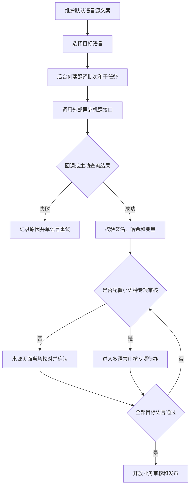

# 消息模板与多语言 PRD

## 1. 模块摘要

本模块统一管理消息内容、渠道文案、模板变量、版本、预览和多语言生产。人工消息模板与事件消息模板是同一模板库的两个筛选入口，不复制模板、版本或翻译数据。多语言能力作为共享工作区嵌入消息模板、人工任务临时内容和事件规则内容版本；操作者选择目标语言后，由后台调用外部异步机翻任务接口。普通语言在来源页面当场校对，小语种按配置进入独立的“多语言审核”，全部通过后才开放业务审核与发布。

## 2. 目标与范围

- 为 Web / App 共用的站内信和独立的 App Push 提供可版本化内容。
- 支持默认语言源文案、目标语言、外部机器翻译、人工修订和审核。
- 防止变量破坏、过期回调、自审和未审核内容发布。
- 支持模板内容预览和任务使用关系查看。

## 3. 用户与使用场景

| 角色 | 能力 |
|---|---|
| 内容编辑 | 创建模板、维护源文案、选择语言、提交机翻 |
| 翻译审核 | 对照源文案修订、通过或驳回译文 |
| 业务审核 | 审核已经通过翻译门禁的模板版本 |
| 运营人员 | 在任务中选择可用模板版本并预览 |

## 4. 前置条件与依赖

- 分类、链接白名单和默认有效期来自[系统配置与审计](./09-系统配置与审计.md)。
- 外部翻译服务由后台适配，浏览器不得直接访问供应商。
- 发布后的模板由[消息任务](./02-消息任务.md)选用。

## 5. 用户流程

## 6. 功能需求

### 6.1 模板与版本

- 模板按编码管理，已发布版本不可覆盖。
- 人工消息入口中的`manual/shared`模板通过业务审核并进入`已发布`后整体锁定，列表操作改为“查看详情”；只读详情必须展示基础字段、模板变量以及 Web 站内信、App 站内信和 App Push 预览，但不得修改源文案或基础配置；当前阶段不提供从已发布人工模板创建新版本或解除锁定的能力。
- 纯事件`event`模板不受上述人工模板锁定规则影响，仍可沿用现有版本更新流程。
- 人工模板仅完成多语言审核但尚未通过业务审核时仍可编辑；编辑后重置为草稿，并重新执行翻译、语言审核和业务审核。
- 支持草稿、送审、发布、停用和归档。
- 模板适用场景为`manual`、`event`或`shared`。人工入口展示`manual/shared`，事件入口展示`event/shared`。
- 两个入口共用`/templates`页面，分别使用`scope=manual`与`scope=event`；缺失或非法参数按人工入口处理。
- 从人工入口新建默认`manual`，从事件入口新建默认`event`，两处均可改为`shared`。
- 历史模板缺少适用场景时，根据人工任务与事件规则内容版本引用关系推断；两类均引用或无法判断时设为`shared`。
- 列表展示分类、渠道、语言覆盖、版本、适用场景、状态和使用任务数。
- 详情显示被哪些人工消息任务或事件规则内容版本使用。

### 6.2 渠道内容

- 站内信（Web + App 共用）：标题、摘要、正文、风险文案、按钮文字、目标链接。
- App Push：Push 标题、Push 正文、图片、Deep Link、折叠键和优先级。
- 编辑时实时提供 Web 站内信预览、App 站内信预览和 App Push 预览、变量示例和长度提示；两种站内信预览渲染同一内容对象。

#### 6.2.1 站内信 Markdown

- 人工消息模板、事件通知模板、共享模板和人工任务临时消息的站内信正文统一使用 Markdown 编辑器；标题、摘要、风险文案、按钮文字和 App Push 内容保持纯文本。
- 支持 CommonMark 与 GFM 常用语法，包括标题、粗体、斜体、删除线、列表、引用、链接、行内代码、代码块、分隔线和表格；不支持图片上传、公式、流程图和任意 HTML。
- 编辑器提供常用格式工具栏以及编辑/分屏预览模式。Web 与 App 站内信、模板详情、任务详情、审核预览和最终预览共用同一个 Markdown 渲染器。
- `web.body`只保存 Markdown 源码，不保存渲染 HTML。旧纯文本正文可直接按 Markdown 展示，无须迁移。
- 渲染器不执行原始 HTML 和代码，只允许`http://`、`https://`和`forxfinance://`链接；包含其他链接协议时禁止提交模板、任务或翻译审核。
- 已发布模板保持不可编辑，详情页同时提供 Markdown 渲染效果和可展开的源码。
- 机翻任务必须保留 Markdown 标记和`{{ variable }}`模板变量，只翻译可见文本；翻译审核页面同时展示源 Markdown、源渲染效果和目标语言 Markdown 编辑器。

#### 6.2.2 模板测试发送

- 新建或编辑未发布模板时可测试发送当前尚未保存的默认语言内容；测试发送不保存模板、不创建版本、不改变翻译或业务审核状态，也不进入正式发送记录。
- 接收账号由系统按当前`operator_id`自动加载本人在系统配置中维护的全部测试 UID，操作者不能在测试弹窗临时输入、取消选择或添加其他 UID。
- 当前操作者未配置测试账号时禁止发送，并引导至`/settings?tab=test-accounts`。
- 测试渠道只能从模板当前勾选的站内信和 Push 中选择，默认全选且至少保留一个。
- 弹窗按模板变量生成可编辑样例值；站内信、Push 内容完整且所有变量样例非空后才能发送。
- 结果按“测试账号 × 渠道”汇总展示账号数、渠道数和生成的测试发送条数。
- 已发布并锁定的人工模板只提供只读详情，不提供测试发送。

### 6.3 多语言生产

- 默认语言由操作者维护，不进入机器翻译。
- 操作者明确选择目标语言后，后台按模板不可变版本创建一个有效翻译批次。
- 每种目标语言创建独立子任务并取得 `external_task_id`。
- 外部结果优先通过签名回调接收；超时或回调丢失时主动查询。
- 部分语言失败时保留成功结果，只重试失败语言。
- 翻译对象统一使用`subject_type + subject_id + content_version`标识，支持`template_version`、`manual_task_content`和`rule_content_version`。
- 每个语言分别保留`machine_output`、`human_draft`和`approved_output`，不得用人工修订覆盖机器原稿。
- 普通语言在来源页面打开对照编辑器，可保存修订、修订并确认或填写原因驳回重翻；普通语言是否允许提交人确认由语言策略决定。
- 配置为专项审核的小语种在来源页面只读，展示审核组和 SLA，并跳转独立“多语言审核”页面完成复核。
- 小语种专项审核支持来源类型、语言、审核组、状态和 SLA 筛选，列表展示来源名称、外部任务 ID、变量校验和等待状态。
- 小语种审核遵守审核组、审核人数和职责分离规则；需要两人审核时，两个有效审核结论均完成后才进入`已通过`。
- 源文案变化时只重翻发生变化的字段，并将受影响语言置为`源文案已变更`，原确认结论失效。

### 6.4 列表进度

模板列表、人工任务列表和事件规则内容版本列表必须直接展示“多语言流程”单元格，包含：

- `approved_count / active_locale_count`和完成百分比；已取消语言不计入分母。
- 当前阶段：`生成机器翻译`、`普通语言确认`、`小语种专审`或`全部语言通过`。
- 最多三项未完成语言及状态；超过三项显示“其余 N 种”。
- 点击后打开进度抽屉，完整展示`源文案完成 → 生成机器翻译 → 普通语言确认 → 小语种专项审核 → 全部语言通过`和所有语言明细。
- 每个语言可在进度抽屉内展开查看源文、机器翻译、人工修订稿或最终审核稿；结果优先级为`approved_output → human_draft → machine_output`。
- 普通语言处于待确认、待人工审核、修改中或审核驳回时，可在进度抽屉内直接保存修订或“修订并通过”；已通过语言只读。
- 配置为小语种专项审核的语言在进度抽屉内始终只读，修改、驳回和通过只能进入独立“多语言审核”。
- 排队中、翻译中和翻译失败且尚无结果时，展开区分别展示等待状态或标准错误原因，不生成空白译文。
- 未完成状态按`翻译失败 > 源文案已变更 > 审核驳回 > 待小语种专审 > 专审中 > 待普通确认 > 修改中 > 翻译中 > 排队中 > 已通过`排序。

### 6.5 发布门禁

任一目标语言处于排队、翻译中、翻译失败、待人工审核、审核驳回或取消状态时，整个模板版本不得进入业务审核、发布或任务选用。已审核内容或源文案发生变化时，相应审核结论立即失效。

### 6.6 变量与回退

标准变量至少包括：`user_nickname`、`amount`、`currency`、`symbol`、`occurred_at`。机翻前后校验变量名称和数量，变量被翻译、删除或新增时禁止人工通过。

语言回退为用户语言 → 同语言通用版本 → 默认语言。紧急消息缺少可用语言时禁止静默发送。

## 7. 字段定义

### 7.1 模板

| 字段 | 类型 | 必填 | 说明 |
|---|---|---|---|
| `template_id` / `template_code` | string | 是 | 模板 ID 与稳定编码 |
| `template_name` | string | 是 | 后台名称 |
| `category_code` / `risk_level` | enum | 是 | 分类和默认风险 |
| `default_locale` | string | 是 | 默认源语言 |
| `supported_locales` | string[] | 是 | 已选择目标语言集合 |
| `channels` | enum[] | 是 | `inbox`、`push` |
| `usage_scope` | enum | 是 | `manual`、`event`、`shared` |
| `variables_schema` | object | 是 | 名称、类型、必填和格式 |
| `version` | integer | 是 | 不可变发布版本号 |
| `status` | enum | 是 | 模板状态 |
| `valid_from` / `valid_to` | datetime | 否 | 模板可用时间 |

### 7.2 语言内容

`locale`、`title`、`summary`、`body`、`risk_copy`、`button_text`、`target_url`、`push_title`、`push_body`、`push_image_url`、`deep_link`。

### 7.3 翻译批次

| 字段 | 类型 | 说明 |
|---|---|---|
| `translation_batch_id` | string | 平台批次 ID |
| `subject_type` | enum | `template_version`、`manual_task_content`或`rule_content_version` |
| `subject_id` / `subject_name` | string | 来源对象 ID 与后台名称 |
| `content_version` / `return_path` | string | 内容版本与返回来源页面路径 |
| `object_id` / `object_version` | string | 对象和不可变版本 |
| `source_locale` / `target_locales` | string/string[] | 源语言与目标语言 |
| `status` | enum | 批次聚合状态 |
| `total_count` / `completed_count` | integer | 总数与机翻完成数 |
| `approved_count` / `failed_count` | integer | 人审通过与失败数 |
| `created_by` / `created_at` / `updated_at` | string/datetime | 创建和更新时间 |

### 7.4 翻译子任务

| 字段 | 类型 | 说明 |
|---|---|---|
| `translation_item_id` / `translation_batch_id` | string | 子任务和所属批次 |
| `target_locale` | string | 目标语言 |
| `external_task_id` | string | 外部机翻任务 ID |
| `attempt_no` | integer | 当前尝试次数 |
| `status` | enum | 子任务状态 |
| `source_content_hash` | string | 源文案哈希 |
| `machine_output` | object | 外部机翻原始内容，永久保留 |
| `human_draft` | object | 人工修订草稿，可多次保存 |
| `approved_output` | object | 最终通过并进入发布版本的内容 |
| `special_review_required` | boolean | 是否必须进入小语种专项审核 |
| `review_group` / `review_sla_hours` | string/integer | 专项审核组与时限快照 |
| `changed_fields` | string[] | 源文案变化后需要重新翻译的字段 |
| `error_code` / `error_message` | string | 外部错误 |
| `submitted_at` / `translated_at` / `reviewed_at` | datetime | 流程时间 |
| `reviewer_id` / `review_result` / `review_comment` | string | 审核记录 |

### 7.5 外部接口约束

- 创建任务同步返回是否受理和 `external_task_id`。
- 回调携带签名、时间戳、防重放信息、外部任务 ID、源内容哈希和结果。
- 查询接口用于回调超时兜底，不替代正常回调。
- 回调和查询结果必须幂等，过期哈希结果丢弃并审计。

## 8. 状态与规则

模板：`草稿 → 审核中 → 已发布 → 已停用 → 已归档`。

翻译批次：`未提交 → 机翻处理中 → 待人工审核 → 全部审核通过`；分支为`部分失败`、`审核被驳回`、`已取消`。

语言子任务主流程：`未提交 → 排队中 → 翻译中`，普通语言进入`待普通确认 → 修改中 → 已通过`，专项语言进入`待小语种专审 → 专审中 → 已通过`；分支为`翻译失败`、`源文案已变更`、`审核驳回`、`已取消`。历史`待人工审核/审核通过`仅用于旧数据兼容。

## 9. 权限与审计

必须记录提交机翻、外部任务 ID 绑定、回调验签、主动查询、失败重试、人工修订、通过/驳回、源文案变化导致审核失效、业务审核和模板发布。

## 10. 异常与边界

- 外部任务未受理：子任务进入翻译失败，整版禁止发布。
- 回调超时：主动查询；超过最大等待时间后标记失败。
- 重复回调：幂等处理。
- 源哈希不匹配：丢弃过期结果并记录审计。
- 服务不可用：显示服务异常并允许稍后重试，不允许绕过人工审核。
- 变量不一致或链接非法：禁止审核通过。

## 11. 数据与埋点

统计批次受理率、各语言翻译成功率、平均返回时长、人审通过率、驳回率、重试次数和从创建到发布的总时长。

## 12. 验收标准

1. 操作者可维护源文案、选择目标语言并创建外部机翻任务。
2. 页面展示批次 ID、external_task_id 和逐语言状态。
3. 回调失败时能展示主动查询和单语言重试结果。
4. 审核人可对照源文案修订后通过，或填写原因驳回。
5. 任一语言未通过时发布和任务选用均被阻止。
6. Web 站内信预览、App 站内信预览和 App Push 预览均展示真实内容效果，且两种站内信内容一致。
7. 模板列表能查看人工消息任务和事件规则内容版本的使用关系。
8. 三类来源列表均直接显示完成比例、当前阶段和未完成语言，点击可查看完整流程。
9. 普通语言可在来源页当场校对；专项语言在来源页不可直接通过，只能进入“多语言审核”。
10. 系统配置可逐语言设置专项审核组、人数、自审、SLA、超时动作和启停状态。
11. 多语言进度抽屉可直接查看逐语言源文、机翻和当前结果，普通语言可当场修订，专项语言保持只读。

## 13. 非本模块范围

专业人工翻译供应商管理、翻译记忆库、术语库运营和自动语言质量评分不在一期范围。
