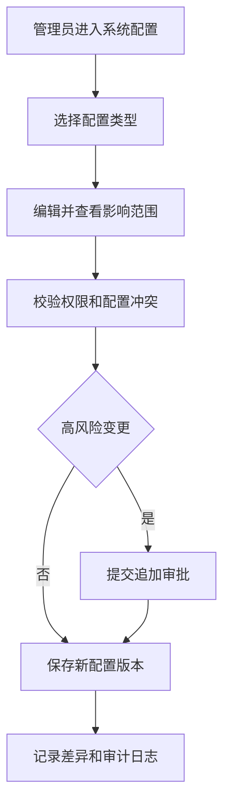

# 系统配置与审计 PRD

## 1. 模块摘要

本模块管理消息中心的全局分类、链接白名单、有效期、保留时间、逐语言审核策略、角色权限和审计日志，为内容、任务、审批、发送和分析提供统一治理规则。

## 2. 目标与范围

- 提供安全、可追踪、可回滚的全局配置。
- 防止非法分类、外链、过长保留和越权操作。
- 建立最小权限、敏感数据脱敏和关键操作审计。
- 配置变更只影响新版本，不静默改写已冻结发布版本。

## 3. 用户与使用场景

| 角色 | 场景 |
|---|---|
| 管理员 | 管理分类、默认有效期、链接白名单和角色 |
| 风控/合规 | 配置风险限制、退订和保留要求 |
| 安全人员 | 管理高风险权限、外链和数据导出策略 |
| 审计员 | 查询操作日志、版本差异和执行结果 |

## 4. 前置条件与依赖

- 组织、账号和认证由统一管理后台提供。
- 分类被用户端、模板和任务引用；链接规则被模板保存和用户点击引用。
- 审计接收各模块的关键操作事件。

## 5. 用户流程

## 6. 功能需求

### 6.1 分类配置

七个分类编码系统预置且不可删除。管理员可修改多语言名称、图标、颜色、排序、默认风险、默认保留时间、是否允许退订和启停状态。

已停用分类不能创建新模板或任务；历史用户消息继续按冻结名称和样式展示。

### 6.2 链接白名单

- 支持站内路径、App Deep Link 和备案 Web 域名/路径。
- 可限制允许参数、平台、业务 Owner、风险级别和生效时间。
- 模板保存、任务提交、发送前和用户点击时均校验。
- 外部 Web URL 默认禁止；通配规则必须限制域名边界，不能允许任意子域或开放重定向。

### 6.3 有效期与保留时间

- 分类配置默认保留天数和建议有效期。
- 模板可以覆盖分类默认值，任务只能在允许范围内缩短或由有权限人员延长。
- 任务有效期控制是否继续生成或补发消息。
- 用户消息有效期控制按钮和业务动作。
- 保留时间控制用户端可见时长和数据清理；审计记录可使用独立合规周期。

### 6.4 角色与权限

一期角色包括内容编辑、运营人员、翻译审核、业务审核、风控审核、管理员和审计员。

| 权限域 | 关键权限 |
|---|---|
| 内容 | 编辑源文案、提交机翻、查看结果、创建模板版本 |
| 任务 | 创建、复制、编辑、提交、取消和查看任务 |
| 审核 | 翻译、业务、风控审核和发布确认 |
| 事件 | 注册和测试事件、创建/审核/启停通知规则、发布内容版本、查看触发记录 |
| 数据 | 查看汇总、查看明细、导出 |
| 配置 | 分类、白名单、有效期、保留和角色管理 |
| 审计 | 查看日志和配置版本，不可修改业务对象 |

使用 RBAC 与业务线数据范围共同校验。创建人不能审核自己的受保护对象。

### 6.5 语言审核策略

每个目标语言独立配置以下字段，策略变更只影响新建翻译任务，存量任务使用创建时的策略快照：

| 字段 | 类型 | 说明 |
|---|---|---|
| `locale_code` / `locale_name` | string | 语言编码与后台名称 |
| `special_review_required` | boolean | 是否进入独立小语种专项审核 |
| `review_group` | string | 专项审核组；普通语言可为空 |
| `reviewer_count` | enum | 需要 1 人或 2 人有效审核 |
| `allow_submitter_review` | boolean | 是否允许机翻提交人完成语言确认 |
| `review_sla_hours` | integer | 目标审核时限 |
| `timeout_action` | enum | `提醒`、`升级`或`阻断发布` |
| `enabled` | boolean | 是否允许新任务选择该语言 |

一期默认将日语、韩语、土耳其语和俄语设为专项审核；英语、繁体中文、法语和西班牙语默认在来源页确认。管理员可按实际语言能力调整。

### 6.6 脱敏与导出

- UID、手机号、邮箱、地址、Push Token 和设备 ID 默认脱敏。
- 完整值仅可由授权服务账号在必要流程中使用，不在浏览器明文展示。
- 导出需要权限、用途、有效期和水印；高风险导出需要追加审批。

### 6.7 操作日志

必须审计：提交机翻、外部任务绑定、回调验签、主动查询、重试、人工修订、翻译结论、模板发布、事件注册与测试、事件规则审核与启停、规则内容版本切换、重复抑制、受众快照、全站/紧急发送、业务审批、全部已读异常、Web / App 已读同步异常、分类和白名单修改、权限修改及数据导出。

## 7. 字段定义

### 7.1 分类配置

`category_code`、`name_i18n`、`icon`、`color`、`sort_order`、`default_risk_level`、`default_validity_seconds`、`default_retention_days`、`allow_opt_out`、`status`、`version`。

### 7.2 链接白名单

| 字段 | 类型 | 必填 | 说明 |
|---|---|---|---|
| `allowlist_id` | string | 是 | 规则 ID |
| `link_type` | enum | 是 | 站内、Deep Link、Web |
| `path_pattern` | string | 是 | 域名和路径规则 |
| `allowed_parameters` | string[] | 是 | 允许参数 |
| `platform` | enum[] | 是 | Web、iOS、Android |
| `owner` | string | 是 | 业务责任人 |
| `risk_level` | enum | 是 | 规则风险 |
| `status` | enum | 是 | 草稿、启用、停用 |
| `effective_at` / `expire_at` | datetime | 是/否 | 生效和到期时间 |
| `version` | integer | 是 | 配置版本 |

### 7.3 语言审核策略

`locale_code`、`locale_name`、`special_review_required`、`review_group`、`reviewer_count`、`allow_submitter_review`、`review_sla_hours`、`timeout_action`、`enabled`、`version`、`updated_by`、`updated_at`。

### 7.4 审计日志

`audit_id`、`actor_id`、`actor_role`、`action`、`object_type`、`object_id`、`object_version`、`before_hash`、`after_hash`、`change_summary`、`ip_device_summary`、`occurred_at`、`result`、`trace_id`。

## 8. 状态与规则

配置对象：`草稿 → 待审批 → 已启用 → 已停用 → 已归档`。低风险配置可按权限直接从草稿启用。

配置以版本生效。已冻结发布版本保留其原始配置引用；涉及紧急安全问题时，可通过全局阻断规则停止未发送任务，并保留原因和审批。

## 9. 权限与审计

- 管理员不能删除或修改审计日志。
- 审计员只读，不具备业务审批和配置修改权限。
- 高风险权限变更、白名单 Web 域名、保留时间延长和批量导出需要双人复核。
- 审计日志需要防篡改存储并按合规周期保留。

## 10. 异常与边界

- 分类仍被草稿引用时停用：允许停用，但草稿提交时阻断。
- 白名单规则到期：新发送阻断，历史详情点击按当前安全规则处理。
- 配置冲突：展示冲突对象和优先级，不允许静默覆盖。
- 权限在操作过程中被撤销：提交时再次校验并拒绝。
- 审计写入暂时失败：高风险操作失败关闭，普通只读操作可继续并告警。

## 11. 数据与埋点

统计配置变更量、驳回率、白名单拦截量、权限拒绝量、导出量、审计写入失败和各类高风险操作次数。

## 12. 验收标准

1. 七个分类编码不可删除，可配置名称、样式、默认风险和保留时间。
2. 白名单能限制链接类型、路径、参数、平台和有效期。
3. 模板保存、任务提交、发送和用户点击均执行链接校验。
4. 角色权限覆盖内容、任务、翻译、业务、风控、配置和审计职责。
5. UID、联系方式、Token 和设备标识默认脱敏。
6. 关键操作日志包含操作者、对象版本、前后变化、时间和结果。
7. 配置变更不静默改写已冻结发布版本。
8. 可逐语言配置专项审核、审核组、人数、自审、SLA、超时动作和启停，并在新翻译任务中按策略正确分流。

## 13. 非本模块范围

统一身份认证、公司级 SIEM、完整数据生命周期平台和国家级合规策略引擎不在一期范围。
