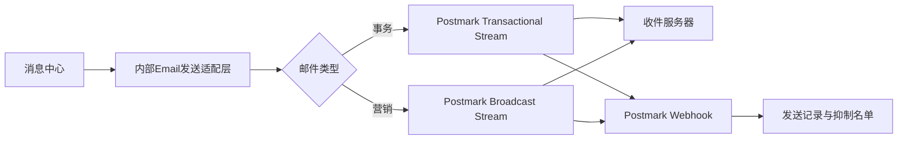
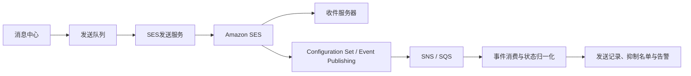

# ForX Finance 消息中心邮件服务商选型对比

> 文档类型：技术与供应商选型参考  
> 更新日期：2026-08-18  
> 适用范围：全球用户、事务邮件与营销邮件  
> 价格口径：供应商官网公开美元标价，不含税费、企业折扣及定制合同价格  
> 范围说明：本文不代表 Email 已自动纳入现有一期范围；正式立项后仍需同步修改消息中心各模块 PRD。

## 1. 结论摘要

建议采用“两阶段”方案：

1. 第一阶段使用 **Postmark Pro**，以一个账号建立独立的 Transactional 与 Broadcast Message Stream，优先降低接入、送达治理和日常运营复杂度。
2. 当月发送量稳定超过 100 万封、邮件成本成为显著支出时，再评估将大批量营销邮件迁移到 **Amazon SES**；关键事务邮件可继续保留在 Postmark，避免营销流量影响关键通知。

如果团队已经具备成熟的 AWS 邮件投递、SNS/SQS、退信投诉治理和送达率运维能力，可以直接选择 Amazon SES。SendGrid 和 Mailgun 能满足需求，但在当前“内容、受众、审批、多语言、数据分析均由 ForX Finance 消息中心自行管理”的前提下，没有形成明显优势。

## 2. 选型前提

- 用户覆盖全球市场。
- 同时发送事务邮件和营销邮件。
- 消息模板、变量、多语言、内容审批、受众选择和发送任务仍由消息中心管理。
- 第三方服务只负责邮件提交、域名认证、投递、回执、退信、投诉、退订和基础统计。
- 事务邮件和营销邮件必须使用不同发送流，建议同时使用不同子域名。
- 事务邮件示例：充值到账、提现结果、订单成交、强平预警、账户异常、安全通知。
- 营销邮件示例：活动推广、奖励召回、VIP/代理活动和产品运营。

建议发送域名：

| 用途 | 建议域名 | 邮件类型 |
|---|---|---|
| 关键通知 | `notify.forx.finance` | Transactional |
| 活动运营 | `news.forx.finance` | Marketing / Broadcast |

## 3. 总体对比

| 维度 | Postmark | Amazon SES | SendGrid | Mailgun |
|---|---|---|---|---|
| 推荐定位 | 第一阶段首选 | 大规模成本优先 | 一体化邮件平台 | API与区域能力优先 |
| 最低付费门槛 | $15/月，含1万封 | $0.10/千封，按量付费 | $19.95/月起 | $15/月，含1万封 |
| 事务/营销隔离 | 原生 Message Stream | 通过域名、配置集和发送策略自行隔离 | 可通过子账号、IP池和配置隔离 | 可通过域名、IP池和标签隔离 |
| API / SMTP | 支持 | 支持 | 支持 | 支持 |
| 送达回执 | Webhook | Event Publishing / SNS | Event Webhook | Webhook |
| 退信与投诉 | 内置并可回调 | 需配置通知并自行消费 | 内置并可回调 | 内置并可回调 |
| 退订管理 | Broadcast支持 | SES订阅管理或自建 | Suppression / Unsubscribe Group | Suppression / Unsubscribe |
| 独立IP | 30万封/月以上，$50/月/IP起 | 标准IP $24.95/月/IP | Pro计划起包含 | 10万封档包含，额外$59/月/IP |
| 开发工作量 | 低 | 高 | 中 | 中 |
| 日常运维量 | 低 | 高 | 中 | 中 |
| 成本优势 | 低到中等发送量 | 中高发送量 | 套餐范围内 | 套餐范围内 |
| 当前匹配度 | 高 | 中高 | 中 | 中 |

## 4. 公开价格对比

### 4.1 Postmark

| 套餐 | 月费 | 包含量 | 超量价格 | 适用场景 |
|---|---:|---:|---:|---|
| Developer | $0 | 100封/月 | 不允许超量 | 开发联调 |
| Basic | $15 | 1万封/月 | $1.80/千封 | 小规模生产 |
| Pro | $16.50 | 1万封/月 | $1.30/千封 | ForX Finance第一阶段建议 |
| Platform | $18 | 1万封/月 | $1.20/千封 | 多团队或平台型账号 |

补充费用：

- 独立IP：$50/月/IP起，仅向每月30万封以上客户提供。
- 自定义活动记录保留：$5/月起，仅Pro及以上。
- DMARC监控：$14/月/域名起；不是接入邮件发送的必选项。
- 大发送量以官方报价器或销售合同为准，不应简单用1万封档超量单价长期推算。

官方来源：[Postmark Pricing](https://postmarkapp.com/pricing/)

### 4.2 Amazon SES

Amazon SES按量计费的基础价格：

| 项目 | 价格 |
|---|---:|
| 出站邮件 | $0.10/千封 |
| Global Endpoints | 额外$0.03/千封 |
| 附件数据 | $0.12/GB |
| Virtual Deliverability Manager | 0—1000万封区间额外$0.07/千封 |
| 标准独立IP | $24.95/月/IP |
| 托管独立IP | $15/月基础费，加发送量费用 |

仅按基础出站邮件计算：

| 月发送量 | 估算发送费 |
|---:|---:|
| 1万封 | $1 |
| 5万封 | $5 |
| 10万封 | $10 |
| 100万封 | $100 |
| 1000万封 | $1,000 |

以上不含SNS、SQS、CloudWatch、数据流量、Global Endpoints、送达率工具和独立IP。Amazon SES价格最低，但退信、投诉、订阅、事件消费、监控和异常治理需要团队自行搭建。

官方来源：[Amazon SES Pricing](https://aws.amazon.com/ses/pricing/)

### 4.3 SendGrid

| 套餐 | 月费 | 包含量 | 主要说明 |
|---|---:|---:|---|
| Free Trial | $0 | 100封/天，持续60天 | 仅用于试用 |
| Essentials 50K | $19.95 | 5万封/月 | 基础Email API |
| Essentials 100K | $34.95 | 10万封/月 | 基础Email API |
| Pro 100K | $89.95 | 10万封/月 | 包含独立IP及更多企业能力 |
| Pro 300K | $249 | 30万封/月 | 中等规模 |
| Pro 700K | $499 | 70万封/月 | 较大规模 |
| Pro 1.5M | $799 | 150万封/月 | 大规模 |
| Pro 2.5M | $1,099 | 250万封/月 | 大规模 |
| Premier | 定制报价 | 250万封以上 | 企业合同 |

SendGrid Email API 与 Marketing Campaigns 是分别计费的产品。本项目已经自建模板、受众、任务和分析能力，因此只需要购买 Email API，不需要额外购买 Marketing Campaigns。

官方来源：[Twilio SendGrid Email API Pricing](https://www.twilio.com/en-us/products/email-api/pricing)

### 4.4 Mailgun

| 套餐 | 月费 | 包含量 | 超量价格 | 主要说明 |
|---|---:|---:|---:|---|
| Free | $0 | 100封/天 | — | 开发试用 |
| Basic | $15 | 1万封/月 | $1.80/千封起 | 1个发送域名、1天日志 |
| Foundation | $35 | 5万封/月 | $1.30/千封起 | 模板API、5天日志 |
| Scale | $90 | 10万封/月 | $1.10/千封起 | SSO、5000次验证、30天日志、独立IP能力 |

额外独立IP为$59/月/IP。Mailgun支持从同一账号选择US或EU区域，适合对区域处理有明确要求的团队，但正式采购前仍应审核DPA、子处理方和具体数据字段的存储位置。

官方来源：[Mailgun Pricing](https://www.mailgun.com/pricing/)

## 5. 成本解读

不同供应商的价格不能只按“每千封”直接比较：

- Postmark价格包含较完整的投递运营体验，适合用较少研发投入快速上线。
- Amazon SES的$0.10/千封主要是基础发送价格，需另计AWS事件、监控、队列、流量和研发运维成本。
- SendGrid的独立IP和企业功能需要进入Pro档；如果不需要Marketing Campaigns，不应重复购买营销产品。
- Mailgun的低价套餐日志保留较短，排查历史投递问题时可能需要把Webhook事件完整保存到ForX Finance自己的数据库。

以每月10万封为例，公开标价可直接确认的基础成本大致为：

| 服务商 | 基础费用口径 | 备注 |
|---|---:|---|
| Amazon SES | 约$10 | 不含AWS外围服务及研发运维 |
| SendGrid Essentials | 约$34.95 | 不含独立IP |
| Mailgun Scale | $90 | 包含更长日志与高级能力 |
| Postmark | 需按官网发送量档位确认 | 1万封Pro基础档为$16.50；高发送量不建议线性外推 |

## 6. 接入架构对比

### 6.1 Postmark方案



需要实现：

- Email发送适配层。
- Transactional/Broadcast Stream映射。
- Webhook鉴权、幂等和状态归一化。
- 营销许可与退订同步。
- 退信、投诉和永久抑制处理。

### 6.2 Amazon SES方案



除通用发送适配层外，还需要实现或配置：

- IAM最小权限、Region与生产配额申请。
- Configuration Set、SNS/SQS和死信队列。
- 退信、投诉、延迟、拒绝、打开、点击和订阅事件消费。
- CloudWatch监控、告警和发送信誉治理。
- 自建或接入SES订阅管理。
- 多区域发送或故障切换策略。

### 6.3 SendGrid / Mailgun方案

两者均使用“消息中心 → 发送适配层 → Email API → Event Webhook → 发送记录”的结构。主要差异集中在套餐、独立IP、日志保留、区域能力和企业权限，不需要改变消息中心核心业务模型。

## 7. 功能适配度

| 消息中心需求 | Postmark | Amazon SES | SendGrid | Mailgun |
|---|---|---|---|---|
| 事务邮件 | 满足 | 满足 | 满足 | 满足 |
| 营销群发 | Broadcast Stream | 满足，需自行治理 | Email API可发送；营销产品另购 | 满足 |
| 多语言HTML | 消息中心渲染后发送 | 消息中心渲染后发送 | 消息中心渲染后发送 | 消息中心渲染后发送 |
| 纯文本回退 | 满足 | 满足 | 满足 | 满足 |
| 测试发送 | API / Sandbox | Mailbox Simulator | API / Sandbox | API / Sandbox |
| 送达/退信/投诉 | Webhook | SNS / Event Publishing | Event Webhook | Webhook |
| 点击/打开 | 支持 | 需配置事件发布 | 支持 | 支持 |
| 营销退订 | 支持 | 订阅管理或自建 | Suppression Group | Suppression |
| 自建分析看板 | Webhook入库 | 事件入库 | Webhook入库 | Webhook入库 |
| 低运维接入 | 最优 | 较弱 | 良好 | 良好 |
| 大规模成本 | 一般 | 最优 | 中等 | 中等 |

## 8. 优缺点

### Postmark

优点：

- 事务与营销发送流边界清晰。
- Webhook和发送记录模型直观，接入工作量低。
- 适合关键交易、安全和资产类通知。
- 第一阶段成本可预测。

缺点：

- 大规模单价高于Amazon SES。
- 独立IP存在发送量门槛。
- 高发送量需要联系销售确认价格。

### Amazon SES

优点：

- 基础发送成本最低。
- AWS原生扩展、权限和区域能力强。
- 适合百万级以上稳定发送量。
- 可精细控制队列、事件、监控和容灾。

缺点：

- 开发、配置和运维工作最多。
- 需要自行构建完整的Webhook消费、抑制、告警和审计闭环。
- 低发送量阶段节省的服务费可能不足以覆盖工程成本。

### SendGrid

优点：

- Email API、模板、分析和企业功能成熟。
- 套餐层级清晰，Pro包含独立IP。
- 团队和子账号能力较完整。

缺点：

- Email API和Marketing Campaigns分别计费，容易重复购买能力。
- Pro价格明显高于基础套餐。
- 本项目已经自建大量运营能力，供应商平台部分功能会重复。

### Mailgun

优点：

- API、SMTP、Webhook和邮件验证能力完整。
- US/EU区域可选。
- 中等发送量套餐清晰。

缺点：

- Basic和Foundation日志保留时间较短。
- 高级支持、SSO和较长日志需要Scale套餐。
- 需要关注套餐内验证、独立IP和额外用量费用。

## 9. 推荐方案

### 9.1 第一阶段

采用Postmark Pro：

- `notify.forx.finance`绑定Transactional Stream。
- `news.forx.finance`绑定Broadcast Stream。
- 消息中心保存完整发送和Webhook事件，不能依赖供应商的短期日志作为唯一审计来源。
- 事务邮件不提供营销退订；营销邮件必须同时包含正文退订链接与标准退订Header。
- 先使用共享IP，不在低发送量阶段购买独立IP。

### 9.2 扩容阶段

满足任一条件时启动Amazon SES复评：

- 连续三个月发送量超过100万封/月。
- 邮件供应商费用达到需要专项优化的水平。
- 团队已经具备AWS邮件信誉、事件队列和7×24告警能力。
- 营销邮件出现明显的突发大批量发送需求。

迁移时优先把营销邮件迁移到SES，关键事务邮件继续保留在Postmark。消息中心应通过统一的Email Provider Adapter屏蔽供应商差异，避免模板、任务和审批层感知具体服务商。

## 10. 供应商适配接口

消息中心后端应定义统一接口：

```ts
interface EmailProviderAdapter {
  send(message: EmailSendRequest): Promise<EmailSendResult>;
  verifyWebhook(headers: Record<string, string>, body: string): boolean;
  normalizeEvent(payload: unknown): EmailDeliveryEvent;
  suppress(recipient: string, reason: SuppressionReason): Promise<void>;
}
```

核心字段至少包括：

- `provider`
- `provider_message_id`
- `message_stream`
- `email_type`
- `recipient_email_masked`
- `accepted_at`
- `delivered_at`
- `bounce_type`
- `bounce_reason`
- `complained_at`
- `unsubscribed_at`
- `opened_at`
- `clicked_at`
- `provider_event_id`
- `raw_event_storage_key`

Webhook必须执行签名或凭证校验、事件ID幂等、乱序保护和重放防护。供应商API密钥只能保存在服务端密钥管理系统中，不能进入浏览器、本地存储、业务数据库明文字段或导出文件。

## 11. 商务与安全尽调清单

正式签约前需要向候选供应商确认：

1. 全球主要邮箱供应商的投递覆盖和发送限制。
2. 事务与营销流量是否使用独立发送基础设施。
3. 数据处理区域、跨境传输机制、DPA和子处理方清单。
4. SOC 2、ISO 27001等安全证明及有效期。
5. 邮件正文、收件地址和事件日志的默认保留时间及删除能力。
6. Webhook签名、IP白名单、重试规则和事件幂等字段。
7. 退信、投诉、退订和全局抑制名单的处理规则。
8. 发送配额、突发限流、暖域名和独立IP申请门槛。
9. SLA、故障通知、技术支持时区和紧急响应渠道。
10. 制裁地区、受限行业和加密资产相关服务政策。
11. 发票、税费、最低消费、超量计费和企业折扣。
12. 服务终止后的数据导出、删除和迁移支持。

## 12. 决策记录模板

| 项目 | 决策 |
|---|---|
| 首选供应商 | Postmark Pro |
| 备选供应商 | Amazon SES |
| 事务发送域名 | `notify.forx.finance` |
| 营销发送域名 | `news.forx.finance` |
| 预计月发送量 | 待业务量测算 |
| 是否需要独立IP | 第一阶段不需要 |
| 数据处理区域 | 待安全与法务确认 |
| 采购负责人 | 待指定 |
| 技术负责人 | 待指定 |
| 上线目标时间 | 待项目排期确认 |

## 13. 官方资料

- [Postmark Pricing](https://postmarkapp.com/pricing/)
- [Postmark Message Streams](https://postmarkapp.com/support/article/how-to-create-and-send-through-message-streams)
- [Postmark Webhooks API](https://postmarkapp.com/developer/api/webhooks-api)
- [Amazon SES Pricing](https://aws.amazon.com/ses/pricing/)
- [Amazon SES Event Publishing](https://docs.aws.amazon.com/ses/latest/dg/event-publishing-retrieving-sns-contents.html)
- [Amazon SES Subscription Management](https://docs.aws.amazon.com/ses/latest/dg/sending-email-subscription-management.html)
- [Twilio SendGrid Email API Pricing](https://www.twilio.com/en-us/products/email-api/pricing)
- [Mailgun Pricing](https://www.mailgun.com/pricing/)
- [Mailgun Webhooks](https://documentation.mailgun.com/docs/mailgun/user-manual/webhooks/webhooks)

